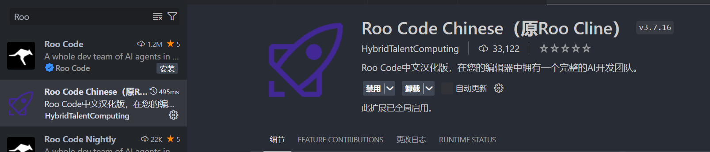
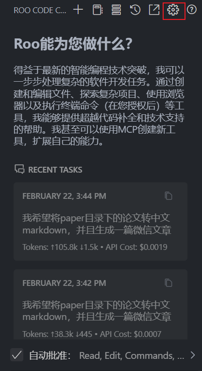
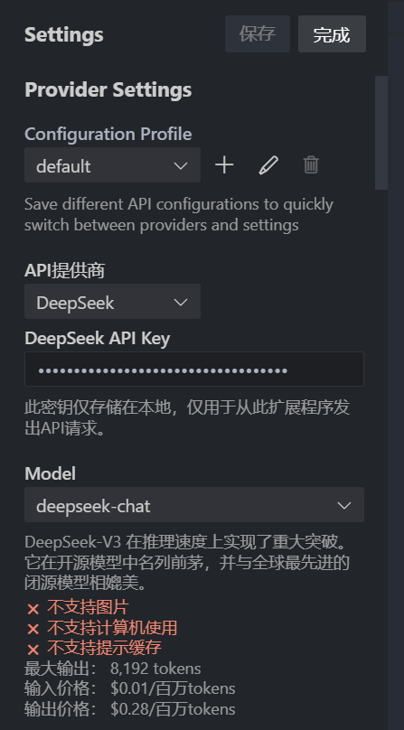
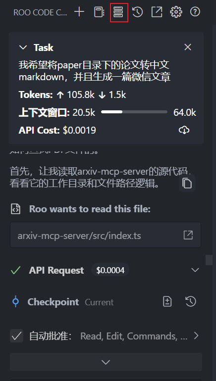
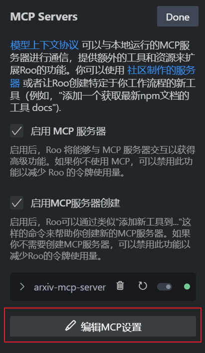
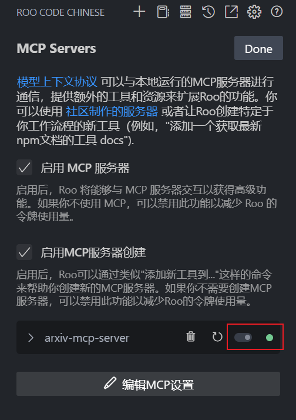
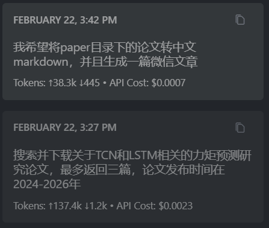
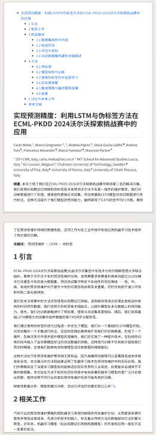
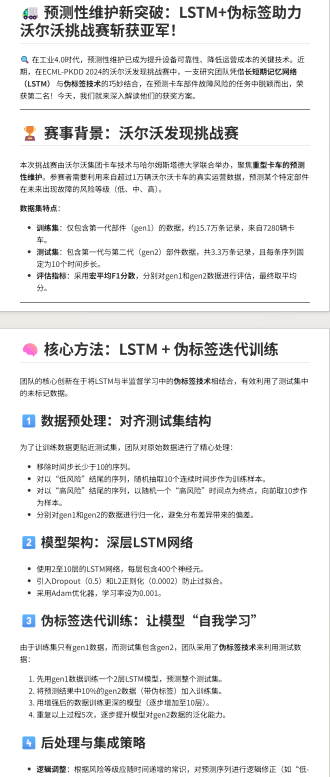

<!--
 * @Author: yeffky
 * @Date: 2026-02-22 15:36:52
 * @LastEditTime: 2026-02-22 16:42:02
-->
# VSCode + Roo Cline的MCP服务本地部署实践

## 1.背景

由于科研需要和创作需要，希望能够在本地部署一个检索论文并能够智能转中文并捕捉知识要点的MCP服务，同时由于创作需求，我希望还能具有生成微信文章的能力。因此我在github上寻找，找到了一款开源的MCP服务，并且在本地部署了该服务。

github地址：https://github.com/yzfly/arxiv-mcp-server

## 2.安装

基本的安装使用可以直接参考作者的readme文档。因为我希望更改一下作者默认配置的API KEY来源，因此我选择了本地部署。

### 2.1.下载插件

首先需要下载VSCode的插件，插件名称为：Roo Cline。



### 2.2.配置API KEY

安装Roo Cline插件后，需要配置API KEY。

- 点击右上角设置按钮



- 选择API供应商，并且去对应供应商处申请API KEY。我这里使用的是deepseek API。



### 2.3.配置本地部署

根据作者的readme文档，实现本地部署的流程如下(Windows环境类似)：

```shell
# 克隆项目
git clone https://github.com/yzfly/arxiv-mcp-server.git
cd arxiv-mcp-server

# 安装依赖
npm install

# 设置环境变量
export SILICONFLOW_API_KEY="your_api_key"

# 开发模式运行
npm run dev

# 构建
npm run build

# 运行构建版本
npm start
```

此处暂时跑不起来，源码中需要设置两处环境变量——SILICONFLOW_API_KEY和WORK_DIR。我们目前还没有配置好API KEY和WORK_DIR，因此无法运行。

### 2.4.修改代码

为了能够在本地部署，我们需要修改作者默认配置的API KEY来源。

打开文件：`src/index.ts`，将API KEY配置部分代码修改为：

```typescript
// Deepseek API配置
const DEEPSEEK_API_URL = "https://api.deepseek.com/v1/chat/completions";
const DEEPSEEK_API_KEY_ENV = process.env.DEEPSEEK_API_KEY;

if (!DEEPSEEK_API_KEY_ENV) {
  console.error("❌ 错误: 必须设置 DEEPSEEK_API_KEY 环境变量");
  console.error("您可以通过以下链接获取 API key: https://platform.deepseek.com/api_keys");
  process.exit(1);
}

// 现在 DEEPSEEK_API_KEY 确保是 string 类型
const DEEPSEEK_API_KEY: string = DEEPSEEK_API_KEY_ENV;
```

将代码中的callSiliconFlowAPI函数修改为：

```typescript
// 工具函数：使用 AI 模型
async function callDeepSeekAPI(prompt: string, systemPrompt?: string): Promise<string> {
  try {
    const messages: Array<{role: string, content: string}> = [];
    if (systemPrompt) {
      messages.push({ role: "system", content: systemPrompt });
    }
    messages.push({ role: "user", content: prompt });

    const response = await axios.post(DEEPSEEK_API_URL, {
      model: "deepseek-chat", // Deepseek模型
      messages: messages,
      stream: false,
      max_tokens: 8192,
      temperature: 0.7,
      top_p: 0.7,
    }, {
      headers: {
        "Authorization": `Bearer ${DEEPSEEK_API_KEY}`,
        "Content-Type": "application/json"
      }
    });

    return response.data.choices[0].message.content;
  } catch (error) {
    console.error("调用 Deepseek API 时出错:", error);
    throw new Error(`AI 调用失败: ${error instanceof Error ? error.message : String(error)}`);
  }
}
```

修改完成后，我们到RooCline插件的设置页面，配置MCP服务。点击右上角的MCP服务器



点击下方编辑MCP配置按钮



更改json文件内容为：

```json
{
  "mcpServers": {
    "arxiv-mcp-server": {
      "command": "node",
      "args": [
        "PathToYourProject\\arxiv-mcp-server\\build\\index.js"
      ],
      "env": {
        "DEEPSEEK_API_KEY": "your_api_key_here",
        "WORK_DIR": "/path/to/your/data/directory"
      },
      "alwaysAllow": [
        "search_arxiv",
        "download_arxiv_pdf",
        "parse_pdf_to_text",
        "convert_to_wechat_article",
        "parse_pdf_to_markdown",
        "process_arxiv_paper"
      ],
      "disabled": false
    }
  }
}
```

此时返回到RooCline插件的设置页面，点击右上角的MCP服务器，选择arxiv-mcp-server，点击右下角的启动按钮。看到右边有绿色的小点，表示服务启动成功。



至此，本地部署的MCP服务已经配置完成。此时可以在RooCline插件中新建任务来使用MCP服务。



在使用过程中可能还会遇到部分网络问题，由于arxiv网站在国内直连几乎无法访问和直接下载pdf，因此MCP中的下载pdf功能几乎无法使用，需要手动修改代码来配置代理进行下载。

以下是生成的中文markdown效果以及微信公众号文章的效果：




