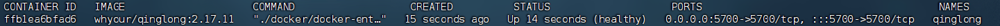
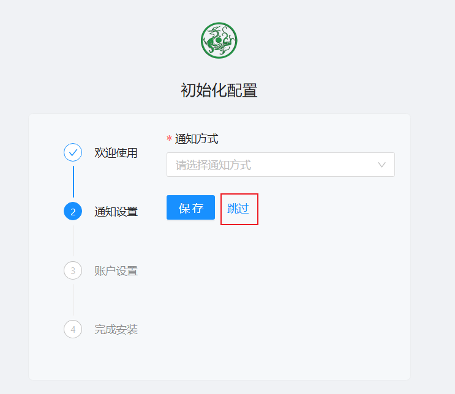
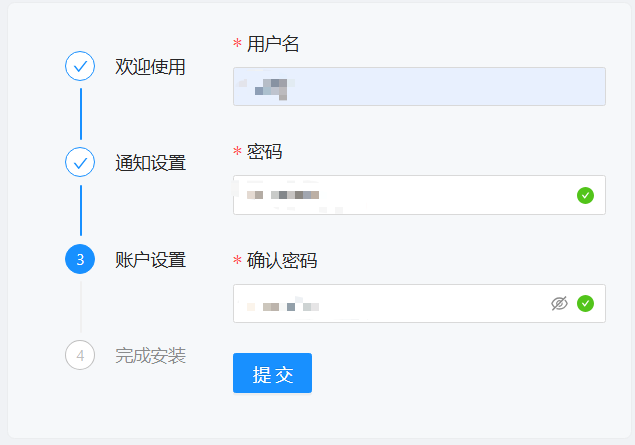
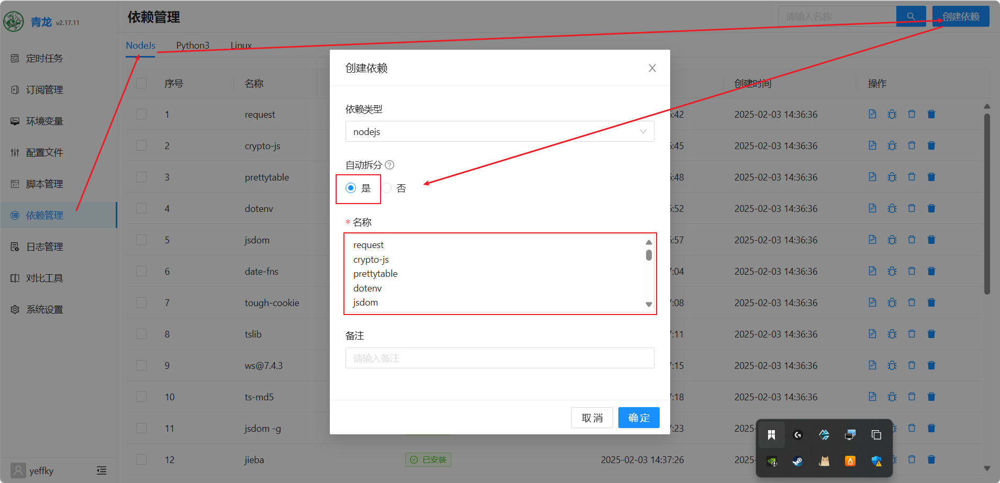
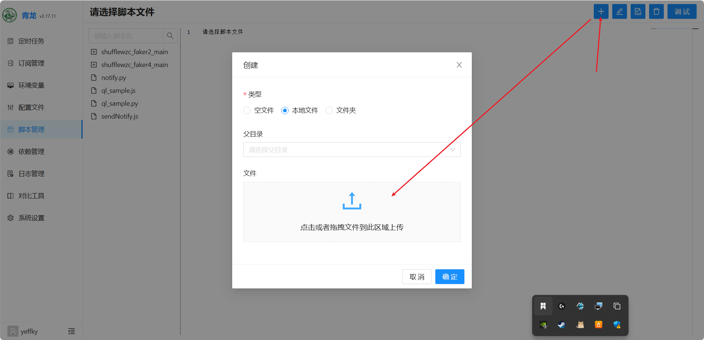
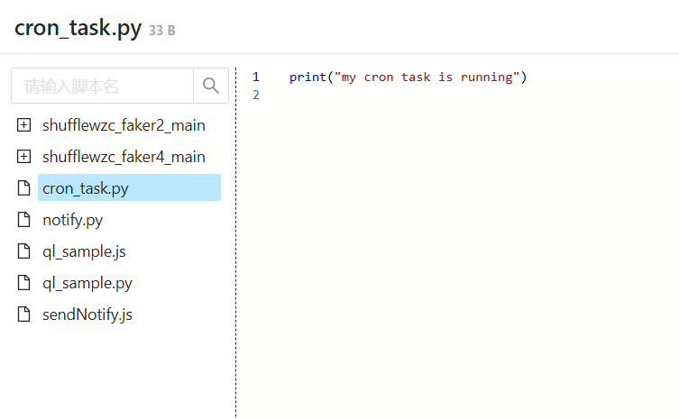
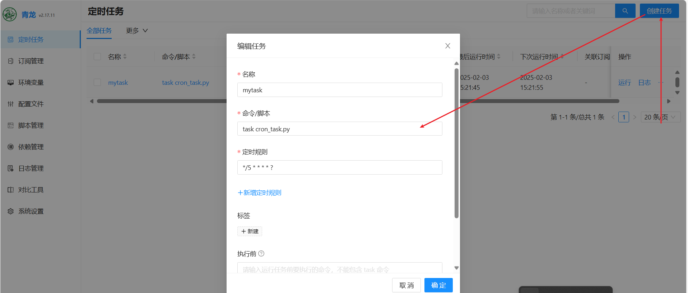
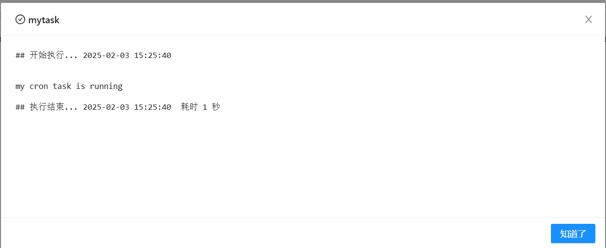
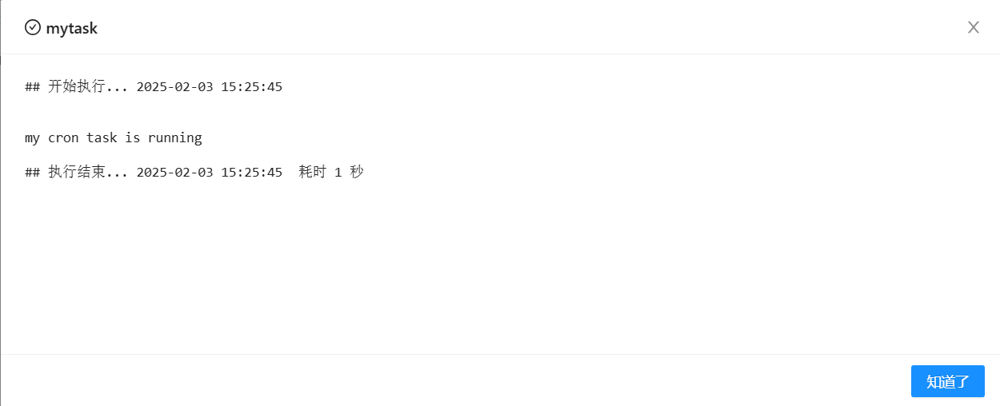
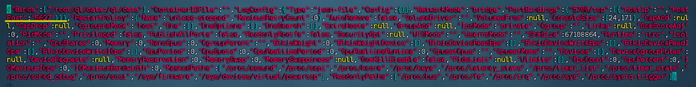

# 镜像部署

## 1. 青龙面板

### 1.1. 创建并启动容器

```shell
docker run -dit \
  -v $PWD/ql/data:/ql/data \
  -p 5700:5700 \
  -e QlBaseUrl="/" \
  -e QlPort="5700" \
  --name qinglong \
  --hostname qinglong \
  --restart unless-stopped \
  whyour/qinglong:2.17.11
```

### 1.2. 查看容器是否启动成功



### 1.3. 访问面板

#### 1.3.1. 浏览器访问：http://ip:5700

#### 1.3.2. 初始化面板





### 1.4. 登录面板

### 1.5. 添加常用依赖

NodeJs

```shell
request
crypto-js
prettytable
dotenv
jsdom
date-fns
tough-cookie
tslib
ws@7.4.3
ts-md5
jsdom -g
jieba
fs
form-data
json5
global-agent
png-js
@types/node
require
typescript
js-base64
axios
moment
```

Python3

```shell
requests
canvas
ping3
jieba
PyExecJS
aiohttp
```

Linux

```shell
bizCode
bizMsg
lxm
```

安装流程：



这里框内直接将所需要安装的库都复制进去即可，然后选中自动拆分即可一键安装。

### 1.6. 上传本地脚本



上传成功：



### 1.7. 定时任务

#### 1.7.1. 定时规则

```shell
第1个是秒，第2个是分，第3个是时，第4个是每月的哪日，第5个是哪月，第6个是每周的周几。数字之间空格隔开。

不限制的用*号替代，定期的时间用“?”替代，间隔运行时间用“*/数字”替代

同一个时间位多个选项用","连接，同一个时间位一个区间用“-”连接。

每天执行，在天位或者周位用"?"都行

一般设置每天执行一次就行0 0 1 * * ?

具体示例如下：

0 0 1 * * ? #每天 1 点触发

0 10 1 ? * * #每天 1:10 触发

*/5 * * * * ? #每隔 5 秒执行一次

0 */1 * * * ? #每隔 1 分钟执行一次

0 0 2 1 * ? * #每月 1 日的凌晨 2 点执行一次

0 0 1 * * ? #每天 23 点执行一次

0 0 1 * * ? #每天凌晨 1 点执行一次

0 0 1 1 ? * #每月 1 日凌晨 1 点执行一次

0 26,29,33 * * * ? #在 26 分、29 分、33 分执行一次

0 0 0,13,18,21 * * ? #每天的 0 点、13 点、18 点、21 点都执行一次

0 0 10,14,16 * * ? #每天上午 10 点，下午 2 点，4 点执行一次

0 0/30 9-17 * * ? #每天朝九晚五工作时间内每半小时执行一次

0 * 14 * * ? #每天下午 2 点到 2:59 期间的每 1 分钟触发

0 */5 14 * * ? #每天下午 2 点到 2:55 期间的每 5 分钟触发

0 */5 14,18 * * ? #每天下午 2 点到 2:55 期间和下午 6 点到 6:55 期间的每 5 分钟触发

0 0-5 14 * * ? #每天下午 2 点到 2:05 期间的每 1 分钟触发
```

#### 1.7.2. 定时执行脚本

这里我将任务定时规则设置为 */5 * * * * ? ，即每隔 5 秒执行一次



#### 1.7.3. 查看任务日志

可以看到脚本每5秒进行了一次日志输出，说明脚本执行成功。





### 1.8. 修改端口

#### 1.8.1. 停止容器和docker服务

```shell
# 查看当前容器的container_id
docker ps -a
docker stop qinglong
systemctl stop docker.service
```

#### 1.8.2. 修改端口

```shell
cd /var/lib/docker/containers/[cotainer_id]
vim hostconfig.json
```



#### 1.8.3. 启动docker服务和容器

```shell
systemctl start docker.service
docker start qinglong
```

### 参考

1.https://blog.csdn.net/u011027547/article/details/130703685?utm_medium=distribute.pc_relevant.none-task-blog-2~default~baidujs_baidulandingword~default-0-130703685-blog-143712277.235^v43^pc_blog_bottom_relevance_base6&spm=1001.2101.3001.4242.1&utm_relevant_index=3
