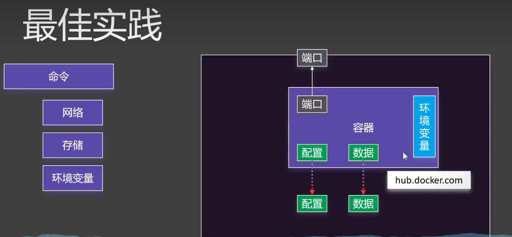

# Docker

## 一、Docker简介

### 1.1 Docker是什么

Docker 是一个开源的应用容器引擎，让开发者可以打包他们的应用以及依赖包到一个可移植的容器中，然后发布到任何流行的 Linux 机器上，也可以实现虚拟化。容器是完全使用沙箱机制，相互之间不会有任何接口。

### 1.2 Docker能做什么

1. 开发人员利用Docker可以消除“它在我机器上可以运行”的问题
2. 项目管理人员利用Docker可以实现开发、测试和生产环境的统一和标准化
3. 运维人员利用Docker可以实现快速部署和扩容

### 1.3 Docker与虚拟机的区别

| 特性     | Docker容器   | 虚拟机VM       |
| -------- | ------------ | -------------- |
| 启动     | 秒级         | 分钟级         |
| 系统资源 | 分享主机内核 | 完整的操作系统 |
| 存储大小 | 一般为MB     | 一般为GB       |

## 二、Docker组成

### 2.1 Docker Host

Docker Host是运行Docker容器的操作系统，可以是物理机也可以是虚拟机

### 2.2 Docker Daemon

Docker Daemon是运行在Docker Host上的后台进程，用于管理Docker容器

### 2.3 Docker Client

Docker Client是用于与Docker Daemon进行通信的客户端程序，用户可以通过Docker Client来管理Docker容器

### 2.4 Docker Registry

Docker Registry是用于存储Docker镜像的服务器，用户可以将自己的Docker镜像上传到Docker Registry，也可以从Docker Registry下载Docker镜像

### 2.5 Docker Image

Docker Image是Docker容器的模板，包含了运行容器所需的所有文件和配置信息

### 2.6 Docker Container

Docker Container是Docker Image的运行实例，用户可以通过Docker Container来运行应用程序

## 三、容器的特点

### 3.1 轻量级的VM

### 3.2 共享OS内核

### 3.3 资源利用率高

### 3.4 隔离性

### 3.5 拥有独立的文件系统和进程空间

## 四、Docker安装

### 4.1 卸载Docker

```shell
sudo yum remove docker \
                   docker-client \
                   docker-client-latest \
                   docker-common \
                   docker-latest \
                   docker-latest-logrotate \
                   docker-logrotate \
                   docker-engine
```

### 4.2 配置yum源

```shell
sudo yum install -y yum-utils

yum-config-manager --add-repo http://mirrors.aliyun.com/docker-ce/linux/centos/docker-ce.repo
```

### 4.3 安装Docker Engine

```shell
sudo yum install docker-ce docker-ce-cli containerd.io docker-compose-plugin docker-buildx-plugin
```

### 4.4 启动Docker

```shell
sudo systemctl start docker
```

### 4.5 设置开机启动

```shell
sudo systemctl enable docker
```

### 4.6 配置加速

```shell
sudo mkdir -p /etc/docker
sudo tee /etc/docker/daemon.json <<-'EOF'
{
  "registry-mirrors": ["https://xxxxxxxx.mirror.aliyuncs.com"]
}
EOF
sudo systemctl daemon-reload
sudo systemctl restart docker
```

## 五、Docker操作常用命令

### 5.1 搜索镜像

```shell
docker search [镜像名] (存在超时问题)
```

直接前往[DockerHub](https://hub.docker.com/)进行镜像搜索

### 5.2 拉取镜像

```shell
docker pull [镜像名]
```

### 5.3 查看镜像

```shell
docker images
```

### 5.4 删除镜像

```shell
docker rmi [镜像名]
```

### 5.5 创建并启动容器

```shell
docker run [options] [镜像名]
```

- options:
  - -d : 后台运行容器，并返回容器ID
  - -p : port 映射，格式为hostPort:containerPort
  - -v : volume 挂载，格式为hostPath:containerPath

### 5.6 查看容器

```shell
docker ps [options]
```

- options:
  - -a : 列出所有容器（包括已停止的容器）
  - -q : 只显示容器的ID

### 5.7 进入容器

```shell
docker exec -it [容器名] /bin/bash
```

### 5.8 停止容器

```shell
docker stop [容器名]
```

### 5.9 启动容器

```shell
docker start [容器名]
```

### 5.10 删除容器

```shell
docker rm [容器名]
常用命令：
  docker rm -f $(docker ps -aq) # 删除所有容器
```

## 六、Docker运维常用命令

### 6.1 查看容器日志

```shell
docker logs [容器名]
```

### 6.2 查看容器信息

```shell
docker inspect [容器名]
```

### 6.3 查看容器状态

```shell
docker stats [容器名]
```

### 6.4 查看容器端口映射

```shell
docker port [容器名]
```

- 因为容器是隔离的，所以需要将容器内的端口映射到宿主机的端口，以便外部访问容器内的服务

### 6.5 查看容器网络

```shell
docker network ls
```

### 6.6 退出容器

```shell
exit
```

## 七、Docker发布常用命令

### 7.1 登录Docker Hub

```shell
docker login
```

### 7.2 命名镜像

```shell
docker tag [镜像名] [用户名]/[镜像名]:[版本号]
```

### 7.3 推送镜像

```shell
docker push [用户名]/[镜像名]:[版本号]
```

## 八、Docker存储

### 8.1 目录挂载

```shell
docker run -d -p 8080:80 -v /data/webapp:/usr/share/nginx/html --name app nginx
```

- -v : 挂载目录，格式为hostPath:containerPath

### 8.2 数据卷映射

```shell
docker run -d -p 8080:80 -v ngconfig:/etc/nginx --name app nginx
```

- -v : 挂载数据卷，格式为volumeName:containerPath

### 8.3 卷操作

```shell
docker volume ls # 查看卷列表
docker volume inspect [卷名] # 查看卷详情
docker volume rm [卷名] # 删除卷
docker volume prune # 删除无用的卷
```

## 九、Docker网络

### 9.1 网络机制

- docker会为每个容器分配唯一ip，使用容器ip+port可以互相访问，因为容器在一个子网。docker0默认不支持主机域名，创建自定义网络，容器名是稳定域名

### 9.2 网络操作

```shell
docker network ls # 查看网络列表
docker network inspect [网络名] # 查看网络详情
docker network create [网络名] # 创建网络
docker network rm [网络名] # 删除网络
docker network prune # 删除无用的网络
```

### 9.3 网络模式

- bridge : 默认网络模式，容器之间可以互相访问，容器可以访问主机，主机不能访问容器(docker0)
- host : 容器共享主机网络，容器可以访问主机，主机可以访问容器
- none : 容器没有网络，容器不能访问主机，主机不能访问容器
- container : 容器共享其他容器的网络，容器之间可以互相访问，容器可以访问主机，主机不能访问容器
- 自定义：docker create --network [网络名]，需要在docker run时指定--network [网络名]，容器之间可以通过http://[容器名]:[端口]互相访问

### 9.4 redis集群主从配置（读写分离）

- 分配端口

  - redis01 6379:6379
  - redis02 6380:6379
- 数据文件挂载

  - redis01 /bitnami/redis/data -> /app/rd1
  - redis02 /bitnami/redis/data -> /app/rd2
- 配置文件（主从同步）

  - redis01

  ```shell
  REDIS_REPLICATION_MODE=master
  REDIS_PASSWORD=123456
  ```

  - redis02

  ```shell
  REDIS_REPLICATION_MODE=slave
  REDIS_MASTER_HOST=redis01
  REDIS_MASTER_PORT_NUMBER=6379
  REDIS_MASTER_PASSWORD=123456
  REDIS_PASSWORD=123456
  ```

## 十、部署实践

### 10.1 部署须知



### 10.2 部署MySQL

- 创建容器

```shell
docker run -d -p 3306:3306 \ # 端口映射
-v /app/myconf:/etc/mysql/conf.d \  # 配置文件挂载
-v /app/mydata:/var/lib/mysql \  # 数据文件挂载
-e MYSQL_ROOT_PASSWORD=123456 \  # 环境变量
--name mysql01 mysql:8
```

## 十一、Docker Compose

### 11.1 编写docker-compose.yml

```yaml
name: myblog
services:
  mysql:
    image: mysql:8.0
    ports:
      - "3306:3306"
    environment:
      MYSQL_ROOT_PASSWORD: 123456
      MYSQL_DATABASE: wordpress
    volumes:
      - mysql-data:/var/lib/mysql
      - /app/myconf:/etc/mysql/conf.d
    restart: always
    networks:
      - blog
    container_name: mysql

  wordpress:
    image: wordpress
    ports:
    - "8080:80"
    environment:
      WORDPRESS_DB_HOST: mysql
      WORDPRESS_DB_USER: root
      WORDPRESS_DB_PASSWORD: 123456
      WORDPRESS_DB_NAME: wordpress
    volumes:
      - wordpress:/var/www/html
    restart: always
    networks:
      - blog
    depends_on:
      - mysql
    container_name: wordpress

volumes:
  mysql-date:
  wordpress:
networks:
  blog:

```

### 11.2 启动服务

```shell
docker-compose -f [yaml文件名] up -d
```

### 11.3 停止服务

```shell
docker-compose -f [yaml文件名] --rmi ["local" | "all"] down
```

## 十二、Dockerfile

### 12.1 编写Dockerfile

```dockerfile
FROM jdk1.8.0_412


LABEL author=yeffky

COPY app.jar /app.jar

EXPOSE 8081

ENTRYPOINT [ "java", "-jar", "/app.jar" ]

```

### 12.2 构建镜像

```shell
docker build -f Dockerfile -t [镜像名] [Dockerfile所在目录]
```

## 13. 实战

### 13.1 容器打包为镜像

```shell
 docker commit [OPTIONS] CONTAINER [REPOSITORY[:TAG]]
```
