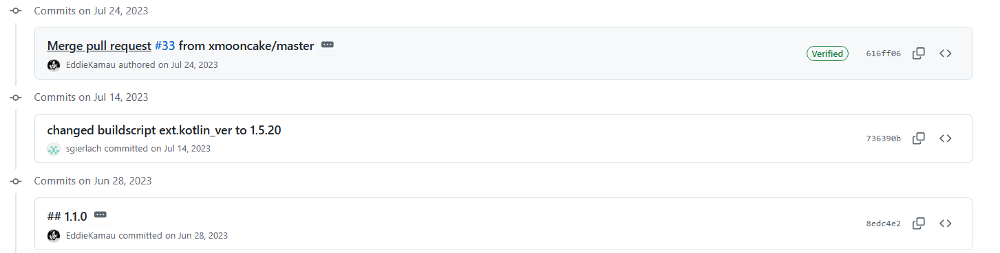
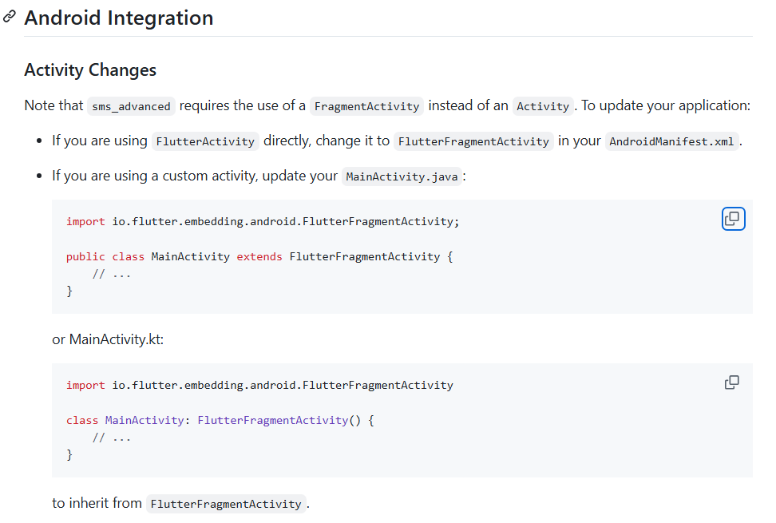

<!--
 * @Author: yeffky
 * @Date: 2025-02-22 10:14:04
 * @LastEditTime: 2025-02-26 19:08:55
-->
# flutter语法

## 1. flutter中的..

是Dart中的语法糖，属于级联操作符，可以连续调用一个对象的多个方法或访问多个属性，而不需要每次都重复写对象名。

最近在研究一个验证码转发的app，原理是尝试读取手机中对应应用的验证码进行自动转发。本次尝试用flutter开发，因为之前没有flutter开发的经验，遇到了诸多环境方面的问题，汇总一些常见的问题如下。希望帮助到入门的flutter开发者，避免踩坑。

## 2. Dart Isolate

Dart中的Isolate是Dart中的线程，每个Isolate都有自己的内存空间和事件循环，可以独立运行Dart代码。Isolate之间可以通过消息传递进行通信，但是不能共享内存。

在Flutter中，每个Widget树都是在一个Isolate中运行的，这样可以避免UI线程阻塞。但是，如果需要在Isolate中执行耗时操作，比如网络请求或者文件读写，就需要使用Isolate来避免阻塞UI线程。


# problems

## 1. running failed

### 1.1. Bug Description

```shell
FAILURE: Build failed with an exception.

* What went wrong:
Execution failed for task ':gradle:compileGroovy'.
> BUG! exception in phase 'semantic analysis' in source unit 'C:\dev\flutter\packages\flutter_tools\gradle\src\main\groovy\app_plugin_loader.groovy' Unsupported class file major version 65

* Try:
> Run with --stacktrace option to get the stack trace.
> Run with --info or --debug option to get more log output.
> Run with --scan to get full insights.

* Get more help at https://help.gradle.org

BUILD FAILED in 31s
Running Gradle task 'assembleDebug'...                             32.3s

┌─ Flutter Fix ──────────────────────────────────────────────────────────────────────────────────────────────────────────────────────────────────┐  
│ [!] Your project's Gradle version is incompatible with the Java version that Flutter is using for Gradle.                                      │  
│                                                                                                                                                │
│ If you recently upgraded Android Studio, consult the migration guide at https://flutter.dev/to/java-gradle-incompatibility.                    │  
│                                                                                                                                                │  
│ Otherwise, to fix this issue, first, check the Java version used by Flutter by running `flutter doctor --verbose`.                             │  
│                                                                                                                                                │  
│ Then, update the Gradle version specified in D:\Project\Verify_Code_App\verify_code_app\android\gradle\wrapper\gradle-wrapper.properties to be │  
│ compatible with that Java version. See the link below for more information on compatible Java/Gradle versions:                                 │  
│ https://docs.gradle.org/current/userguide/compatibility.html#java                                                                              │  
│                                                                                                                                                │  
│                                                                                                                                                │  
└────────────────────────────────────────────────────────────────────────────────────────────────────────────────────────────────────────────────┘
```

### 1.2. Solution

执行`flutter doctor --verbose`发现

```shell
Java binary at: D:\Android\Android Studio\jbr\bin\java
```

说明java地址指向不对，要使用`flutter config --jdk-dir <jdk目录>`来指定java目录

## 2. settings.gradle.kts配置

### 2.1. Bug Description

配置gradle plugin国内镜像源时，使用了

```kotlin
pluginManagement {
    repositories {
        maven { url 'https://plugins.gradle.org/m2/' }
        maven { url 'https://maven.aliyun.com/nexus/content/repositories/google' }
        maven { url 'https://maven.aliyun.com/nexus/content/groups/public' }
        maven { url 'https://maven.aliyun.com/nexus/content/repositories/jcenter'}
        gradlePluginPortal()
        google()
        mavenCentral()
    }
}
```

报错如下：

```bash
Launching lib\main.dart on sdk gphone64 x86 64 in debug mode...
e: D:\Project\Verify_Code_App\verify_code_app\android\settings.gradle.kts:14:25: Too many characters in a character literal ''https://maven.aliyun.com/nexus/content/repositories/google''
e: D:\Project\Verify_Code_App\verify_code_app\android\settings.gradle.kts:15:25: Too many characters in a character literal ''https://maven.aliyun.com/nexus/content/groups/public''
e: D:\Project\Verify_Code_App\verify_code_app\android\settings.gradle.kts:16:25: Too many characters in a character literal ''https://maven.aliyun.com/nexus/content/repositories/jcenter''

FAILURE: Build failed with an exception.

* Where:
Settings file 'D:\Project\Verify_Code_App\verify_code_app\android\settings.gradle.kts' line: 14

* What went wrong:
Script compilation errors:

  Line 14:         maven { url=uri('https://maven.aliyun.com/nexus/content/repositories/google') }
                                   ^ Too many characters in a character literal ''https://maven.aliyun.com/nexus/content/repositories/google''    

  Line 15:         maven { url=uri('https://maven.aliyun.com/nexus/content/groups/public') }
                                   ^ Too many characters in a character literal ''https://maven.aliyun.com/nexus/content/groups/public''

  Line 16:         maven { url=uri('https://maven.aliyun.com/nexus/content/repositories/jcenter')}
                                   ^ Too many characters in a character literal ''https://maven.aliyun.com/nexus/content/repositories/jcenter''   

3 errors
```

### 2.2. Solution

网上的教程大多是按build.gradle文件来配置的，然而本项目采用了build.gradle.kts，所以需要修改为

修改为

```kotlin
repositories {
    maven { url=uri("https://plugins.gradle.org/m2/") }
    maven { url=uri("https://maven.aliyun.com/nexus/content/repositories/google") }
    maven { url=uri("https://maven.aliyun.com/nexus/content/groups/public") }
    maven { url=uri("https://maven.aliyun.com/nexus/content/repositories/jcenter")}
    gradlePluginPortal()
    google()
    mavenCentral()
}
```

## 3. 第三方库命名空间NameSpace问题

### 3.1. Bug Description

运行flutter项目时报错，提示找不到第三方库的命名空间：

```shell
Namespace not specified. Specify a namespace in the module's build file
```

### 3.2. Solution

在`build.gradle.kts`文件中添加如下代码，来对第三方库进行命名空间指定：

```kotlin
subprojects {
    afterEvaluate {
        if (this is org.gradle.api.Project && (plugins.hasPlugin("com.android.library") || plugins.hasPlugin("com.android.application"))) {
            val androidExtension = extensions.findByType<com.android.build.gradle.BaseExtension>()
            androidExtension?.let { android ->
                val currentNamespace = android.namespace
                println("project: ${this.name} Namespace get: $currentNamespace")

                val packageName = currentNamespace
                    ?: android.defaultConfig.applicationId
                    ?: android.sourceSets.getByName("main").manifest.srcFile.readText().let { manifestText ->
                        val regex = Regex("package=\"([^\"]*)\"")
                        regex.find(manifestText)?.groupValues?.get(1)
                    }
                    ?: group.toString()

                android.namespace = packageName
                println("Namespace set to: $packageName for project: ${this.name}")

                val manifestFile = android.sourceSets.getByName("main").manifest.srcFile
                if (manifestFile.exists()) {
                    var manifestText = manifestFile.readText()
                    if (manifestText.contains("package=")) {
                        manifestText = manifestText.replace(Regex("package=\"[^\"]*\""), "")
                        manifestFile.writeText(manifestText)
                        println("Package attribute removed in AndroidManifest.xml for project: ${this.name}")
                    } else {
                        println("No package attribute found in AndroidManifest.xml for project: ${this.name}")
                    }
                } else {
                    println("AndroidManifest.xml not found for project: ${this.name}")
                }
            }
        }
    }
}
```

## 4. sms_advanced第三方依赖问题

### 4.1. Bug Description

在编写flutter项目时，引入了sms_advanced第三方库，但是在运行时，出现了如下错误：

```shell
* What went wrong:
The Android Gradle plugin supports only Kotlin Gradle plugin version 1.5.20 and higher.
The following dependencies do not satisfy the required version:
project ':sms_advanced' -> org.jetbrains.kotlin:kotlin-gradle-plugin:1.3.50
```

pubspec.yml中引入的依赖：

```yaml
dependencies:
  flutter:
    sdk: flutter
  http: ^1.3.0
  shared_preferences: ^2.5.2

  # The following adds the Cupertino Icons font to your application.
  # Use with the CupertinoIcons class for iOS style icons.
  cupertino_icons: ^1.0.8
  sms_advanced: ^1.1.0
```

### 4.2. Solution

网上大多数解决方案是修改`android/build.gradle`文件，将`kotlin`版本修改为1.5.20以上，这个方案需要对`sms_advanced`依赖中的文件进行操作。我尝试前往对应插件库的github项目地址，发现作者最新的更新仅上传了github并未上传到pub，因此无法通过修改版本号的方式解决问题。



因此我尝试修改dependencies，直接从git仓库中引入依赖，如下：

```yaml
dependencies:
  flutter:
    sdk: flutter
  http: ^1.3.0
  shared_preferences: ^2.5.2

  # The following adds the Cupertino Icons font to your application.
  # Use with the CupertinoIcons class for iOS style icons.
  cupertino_icons: ^1.0.8
  sms_advanced:
    git:
      url: git@github.com:EddieKamau/sms_advanced.git
```

最终得以解决。

## 5. 向虚拟机发送短信调试

```shell
C:\Users\YourUsername\AppData\Local\Android\Sdk\platform-tools

adb -s emulator-5554 emu sms send 1234567890 "Hello World"
```

## 6. flutter Unhandled Exception: MissingPluginException(No implementation found for method getInbox on channel

### 6.1. Bug Description

在编写flutter项目时，引入了sms_advanced第三方库，但是在运行时，出现了如下错误：

```shell
[ERROR:flutter/runtime/dart_vm_initializer.cc(40)] Unhandled Exception: MissingPluginException(No implementation found for method getInbox on channel plugins.elyudde.com/querySMS)
E/flutter (10445): #0      MethodChannel._invokeMethod (package:flutter/src/services/platform_channel.dart:368:7)
E/flutter (10445): <asynchronous suspension>
E/flutter (10445): #1      SmsQuery._querySmsWrapper.<anonymous closure> (package:sms_advanced/sms_advanced.dart:441:66)
E/flutter (10445): <asynchronous suspension>
E/flutter (10445): #2      SmsQuery._querySmsWrapper (package:sms_advanced/sms_advanced.dart:441:12)
E/flutter (10445): <asynchronous suspension>
E/flutter (10445): #3      SmsQuery.querySms (package:sms_advanced/sms_advanced.dart:463:21)
E/flutter (10445): <asynchronous suspension>
E/flutter (10445): #4      SMSHandler.initSMSListener (package:verify_code_app_new/sms_handler.dart:19:34)
E/flutter (10445): <asynchronous suspension>
E/flutter (10445): #5      _MyHomePageState._initializeSMSHandler (package:verify_code_app_new/main.dart:55:25)
E/flutter (10445): <asynchronous suspension>
```

### 6.2. Solution




