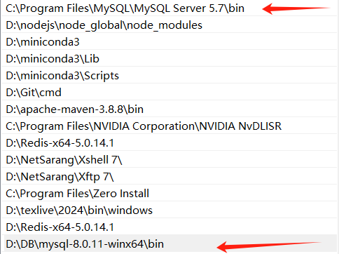
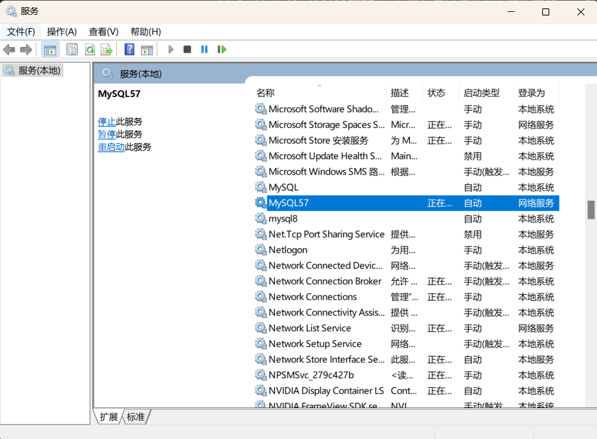
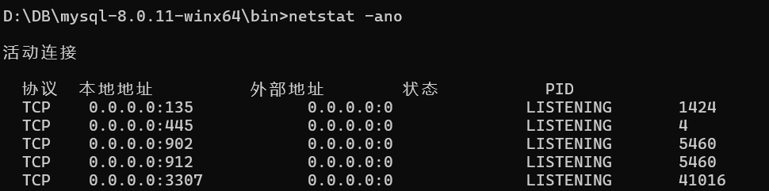

# 同时安装两个版本mysql遇到的服务配置问题

## 1.问题

当我参照[Win10安装两个不同版本MySQL数据库（一个5.7，一个8.0.17](https://blog.csdn.net/sinat_40770656/article/details/101027777)，在电脑内安装两个不同版本的mysql时，运行mysqld --initialize --console不生效，创建的mysql8服务不会加载指定my.ini文件。使用netstat -ano命令查看运行端口，发现mysql8服务端口3306在运行，端口3307没有运行。

## 2.解决

因为先前安装mysql5.7版本时，在环境变量中存在mysql5.7版本的环境变量：

需要应用mysql8的环境变量需要将mysql8的环境变量上移到mysql5.7的环境变量之上。

同时如果先前使用过mysql其他版本，大概率mysql的另一版本正在运行，需要停止其他版本的mysql服务。使用win + R，输入services.msc，打开服务管理器，找到正在运行的mysql服务，停止服务。

如果mysql8服务已经被创建，需要删除服务。运行win + R，输入sc query mysql8，找到mysql8服务的名称，使用sc delete mysql8删除服务。

重新创建mysql服务并启动，查看端口占用情况，发现mysql8服务端口3307已经运行。

### 参考

- [Win10安装两个不同版本MySQL数据库（一个5.7，一个8.0.17](https://blog.csdn.net/sinat_40770656/article/details/101027777)

