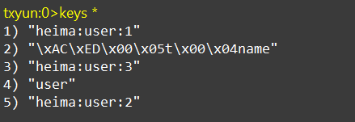
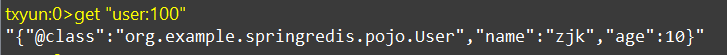
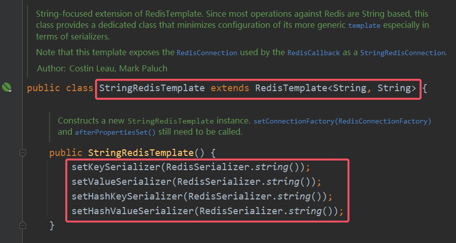
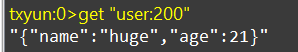
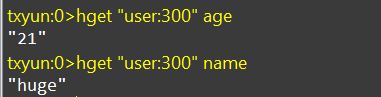

<!--
 * @Author: yeffky
 * @Date: 2026-02-01 15:57:12
 * @LastEditTime: 2026-02-08 13:09:53
-->

# Redis 基础篇

# 一、Redis 概述

## 1. 关系型数据库与 NoSQL数据库

关系型数据库：关系模型，数据以表格的形式存储，并且具有结构化的定义，SQL查询。

NoSQL数据库：非关系模型，数据以键值、列、Graph、文档的形式存储，并且没有固定的模式，非SQL查询。

## 2. Redis 简介

Redis 是一个开源的高性能键值对数据库，它支持多种数据结构，包括字符串、哈希、列表、集合、有序集合。

Redis 优点：

1. 性能极高 – Redis 能读的速度是 110000 次/s, 写的速度是 81000 次/s。
2. 丰富的数据类型 – Redis 支持五种数据类型，包括字符串、哈希、列表、集合、有序集合。
3. 原子性 – Redis 的所有操作都是原子性的，同时 Redis 还支持对几个操作全并后的原子性执行。

## 3. Redis 应用场景

Redis 适用于缓存、消息队列、排行榜、计数器等场景。

## 4. Redis 常用命令

Redis 常用命令包括：

1. SET key value – 设置键值对
2. GET key – 获取键值对的值
3. DEL key – 删除键值对
4. EXPIRE key seconds – 设置键值对的过期时间
5. TTL key – 获取键值对的剩余过期时间
6. INCR key – 自增键值对的值
7. DECR key – 自减键值对的值

## 5. Redis安装

Linux版本：CentOS 7.6， Redis版本：6.2.6.

**（1） 安装依赖**
Redis是基于C语言编写的，因此首先需要安装Redis所需要的gcc依赖：

```shell
sudo yum install -y gcc tcl
```

**（2）上传Redis安装包**
利用远程连接工具 FinalShell 上传安装包到 /usr/local/src 目录：

**（3）解压Redis安装包**
解压缩：

```shell
tar -zxvf redis-6.2.6.tar.gz
```

进入redis-6.2.6目录：

```shell
cd redis-6.2.6
```

运行编译命令：

```shell
make && make install
```

安装路径在/usr/local/bin目录下，目录默认配置到环境变量，可以直接使用。

* redis-cli：Redis客户端，用于连接Redis服务器，执行Redis命令。
* redis-server：Redis服务器，用于接收客户端连接，处理命令请求。
* redis-sentinel：Redis哨兵，用于实现Redis高可用。

## 6. Redis配置

Redis默认配置文件为redis.conf，位于Redis安装目录下。

**（1）配置Redis服务**

```shell
vim redis.conf

# 允许访问（监听）的地址，默认是127.0.0.1，会导致只能在本地访问。修改为0.0.0.0则可以在任意IP访问，生产环境不要设置为0.0.0.0
bind 0.0.0.0
# 守护进程，修改为yes后即可后台运行
daemonize yes
# 密码，设置后访问Redis必须输入密码
requirepass 123321
# 云服务器注意一定要设置密码！不然会被攻击成矿机，这里必须要设置密码才能远程访问。
# 监听的端口
port 6379
# 工作目录，默认是当前目录，也就是运行redis-server时的命令，日志、持久化等文件会保存在这个目录
dir .
# 数据库数量，设置为1，代表只使用1个库，默认有16个库，编号0~15
databases 1
# 设置redis能够使用的最大内存
maxmemory 512mb
# 日志文件，默认为空，不记录日志。可以指定日志文件名（写到/var/log/redis.log也比较好）
logfile "redis.log"
```

启动Redis服务：

```shell
redis-server redis.conf
```

启动redis-cli客户端：

```shell
redis-cli [options] [command [arg [arg...]]]
```

常见options：

- -h host：指定Redis服务器的主机名或IP地址。
- -p port：指定Redis服务器的端口号。
- -a password：指定Redis服务器的密码。


测试连通性：

```shell
ping
```

如果返回PONG，则说明Redis服务正常运行。

# 二、Redis 常见命令

## 1. Redis数据结构

key: 通常为字符串类型，用于唯一标识一个值。

value: 存储在key-value对中的数据，可以是字符串、列表、集合、散列、有序集合等。

Redis支持五种数据类型：

1. 字符串类型String：用于存储字符串值，value最多可以是512M。
2. 散列类型Hash：用于存储键值对，value可以是字符串、列表、集合、散列、有序集合等。
3. 列表类型List：用于存储多个字符串值，按照插入顺序排序。
4. 集合类型Set：用于存储多个字符串值，无序且不重复。
5. 有序集合类型Sorted Set：用于存储多个字符串值，每个值都关联一个分数，按照分数排序。

Redis还支持三种特殊类型：

1. GEO：用于存储地理位置信息。
2. HyperLogLog：用于存储大量的唯一元素，并提供近似的基数统计。
3. Bitmap：用于存储二进制位图，可以用于统计活跃用户、统计每天点击量等。

## 2. Redis通用命令

通用指令是部分数据类型的，都可以使用的指令，常见的有：


- KEYS pattern：查找符合给定模式的key。
- EXISTS key：判断key是否存在。
- DEL key：删除key。
- EXPIRE key seconds：设置key的过期时间。
- TTL key：获取key的剩余过期时间。过期了会显示为-2。

## 3. Redis字符串类型

String类型的常见命令：

- SET key value：设置key-value对。
- MSET key1 value1 [key2 value2]：批量设置key-value对。
- GET key：获取key的值。
- INCR key：自增key的值。
- DECR key：自减key的值。
- TYPE key：获取key的类型。
- SETNX key value：设置key-value对，如果key不存在则设置成功，否则设置失败。
- SETEX key seconds value：设置key-value对，并设置过期时间。

## 4. Redis散列类型

Hash类型的常见命令：

- HSET key field value：设置散列中field的值。    
- HGET key field：获取散列中field的值。
- HMSET key field1 value1 [field2 value2]：批量设置散列中多个field的值。
- HMGET key field1 [field2]：批量获取散列中多个field的值。
- HDEL key field：删除散列中field。
- HGETALL key：获取散列中所有field和value。
- HKEYS key：获取散列中所有field。
- HINCRBY key field increment：自增散列中field的值。
- HSETNX key field value：设置散列中field的值，如果field不存在则设置成功，否则设置失败。

## 5. Redis列表类型

Redis中的List类型和Java中的LinkedList类似，可以从两端插入和删除元素，并且可以按照索引来访问元素。

常用来存储一个有序数据，例如：朋友圈点赞列表，评论列表等。

List类型的常见命令：

- LPUSH key value：在列表头部插入一个元素。
- RPUSH key value：在列表尾部插入一个元素。
- LPOP key：删除并返回列表头部元素。
- RPOP key：删除并返回列表尾部元素。
- LLEN key：获取列表长度。
- LRANGE key start stop：获取列表中指定范围的元素。
- LINDEX key index：获取列表中指定索引的元素。
- BLPOP key1 [key2] timeout：阻塞式获取列表头部元素，直到超时或有元素可获取。

## 6. Redis集合类型

Redis中的Set类型和Java中的HashSet类似，不允许重复元素，并且元素无序。

常用来存储一些不重复的数据，例如：用户的黑名单，商品的收藏夹等。

Set类型的常见命令：

- SADD key member：向集合添加元素。
- SREM key member：从集合删除元素。
- SCARD key：获取集合元素个数。
- SMEMBERS key：获取集合所有元素。
- SISMEMBER key member：判断元素是否在集合中。
- SINTER key1 [key2]：求多个集合的交集。
- SUNION key1 [key2]：求多个集合的并集。
- SDIFF key1 [key2]：求多个集合的差集。

## 7. Redis有序集合类型

Redis中的Sorted Set类型和Java中的TreeSet类似，可以按照分数排序，并且分数可以重复。

常用来存储一些有序的数据，例如：排行榜，商品的评分等。

Sorted Set类型的常见命令：

- ZADD key score1 member1 [score2 member2]：向有序集合添加元素。
- ZREM key member：从有序集合删除元素。
- ZCARD key：获取有序集合元素个数。
- ZSCORE key member：获取有序集合中元素的分数。
- ZRANK key member：获取有序集合中元素的排名。
- ZRANGE key start stop [WITHSCORES]：获取有序集合中指定范围的元素。
- ZRANGEBYSCORE key min max [WITHSCORES]：获取有序集合中指定分数范围的元素。
- ZCOUNT key min max：获取有序集合中指定分数范围的元素个数。
- ZDIFF、ZINTER、ZUNION：求多个有序集合的差集、交集、并集。

# 三、Redis的Java客户端

Redis的Java客户端有Jedis、Lettuce、Redisson等。

- Jedis：Jedis是一个开源的Java客户端，基于Redis协议实现。但是Jedis实例线程不安全，不建议多线程使用。多线程环境需要使用JedisPool为每一个线程创建一个Jedis实例。

- Lettuce：Lettuce是一个开源的Java客户端，基于Netty实现。Lettuce实例线程安全，可以多线程使用。支持同步、异步和响应式变成。支持Redis的哨兵模式、集群模式和管道模式。

- Redisson：Redisson是一个开源的Java客户端，基于Netty实现。Redisson实例线程安全，可以多线程使用。实现了分布式、可伸缩的Java数据结构，例如Map、Queue等，支持跨进程同步：Lock、Semaphore等待，适合实现特殊的分布式场景。

## 1.Spring Data Redis

Spring Data Redis是一个开源的Java客户端，基于Redis协议实现。Spring Data Redis提供了对Redis的封装，使得Redis的使用更加方便。

- 提供了对不同Redis客户端的整合（Lettuce、Jedis等）
- 提供了RedisTemplate统一API，用于操作Redis
- 支持Redis的发布订阅模式
- 支持Redis哨兵模式和集群模式
- 支持基于Lettuce的响应式编程
- 支持基于JDK、JSON、字符串，Spring对象的数据序列化及反序列化
- 支持基于Redis的JDKCollection实现

### （1）快速入门

SpringBoot已经提供了对SpringDataRedis的支持，使用非常简单。

- 导入pom依赖

```xml
<dependencies>
  <!-- spring-data-redis -->
  <dependency>
    <groupId>org.springframework.boot</groupId>
    <artifactId>spring-boot-starter-data-redis</artifactId>
  </dependency>
  <!-- commons-pool2连接池 -->
  <dependency>
    <groupId>org.apache.commons</groupId>
    <artifactId>commons-pool2</artifactId>
  </dependency>
  <!-- Jackson -->
  <dependency>
    <groupId>com.fasterxml.jackson.core</groupId>
    <artifactId>jackson-databind</artifactId>
  </dependency>
  <dependency>
    <groupId>org.projectlombok</groupId>
    <artifactId>lombok</artifactId>
    <optional>true</optional>
  </dependency>
  <dependency>
    <groupId>org.springframework.boot</groupId>
    <artifactId>spring-boot-starter-test</artifactId>
    <scope>test</scope>
  </dependency>
</dependencies>

<build>
  <plugins>
    <plugin>
      <groupId>org.springframework.boot</groupId>
      <artifactId>spring-boot-maven-plugin</artifactId>
      <configuration>
        <excludes>
          <exclude>
            <groupId>org.projectlombok</groupId>
            <artifactId>lombok</artifactId>
          </exclude>
        </excludes>
      </configuration>
    </plugin>
  </plugins>
</build>
```

- yaml配置文件

```yaml
# spring-data-redis
spring:
  data:
    redis:
      host: 192.168.8.100
      port: 6379
      password: 123321
      lettuce:
        pool: # lettuce的pool必须手动配置才会生效
          max-active: 8 # 最大连接
          max-idle: 8 # 最大空闲连接
          min-idle: 0 # 最小空闲连接
          max-wait: 1000ms  # 连接等待时间
```

- 注入RedisTemplate

```java
@SpringBootTest
class SpringDataRedisTests {
    @Autowired
    private RedisTemplate<String, Object> redisTemplate;    // 注入RedisTemplate

    @Test
    void testString() {
        // 写入一条String数据
        redisTemplate.opsForValue().set("name", "虎哥");
        // 获取String数据
        Object name = redisTemplate.opsForValue().get("name");
        System.out.println("name = " + name);
    }
}
```

### （2）自定义序列化

RedisTemplate可以接收任意Object，但是默认情况下，RedisTemplate只能将Object序列化为字节数组，不能将Object序列化为JSON字符串。

RedisTemplate默认使用的是**JDK的序列化（JdkSerializationRedisSerializer）**方式，JDK序列化底层使用的是**ObjectOutputStream**将**Java对象转为字节**后写入Redis。在redis库中，key被序列化后保存如下图所示：



JDK的序列化方式可读性低、内存占用大，我们可以自定义序列化方式。

创建一个RedisConfig序列化配置类，自定义RedisTemplate的序列化方式。

```java
@Configuration
public class RedisConfig {
    @Bean
    public RedisTemplate<String, Object> redisTemplate(RedisConnectionFactory redisConnectionFactory) {
        RedisTemplate<String, Object> redisTemplate = new RedisTemplate<>();
        redisTemplate.setConnectionFactory(redisConnectionFactory);
        GenericJackson2JsonRedisSerializer jsonRedisSerializer = new GenericJackson2JsonRedisSerializer();
        redisTemplate.setKeySerializer(jsonRedisSerializer);
        redisTemplate.setValueSerializer(jsonRedisSerializer);
        redisTemplate.setHashKeySerializer(jsonRedisSerializer);
        redisTemplate.setHashValueSerializer(jsonRedisSerializer);
        return redisTemplate;
    }
}
```

这里采用了JSON序列化来代替默认的JDK序列化方式。最终结果如图:



整体可读性有了很大提升，并且能将Java对象自动的序列化为JSON字符串，并且查询时能自动把JSON反序列化为Java对象。不过，其中记录了序列化时对应的class全类名，目的是为了查询时实现自动反序列化。这会带来额外的内存开销。

### （3）StringRedisTemplate

为了在反序列化时知道对象的类型，JSON序列化器会将类的class类型写入json结果中，存入Redis，会带来额外的内存开销。

为了减少内存的消耗，我们可以采用**手动序列化**的方式，换句话说，就是不借助默认的序列化器，而是我们**自己来控制序列化的动作**，同时，我们只采用**String的序列化器**，这样在存储value时，我们就不需要在内存中就不用多存储数据，从而节约我们的内存空间。

这种用法比较普遍，因此SpringDataRedis就提供了RedisTemplate的子类：**StringRedisTemplate**，它的key和value的序列化方式默认就是String方式。



当我们写入原先的User对象时，需要将其映射为String类型写入Redis，然后在查询时，获取到String，再将String反序列化为User对象。

```java
@SpringBootTest
class SpringRedisTemplateTests {
    @Autowired
    private StringRedisTemplate stringRedisTemplate;    // 注入StringRedisTemplate

    @Test
    void testString() {
        // 写入一条String数据
        stringRedisTemplate.opsForValue().set("name", "虎哥");
        // 获取String数据
        Object name = stringRedisTemplate.opsForValue().get("name");
        System.out.println("name = " + name);
    }

    private static final ObjectMapper mapper = new ObjectMapper();

    @Test
    void testSaveUser() throws JsonProcessingException {
        // 创建对象
        User u = new User("虎哥", 21);
        // 手动序列化
        String json = mapper.writeValueAsString(u);
        // 写入User对象（将Java对象序列化为json）
        stringRedisTemplate.opsForValue().set("user:200", json);
        // 获取数据（将json反序列化为Java对象）
        String jsonUserStr = stringRedisTemplate.opsForValue().get("user:200");
        // 手动反序列化
        User user = mapper.readValue(jsonUserStr, User.class);
        System.out.println("user = " + user);
    }
}
```

原先的class对应数据已经不存在，节约了内存空间



- Hash操作

```java
@Test
void testHash2() {
    stringRedisTemplate.opsForHash().put("user:300", "name", "huge");
    stringRedisTemplate.opsForHash().put("user:300", "age", "21");
    String name = (String)stringRedisTemplate.opsForHash().get("user:300", "name");
    System.out.println("name = " + name);
    Map<Object, Object> map = (Map<Object, Object>)stringRedisTemplate.opsForHash().entries("user:300");
    System.out.println("map = " + map);
}
```

结果：


