<!--
 * @Author: yeffky
 * @Date: 2026-02-08 13:17:10
 * @LastEditTime: 2026-02-26 12:26:23
-->

# Redis实战篇

本文章记录在学习Redis实战篇中遇到的一些难点和知识点。

## 1.ThreadLocal

ThreadLocal是一个线程域对象，它为每个线程提供一个独立的变量副本，可以解决线程安全问题。

ThreadLocal为当前用户线程开辟一块独立的内存空间，保存信息到对应的ThreadLocalMap，保证每个线程互相不干扰。在ThreadLocal的源码中，无论是它的put方法还是get方法， 都是先从获得当前用户的线程，然后从线程中取出线程的成员变量map，只要线程不一样，map就不一样，所以可以通过这种方式来做到线程隔离。

将用户信息存入ThreadLocal，可以实现用户信息的隔离，防止不同用户之间信息的干扰。避免频繁向session中存取数据，减少session访问开销。

## 2.敏感信息处理

服务端返回前端的数据应该对应UserVo，而UserVo中不应该包含敏感信息，比如密码、手机号码等。

这里涉及到DTO、DO，VO、PO、BO等概念，DTO（Data Transfer Object）是数据传输对象，用于服务端向客户端传输数据，不包含敏感信息。DO（Data Object）是数据对象，用于存储数据，不包含业务逻辑。VO（View Object）是视图对象，用于展示数据，不包含业务逻辑，不包含敏感信息。PO（Persistent Object）是持久化对象，用于持久化数据，不包含业务逻辑。BO（Business Object）是业务对象，用于业务逻辑处理，不包含数据。

## 3.session共享问题

session共享问题是指多台Tomcat不共享session的问题，当请求切换到不同Tomcat时导致数据丢失问题。例如验证码发到其中一台Tomcat，而用户登录请求如果被负载均衡到另一台Tomcat，则验证码失效。

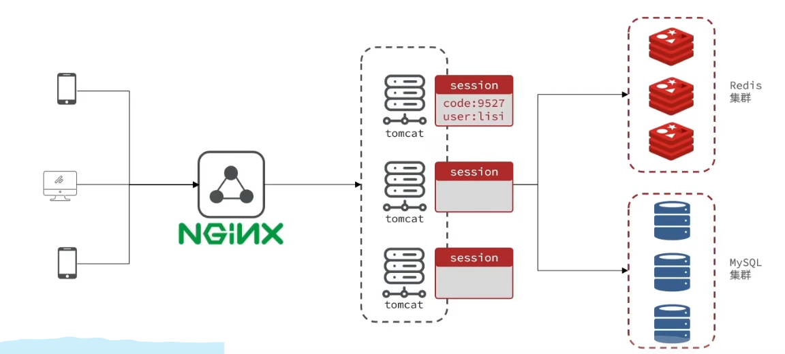

解决方法：

使用Redis存储session，将验证码以及用户登录之类的session信息存储到Redis中，用户通过查询redis获取session信息，避免Tomcat之间session共享问题。

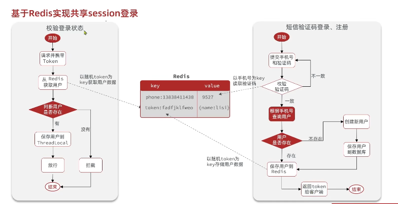

## 4.拦截器问题（Token刷新）

在访问一些不需要登录鉴权的页面时，如果只配置了登录拦截器，则不会刷新Token，导致用户在访问这些页面时，Token时长没有刷新。因此正确的逻辑是，无论访问什么页面都进行token刷新，并保存用户到ThreadLocal中（无论用户是否为空），并且放行所有请求。然后在登录拦截器中判断ThreadLocal中的用户是否为空，如果不为空则放行需要登录鉴权的请求。

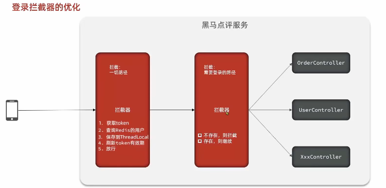

## 5.缓存更新策略

|          |                                      内存淘汰                                      |                         超时剔除                         |                主动更新                |
| :------: | :---------------------------------------------------------------------------------: | :-------------------------------------------------------: | :------------------------------------: |
|   说明   | 不用主动维护，利用Redis内存淘汰机制，内存不足时自动淘汰部分数据，下次查询时更新缓存 | 给缓存数据添加TTL，到期后自动删除缓存，下次查询时更新缓存 | 编写业务逻辑，修改数据库的同时更新缓存 |
|  一致性  |                              差，内存充足时更新频率低                              |                           一般                           |                   好                   |
| 维护成本 |                                         无                                         |                            低                            |                   高                   |

业务场景：

- 低一致性需求：使用内存淘汰机制，例如店铺类型查询缓存
- 高一致性需求：主动更新，以超时剔除作为兜底，例如店铺详情查询的缓存

主动更新策略：

(1) Cache Aside Pattern：由缓存的调用者，在更新数据库时同时更新缓存。

(2) Read/Write-through Pattern：缓存和数据库整合为一个服务，由服务来维护一致性。调用者调用该服务，无需关心一致性问题。

(3) Write-behind Pattern：调用者只操作缓存，其他线程异步将缓存数据持久化到数据库，保证最终一致。（宕机数据丢失）

操作缓存和数据库的问题：

- 删除缓存还是更新缓存？

  - 更新缓存：每次更新数据库都更新缓存，无效写操作多
  - 删除缓存：更新数据库让缓存失效，查询时再更新
- 如何保证缓存和数据库的操作同时成功或失败？

  - 事务机制：事务机制保证缓存和数据库操作同时成功或失败
  - 分布式系统，利用TCC（Try-Confirm-Cancel）模式，保证缓存和数据库操作同时成功或失败
- 先更新数据库还是先更新缓存？

  - 先更新缓存：双线程不加锁的情况，可能导致删除后缓存先被更新，数据库后被更新，导致数据不一致。原因在于数据库的更新时间比缓存的更新时间长，导致缓存在另一个线程先被更新。
    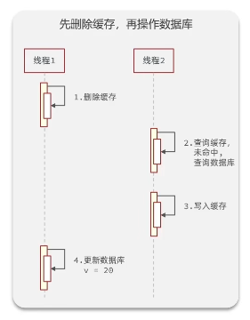
  - 先更新数据库：双线程不加锁的情况，可能导致查询缓存未命中进行查数据库操作，而另一个线程开始更新数据库和删缓存操作，而在删除缓存后原线程才查询数据库结束并写入缓存，导致缓存和数据库数据不一致。（可能性较低，因为查询数据库后写入缓存的时间间隔较短，突然插入另一个线程操作间隔小于这个时间间隔的可能性低）
    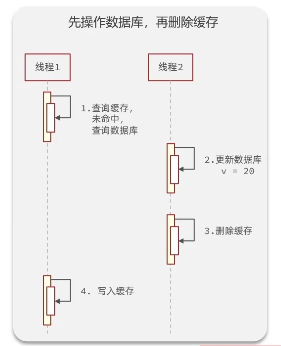

## 6.缓存穿透

缓存穿透是指客户端请求的数据在缓存中和数据库中都不存在，导致请求直接到数据库，导致数据库压力过大。（编造不存在的数据）

解决方案：

- 缓存空对象：缓存空对象，当缓存和数据库都不存在时，在redis中缓存一个空对象，避免频繁查询数据库。
  - 优点：实现简单，维护方便
  - 缺点：
    - 额外的内存消耗
    - 可能导致短期不一致
      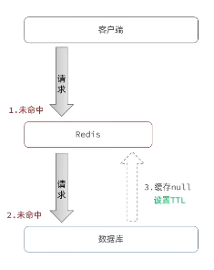
- 布隆过滤器：布隆过滤器是一种数据结构，它利用位数组和哈希函数对数据进行快速判断，可以用于检索一个元素是否在一个集合中。布隆过滤器可以用于缓存穿透问题。
  - 优点：内存占用小，没有多余key
  - 缺点：存在假阳性，存在误判
    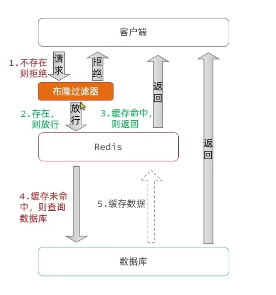
- 增强id复杂度，避免被猜测id规律
- 基础格式校验
- 加强用户权限校验
- 限流降级

## 7.缓存雪崩

缓存雪崩是指缓存服务器重启或者大量缓存集中失效，导致大量请求直接到数据库，导致数据库压力过大。

解决方案：

- 缓存失效时间设置随机值：缓存失效时间设置随机值，避免缓存集中失效。
- 利用Redis集群提高服务可用性
- 限流降级
- 给业务添加多级缓存

## 8.缓存击穿

缓存击穿是指缓存中有热点数据，一个被高并发访问并且缓存重建业务复杂的key突然失效，导致大量请求直接到数据库，导致数据库压力过大。

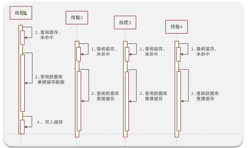

解决方案：

- 互斥锁：只能有一个线程查询数据库重建缓存，其他线程等待。
  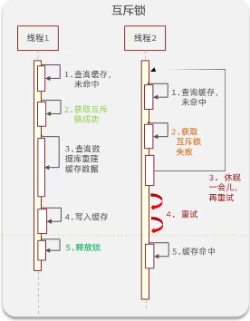
- 逻辑过期：始终存在于缓存，设置缓存过期时间，开启新线程进行缓存重建。其他线程查询缓存，发现逻辑时间过期，如果此时互斥锁获取失败，则直接返回过期数据。
  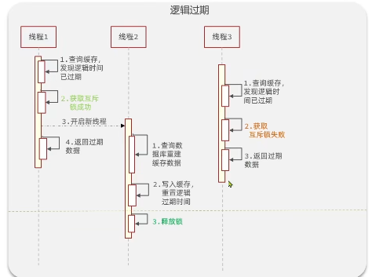

两种方案的优缺点对比：

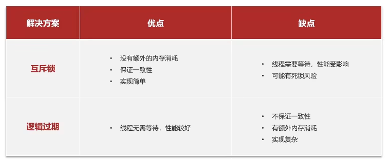

## 9.订单表不使用自增id

订单表如果使用自增id存在一些问题，比如：

- id的规律太明显
- 受单表数据量的限制

因此，需要采用全局ID生成器，保证唯一性、高性能、安全性、递增性、高可用。通常使用UUID、Redis自增、snowflake算法、数据库自增等。

Redis自增ID策略：

- 利用Redis的incr命令，每次生成一个ID，并将其存入Redis的某个key中。可以设置为每天一个key，方便统计订单量。

ID组成部分：

- 符号位：1bit，固定为0
- 时间戳：31bit，精确到秒，可以使用秒级时间戳
- 序列号：32bit，秒内的计数器，支持每秒产生2^32个ID

## 10.CountDownLatch

CountDownLatch是java并发编程中提供的一种同步辅助类，它允许一个或多个线程等待其他线程完成各自的工作后再继续运行。

用法：

- 创建一个CountDownLatch对象，并指定计数值，当一个任务线程执行完毕后，调用countDown()方法让计数器减1，当计数器的值为0时，在CountDownLatch上await()方法的线程才会被唤醒。

示例代码：

```java
@Test
void testIdWork() throws InterruptedException {
    CountDownLatch countDownLatch = new CountDownLatch(300);
    Runnable task = () -> {
        for (int i = 0; i < 100; i++) {
            long id = redisIdWorker.nextId("order");
            System.out.println("id:" + id);
        }
        countDownLatch.countDown();
    };
    long begin = System.currentTimeMillis();
    for (int i = 0; i < 300; i++) {
        es.submit(task);
    }
    countDownLatch.await();
    long end = System.currentTimeMillis();
    System.out.println("time=" + (end - begin));
}
```

## 11.优惠券秒杀的下单功能

下单时需要判断两点：

- 秒杀是否开始或结束，如果秒杀未开始，则无法下单
- 库存是否充足，如果库存不足，则无法下单

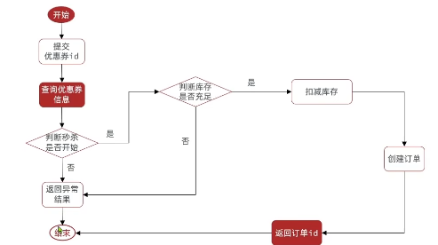

## 12.超卖问题

超卖问题是典型的多线程安全问题，通常发生在秒杀业务中。指的是多个用户同时下单，由于多线程查询库存操作先于扣减库存发生，导致库存不足的情况下，库存依旧发生了更新操作，导致库存超卖，库存余额为负数。

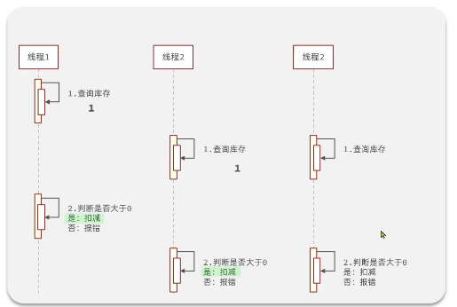

解决方案：

- 悲观锁：认为线程安全问题一定会发生，因此在操作数据之前获取锁，确保线程串行执行。
- 乐观锁：认为线程安全问题不一定会发生，因此在操作数据之前不获取锁，只有在更新数据时判断有没有其他线程对数据进行了修改。如果没有修改则认为安全，如果有修改则认为不安全，需要重试。

  - 版本号法：为每个数据增加一个版本号，每次更新数据时，对版本号进行更新，如果版本号不一致则认为数据已经被修改，需要重试或不执行。
    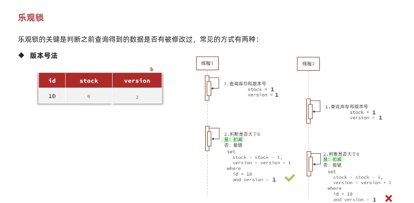
  - CAS法：使用CAS（Compare And Set）指令，通过CAS指令更新数据，在查询库存后记录数据，并且在判断库存是否充足后更新数据时，强行设置库存等于先前记录的库存，如果库存数据不等于先前记录的库存，则说明数据已经被修改，需要重试或不执行。
    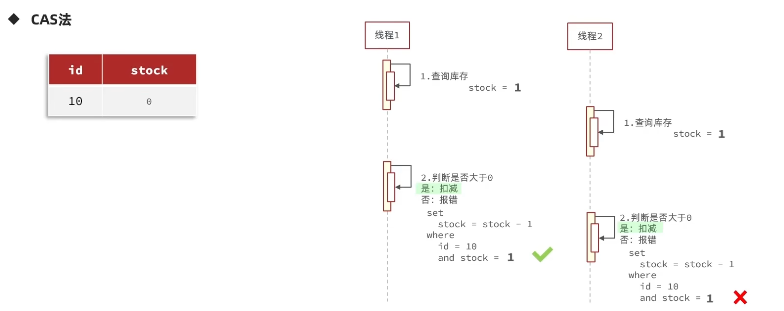

乐观锁缺点：成功率太低，如果多线程并发更新数据，其中一个线程更新成功后，其他线程比对的都是更新后的数据和初始查询到的数据，会导致大量线程更新失败，降低系统性能。（可以放宽条件，只需要限制库存大于0即可）

共同缺点：都需要访问数据库，在高并发场景下，会导致数据库压力过大。

## 13.一人一单问题

一人一单问题是指，同一用户对同一秒杀商品只能下单一次。

解决方案：

- 对userId进行加synchronized锁，保证同一用户只能对同一秒杀商品下单一次。

示例代码：

```java
@Transactional(rollbackFor = Exception.class)
public synchronized Result createVoucherOrder(Long voucherId) {
    // 5. 一人一单
    Long userId = UserHolder.getUser().getId();
    synchronized (userId.toString().intern()) {
        // 5.1.查询订单
        int count = query().eq("user_id", userId).eq("voucher_id", voucherId).count();

        // 5.2.判断是否存在
        if (count > 0) {
            return Result.fail("用户已经购买过一次!");
        }

        // 6.扣减库存
        boolean success = seckillVoucherService.update().setSql("stock = stock - 1")
                .eq("voucher_id", voucherId)
//                .eq("stock", voucher.getStock()) // where stock = ?
                .gt("stock", 0) // where stock > 0
                .update();

        if (!success) {
            return Result.fail("库存不足！");
        }

        // 6.创建订单
        VoucherOrder voucherOrder = new VoucherOrder();
        // 6.1.订单id
        long orderId = redisIdWorker.nextId("order");
        voucherOrder.setId(orderId);
        // 6.2.用户id
        voucherOrder.setUserId(UserHolder.getUser().getId());
        // 6.3.代金券id
        voucherOrder.setVoucherId(voucherId);
        save(voucherOrder);
        // 7.返回id
        return Result.ok(orderId);
    }
}
```

但以上代码锁粒度太小，当返回id后锁被释放，但数据库可能执行还没有结束，事务还未提交。此时其他线程可能可以获取锁执行新事务，导致订单还未创建其他线程就进行查询。

解决方案：
应该扩大锁粒度，对整个事务加锁。

```java
Long userId = UserHolder.getUser().getId();
synchronized (userId.toString().intern()) {
    return createVoucherOrder(voucherId);
}
```

此时又出现了新问题——事务失效。因为外部方法没有加事务注解，只对createVoucherOrder方法加事务。此时，调用createVoucherOrder方法实际上是当前对象（目标对象）进行调用，而非动态代理对象调用。因此需要获取到当前的代理对象进行调用。

示例代码：

```java
@Service
public class VoucherOrderServiceImpl extends ServiceImpl<VoucherOrderMapper, VoucherOrder> implements IVoucherOrderService {

    @Resource
    private ISeckillVoucherService seckillVoucherService;

    @Resource
    private RedisIdWorker redisIdWorker;

    @Override
    public Result seckillVoucher(Long voucherId) {
        // 1.查询优惠券
        SeckillVoucher voucher = seckillVoucherService.getById(voucherId);

        // 2.判断秒杀是否开始
        if(voucher.getBeginTime().isAfter(LocalDateTime.now())) {
            return Result.fail("秒杀尚未开始!");
        }
        // 3.判断秒杀是否结束
        if(voucher.getEndTime().isBefore(LocalDateTime.now())) {
            return Result.fail("秒杀已经结束!");
        }
        // 4.判断库存是否充足
        if (voucher.getStock() < 1) {
            // 库存不足
            return Result.fail("库存不足");
        }
        Long userId = UserHolder.getUser().getId();
        synchronized (userId.toString().intern()) {
            // 获取代理对象（事务）
            IVoucherOrderService proxy = (IVoucherOrderService) AopContext.currentProxy();
            return proxy.createVoucherOrder(voucherId);
        }
    }

    @Transactional(rollbackFor = Exception.class)
    public Result createVoucherOrder(Long voucherId) {
        Long userId = UserHolder.getUser().getId();

        // 5. 一人一单
        synchronized (userId.toString().intern()) {
            // 5.1.查询订单
            int count = query().eq("user_id", userId).eq("voucher_id", voucherId).count();

            // 5.2.判断是否存在
            if (count > 0) {
                return Result.fail("用户已经购买过一次!");
            }

            // 6.扣减库存
            boolean success = seckillVoucherService.update().setSql("stock = stock - 1")
                    .eq("voucher_id", voucherId)
//                .eq("stock", voucher.getStock()) // where stock = ?
                    .gt("stock", 0) // where stock > 0
                    .update();

            if (!success) {
                return Result.fail("库存不足！");
            }

            // 6.创建订单
            VoucherOrder voucherOrder = new VoucherOrder();
            // 6.1.订单id
            long orderId = redisIdWorker.nextId("order");
            voucherOrder.setId(orderId);
            // 6.2.用户id
            voucherOrder.setUserId(UserHolder.getUser().getId());
            // 6.3.代金券id
            voucherOrder.setVoucherId(voucherId);
            save(voucherOrder);
            // 7.返回id
            return Result.ok(orderId);
        }
    }
}
```

## 14.集群模式下线程并发安全问题

以上一人一单问题的解决是基于单机服务下的方案，在集群模式下，由于负载均衡的原因，同一用户的多次请求可能被分配到不同的服务器上，因此synchronized锁的作用就不再适用。同时，超卖问题也可以通过以下提出的解决方案来解决，使用分布式锁来锁住库存扣减操作。

解决方案：

分布式锁：满足分布式系统或集群模式下多进程可见并互斥的锁。满足分布式锁的方式有很多，常见的有三种：

|        | MySQL                     | Redis                   | Zookeeper                        |
| ------ | ------------------------- | ----------------------- | -------------------------------- |
| 互斥   | 利用mysql本身的互斥锁机制 | 利用setnx这样的互斥命令 | 利用节点的唯一性和有序性实现互斥 |
| 高可用 | 好                        | 好                      | 好                               |
| 高性能 | 一般                      | 好                      | 一般                             |
| 安全性 | 断开连接，自动释放锁      | 利用锁超时时间到期释放  | 临时节点，断开连接自动释放       |

## 15.基于Redis的分布式锁

实现分布式锁时需要实现的两个基本方法：

- 获取锁：
  -互斥：确保只有一个线程获取锁

  ```shell
  setnx lock_name value
  ```

  - 非阻塞：尝试一次，成功返回true，失败返回false
- 释放锁：

  - 手动释放

  ```shell
  del lock_name
  ```

  - 超时释放：获取锁时设置超时时间

  ```shell
  set lock_name value ex seconds nx
  ```

示例代码：

```java
// distributed lock
public class SimpleRedisLock implements ILock {

    private String name;
    private StringRedisTemplate stringRedisTemplate;
    private static final String KEY_PREFIX = "lock:";

    public SimpleRedisLock(StringRedisTemplate stringRedisTemplate, String name) {
        this.stringRedisTemplate = stringRedisTemplate;
        this.name = name;
    }

    @Override
    public boolean tryLock(long timeoutSec) {
        long threadId = Thread.currentThread().getId();
        Boolean success = stringRedisTemplate.opsForValue().setIfAbsent(KEY_PREFIX + name, threadId + "", timeoutSec, TimeUnit.SECONDS);
        return Boolean.TRUE.equals(success);
    }

    @Override
    public void unlock() {
        // 释放锁
        stringRedisTemplate.delete(KEY_PREFIX + name);
    }
}

// usage
Long userId = UserHolder.getUser().getId();
// 创建锁对象
SimpleRedisLock lock = new SimpleRedisLock(stringRedisTemplate, "order:" + userId);
// 获取锁
boolean isLock = lock.tryLock(1200);
// 判断是否获取锁成功
if (!isLock) {
    // 获取锁失败，返回错误或重试
    return Result.fail("不允许重复下单");
}
// 获取代理对象（事务）
try {
    IVoucherOrderService proxy = (IVoucherOrderService) AopContext.currentProxy();
    return proxy.createVoucherOrder(voucherId);
} catch (IllegalStateException e) {
    throw new RuntimeException(e);
} finally {
    // 释放锁
    lock.unlock();
}
```

但是以上代码存在**锁误删**问题：如果线程1超时释放锁，然而此时线程中的业务尚未完成。这会导致线程2获取锁成功，开始执行业务。同时线程1业务完成后又会去释放锁，此时线程1释放的是线程2获取到的锁。

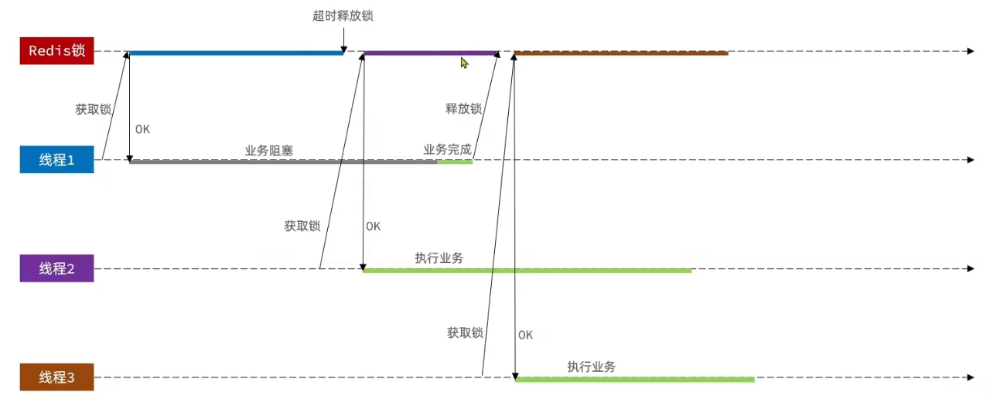

解决方案：

设置锁的value为线程标识（可以使用UUID），释放锁时，判断value是否为当前线程标识，如果是，则释放锁。

示例代码：

```java
// 业务名称
private String name;
private StringRedisTemplate stringRedisTemplate;
private static final String KEY_PREFIX = "lock:";
public static final String ID_PREFIX = UUID.randomUUID().toString(true) + "-";

public SimpleRedisLock(StringRedisTemplate stringRedisTemplate, String name) {
    this.stringRedisTemplate = stringRedisTemplate;
    this.name = name;
}

@Override
public boolean tryLock(long timeoutSec) {
    String threadId = ID_PREFIX + Thread.currentThread().getId();
    Boolean success = stringRedisTemplate.opsForValue().setIfAbsent(KEY_PREFIX + name, threadId, timeoutSec, TimeUnit.SECONDS);
    return Boolean.TRUE.equals(success);
}

@Override
public void unlock() {
    // 获取线程标识
    String threadId = ID_PREFIX + Thread.currentThread().getId();
    String id = stringRedisTemplate.opsForValue().get(KEY_PREFIX + name);
    // 判断标识是否一致
    if (threadId.equals(id)) {
        // 释放锁
        stringRedisTemplate.delete(KEY_PREFIX + name);
    }
}
```

此时仍存在**分布式锁原子性**问题，在判断锁标识后，线程会进行锁的释放，此时由于JVM的FullGC机制，线程可能会发生阻塞，导致锁提前超时释放锁。此时其他线程获取锁成功并开始执行业务，原先线程经过阻塞后正常进行释放锁操作，此时释放了其他线程获取到的锁。

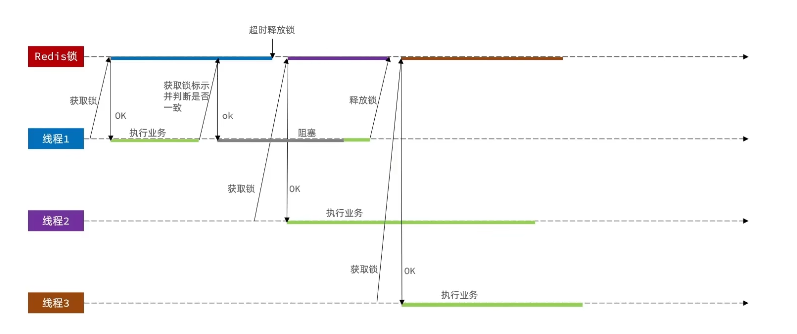

解决方案：

采用Redis的Lua脚本来实现原子性的释放锁操作。

## 16.Redis的Lua脚本

Lua脚本：

```lua
if (redis.call('get', KEYS[1]) == ARGV[1]) then
    return redis.call('del', KEYS[1])
end
return 0
```

业务代码：

```java
@Override
public void unlock() {
    // 调用lua脚本
    stringRedisTemplate.execute(
            UNLOCK_SCRIPT,
            Collections.singletonList(KEY_PREFIX + name),
            ID_PREFIX + Thread.currentThread().getId()
    );
  
}
```

## 17.Redisson

基于setnx实现的分布式锁存在以下问题：

- 不可重入：同一个线程无法多次获取同一把锁
- 不可重试：获取锁失败时直接返回false，无法重试
- 超时释放：锁超时释放虽然可以避免死锁，但如果业务执行耗时较长，也会导致锁释放，存在安全隐患
- 主从一致性：如果redis提供了主从集群，同步存在延迟，当主宕机时，如果从并同步主中的锁数据，则会出现锁实现

Redisson是一个在redis基础上实现的Java驻内存数据网格（In-Memory Data Grid）客户端，提供了一系列分布式的Java常用对象，还提供了许多分布式服务，其中包含了各种分布式锁的实现。

示例代码：

配置类：

```java
@Configuration
public class RedissonConfig {

    @Bean
    public RedissonClient redissonClient() {
        Config config = new Config();
        config.useSingleServer().setAddress("redis://159.75.221.88:6390");
        // 创建RedissonClient对象
        return Redisson.create(config);
    }
}
```

业务代码：

```java
RLock lock = redissonClient.getLock("lock:order:" + userId);
// 获取锁
boolean isLock = lock.tryLock();
// 判断是否获取锁成功
if (!isLock) {
    // 获取锁失败，返回错误或重试
    return Result.fail("不允许重复下单");
}
// 获取代理对象（事务）
try {
    IVoucherOrderService proxy = (IVoucherOrderService) AopContext.currentProxy();
    return proxy.createVoucherOrder(voucherId);
} catch (IllegalStateException e) {
    throw new RuntimeException(e);
} finally {
    // 释放锁
    lock.unlock();
}
```

### 17.1.Redisson可重入锁原理

通过对锁计数来实现可重入锁。在首次获取锁时判断锁是否存在，如果存在，则判断锁标识是否是自己，是的话则锁计数+1，不是则锁获取失败。如果锁不存在，则获取锁，并设置锁标识为当前线程标识，并设置锁有效期。

执行业务后，释放锁时，判断锁标识是否是自己，是的话则锁计数-1并判断是否为0，如果为0则释放锁，如果不是则重置锁有效期。如果当前锁不是自己的，则锁已经被释放。

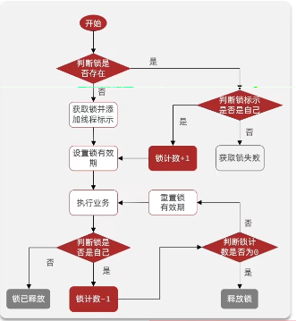

具体实现：

- 获取锁的Lua脚本：

```lua
local key = KEYS[1];
local threadId = ARGV[1];
local releaseTime = ARGV[2];

if(redis.call("exists", key) == 0) then
    -- 锁不存在，获取锁
    redis.call('hset', key, threadId, '1');
    -- 设置锁有效期
    redis.call('expire', key, releaseTime);
    return 1; -- 获取锁成功
end;

-- 锁存在，判断锁标识是否是自己
if (redis.call('hexists', key, threadId) == 1) then
     -- 锁标识是自己，锁计数+1
     redis.call('hincrby', key, threadId, 1);
     -- 设置锁有效期
     redis.call('expire', key, releaseTime);
     return 1; -- 获取锁成功
end;
return 0; -- 获取锁失败
```

- 释放锁的Lua脚本：

```lua
local key = KEYS[1];
local threadId = ARGV[1];
local releaseTime = ARGV[2];

-- 判断当前锁是否自己持有
if (redis.call('hexists', key, threadId) == 0) then
    -- 锁标识不是自己，直接返回
    return nil;
end;
local count = redis.call('hincrby', key, threadId, -1);
-- 判断锁计数是否为0
if (count > 0) then
    -- 设置锁有效期
    redis.call('expire', key, releaseTime);
    return nil;
else
    -- 锁计数为0，释放锁
    redis.call('del', key);
    return nil;
end;
```

### 17.2.Redisson的锁重试和看门狗机制

- 锁重试

  - 当尝试获取锁失败时，Redisson 不会立即返回失败，而是按照配置的策略（如重试次数、重试间隔）反复尝试获取锁，直到成功或达到重试上限。
  - 核心是 lock() 方法中的 while (true) 循环 + Redis Pub/Sub 被动通知，获取锁失败后订阅锁释放消息，阻塞等待后重试，直到成功或超时；底层通过 tryAcquire 调用 Lua 脚本保证原子性获取锁。
- 看门狗机制

  - 当业务逻辑执行时间超过锁的过期时间时，看门狗会自动延长锁的过期时间，避免锁提前释放导致的并发问题。
  - 默认在未指定 leaseTime 时开启，获取锁成功后通过 scheduleExpirationRenewal 启动定时任务，每隔 10s 执行 Lua 脚本续期（重置锁过期时间为 30s），释放锁时通过 cancelExpirationRenewal 取消续期，避免锁无限续期。

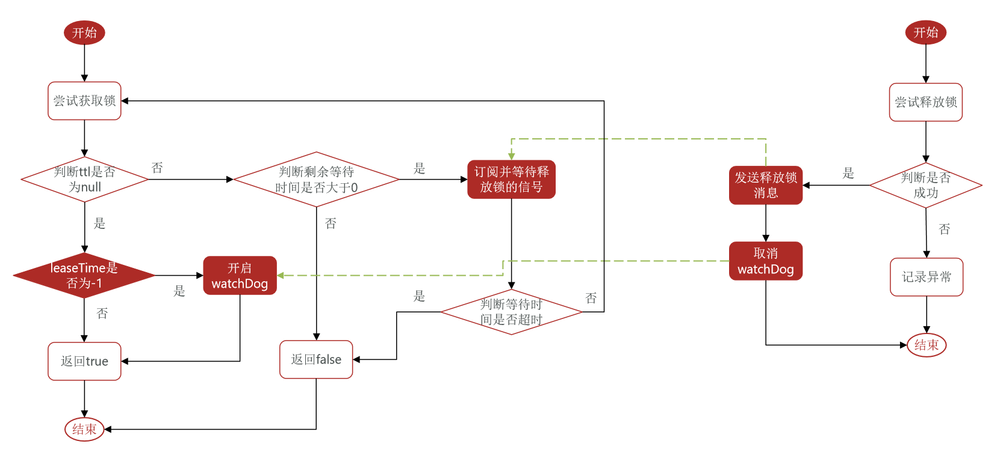

### 17.3.Redisson主从一致性问题

当应用尝试获取锁时，Redisson 会在 Redis 主节点上获取锁，并将锁数据同步到 Redis 主从节点。当主节点宕机时，哨兵会选举一个slave节点转为主节点，然而由于此时主节点的锁已经丢失，因此新的主节点并没有锁的信息，导致锁丢失。

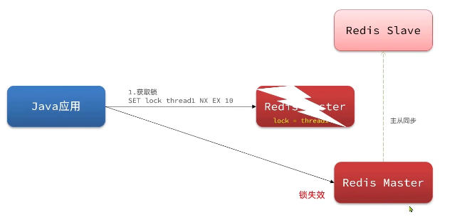

解决方案：

Redisson提出了MutiLock的概念，将传统的主从节点直接都设置为主节点，将锁同步写到每一个节点，并且只有所有节点都获取到锁后，才认为获取锁成功。如果其中有一个节点宕机，但是其他节点仍然处于加锁状态，则不能成功获取锁，确保了高可用性和一致性。

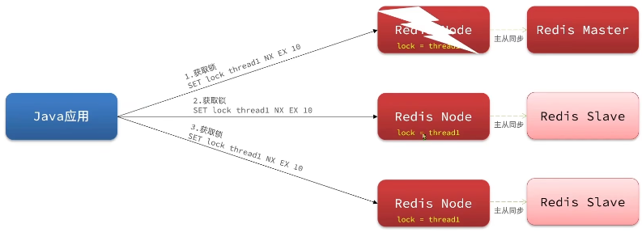

## 18.秒杀优化

当使用1000个线程并发下单时，会发现吞吐量很低。（此处由于使用的是云服务器的数据库和redis，所以并发量会比演示的更低）

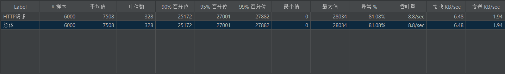

- 思路分析

之前的秒杀业务流程：

1.查询优惠券，判断秒杀时间和库存是否满足条件
2.查询订单，查看是否一人一单
3.扣减库存
4.创建订单

这里四步都涉及到数据库的操作，耗时较久，导致吞吐量低。

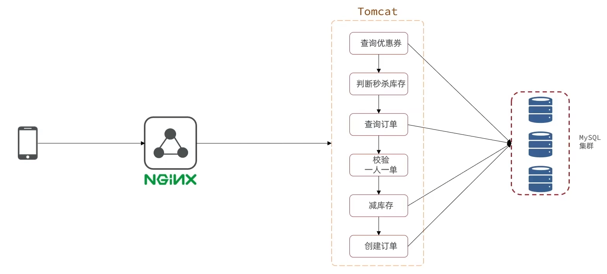

- 优化方案
- 将库存信息和订单购买记录放到Redis中，针对订单购买记录使用Set类型来进行存储（集合元素方便快速判断是否存在），在Reids中先扣库存，保存优惠券id、用户id、订单id到阻塞队列，将减库存和创建订单这两步放在线程池中异步执行。

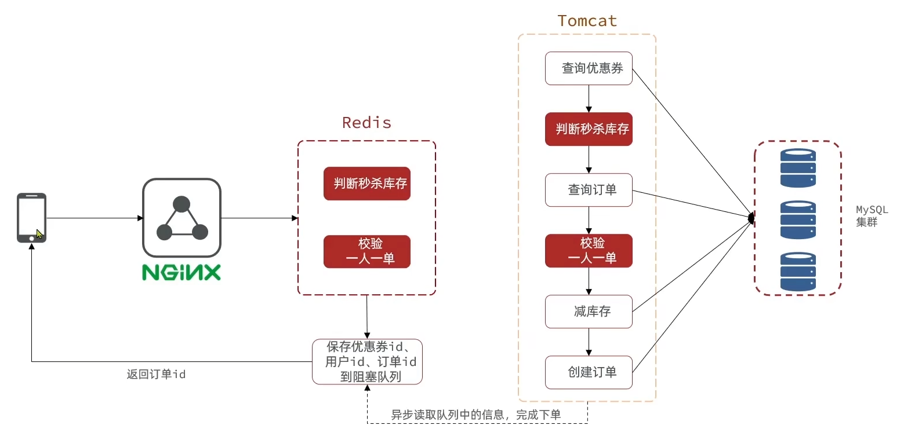

- 实现代码

1. 新增优惠券时保存库存到redis

```java
@Override
@Transactional
public void addSeckillVoucher(Voucher voucher) {
    // 保存优惠券
    save(voucher);
    // 保存秒杀信息
    SeckillVoucher seckillVoucher = new SeckillVoucher();
    seckillVoucher.setVoucherId(voucher.getId());
    seckillVoucher.setStock(voucher.getStock());
    seckillVoucher.setBeginTime(voucher.getBeginTime());
    seckillVoucher.setEndTime(voucher.getEndTime());
    seckillVoucherService.save(seckillVoucher);
    // 保存秒杀库存到Redis中
    stringRedisTemplate.opsForValue().set(SECKILL_STOCK_KEY + voucher.getId(), String.valueOf(voucher.getStock()));
}
```

2.编写判断秒杀库存、一人一单的lua脚本，并且在lua脚本中扣减库存，保证判断和扣减库存的原子性。

```lua
---
--- Generated by EmmyLua(https://github.com/EmmyLua)
--- Created by ZhangJiaKang.
--- DateTime: 2026/2/21 下午5:15
---

local voucherId = ARGV[1]
local userId = ARGV[2]

local stockKey = 'seckill:stock:' .. voucherId
local orderKey = 'seckill:order:' .. voucherId

-- 判断库存是否充足
if tonumber(redis.call('get', stockKey)) <= 0 then
    return 1
end
-- 判断是否一人一单
if redis.call('sismember', orderKey, userId) == 1 then
    return 2
end

-- 扣减库存
redis.call('incrby', stockKey, -1)
-- 添加集合
redis.call('sadd', orderKey, userId)

return 0
```

3.设置阻塞队列，将创建订单任务放到阻塞队列当中，并且设置代理对象来执行创建订单的事务。

```java
@Service
public class VoucherOrderServiceImpl extends ServiceImpl<VoucherOrderMapper, VoucherOrder> implements IVoucherOrderService {

    @Resource
    private ISeckillVoucherService seckillVoucherService;

    @Resource
    private RedisIdWorker redisIdWorker;
    @Resource
    private StringRedisTemplate stringRedisTemplate;

    private BlockingQueue<VoucherOrder> orderTasks = new ArrayBlockingQueue<>(1024 * 1024);
    private static final ExecutorService SECKILL_ORDER_EXECUTOR = Executors.newSingleThreadExecutor();
    @Autowired
    private VoucherOrderMapper voucherOrderMapper;

    @PostConstruct
    private void init() {
        SECKILL_ORDER_EXECUTOR.submit(new VoucherOrderHandler());
    }

    private class VoucherOrderHandler implements Runnable {

        @Override
        public void run() {
            while (true) {
                try {
                    // 获取队列中的订单信息
                    VoucherOrder voucherOrder = orderTasks.take();
                    // 创建订单
                    handleVoucherOrder(voucherOrder);
                } catch (Exception e) {
                    log.error("处理订单异常");
                }
            }
        }
    }

    private void handleVoucherOrder(VoucherOrder voucherOrder) throws InterruptedException {
        Long userId = voucherOrder.getUserId();
         // 创建锁对象
//        SimpleRedisLock lock = new SimpleRedisLock(stringRedisTemplate, "order:" + userId);
        RLock lock = redissonClient.getLock("lock:order:" + userId);
        // 获取锁
        boolean isLock = lock.tryLock(1L, TimeUnit.SECONDS);
        // 判断是否获取锁成功
        if (!isLock) {
            log.error("不允许重复下单");
        }
        // 子线程无法被代理对象调用，因为AopContext.currentProxy()是利用ThreadLocal获取的。
        try {
            //
//            IVoucherOrderService proxy = (IVoucherOrderService) AopContext.currentProxy();
            proxy.createVoucherOrder(voucherOrder);
        } catch (IllegalStateException e) {
            throw new RuntimeException(e);
        } finally {
            // 释放锁
            lock.unlock();
        }
    }
    @Resource
    private RedissonClient redissonClient;

    private IVoucherOrderService proxy;

    public static final DefaultRedisScript<Long> SECKILL_SCRIPT;

    static {
        SECKILL_SCRIPT = new DefaultRedisScript<>();
        SECKILL_SCRIPT.setLocation(new ClassPathResource("seckill.lua"));
        SECKILL_SCRIPT.setResultType(Long.class);
    }

    @Override
    public Result seckillVoucher(Long voucherId) throws InterruptedException {
        Long userId = UserHolder.getUser().getId();
        // 1.执行lua脚本
        Long result = stringRedisTemplate.execute(SECKILL_SCRIPT,
                Collections.emptyList(),
                voucherId.toString(), userId.toString());
        // 2.判断结果是否为0
        int r = result.intValue();
        // 2.1.不为0
        if (r != 0) {
            return Result.fail(r == 1 ? "库存不足" : "不能重复下单");
        }
        // 2.2.为0，有购买资格, 把下单信息保存到阻塞队列
        VoucherOrder voucherOrder = new VoucherOrder();
        long orderId = redisIdWorker.nextId("order");
        voucherOrder.setId(orderId);
        voucherOrder.setUserId(userId);
        voucherOrder.setVoucherId(voucherId);
        // 2.3.创建阻塞队列
        orderTasks.add(voucherOrder);

        // 2.4.获取代理对象
        proxy = (IVoucherOrderService) AopContext.currentProxy();
        //
        // 3.返回订单id
        return Result.ok();
    }
    // 原方法
//    @Override
//    public Result seckillVoucher(Long voucherId) throws InterruptedException {
//        // 1.查询优惠券
//        SeckillVoucher voucher = seckillVoucherService.getById(voucherId);
//
//        // 2.判断秒杀是否开始
//        if(voucher.getBeginTime().isAfter(LocalDateTime.now())) {
//            return Result.fail("秒杀尚未开始!");
//        }
//        // 3.判断秒杀是否结束
//        if(voucher.getEndTime().isBefore(LocalDateTime.now())) {
//            return Result.fail("秒杀已经结束!");
//        }
//        // 4.判断库存是否充足
//        if (voucher.getStock() < 1) {
//            // 库存不足
//            return Result.fail("库存不足");
//        }
//        Long userId = UserHolder.getUser().getId();
////        synchronized (userId.toString().intern()) {
//        // 创建锁对象
////        SimpleRedisLock lock = new SimpleRedisLock(stringRedisTemplate, "order:" + userId);
//        RLock lock = redissonClient.getLock("lock:order:" + userId);
//        // 获取锁
//        boolean isLock = lock.tryLock(1L, TimeUnit.SECONDS);
//        // 判断是否获取锁成功
//        if (!isLock) {
//            // 获取锁失败，返回错误或重试
//            return Result.fail("不允许重复下单");
//        }
//        // 获取代理对象（事务）
//        try {
//            IVoucherOrderService proxy = (IVoucherOrderService) AopContext.currentProxy();
//            return proxy.createVoucherOrder(voucherId);
//        } catch (IllegalStateException e) {
//            throw new RuntimeException(e);
//        } finally {
//            // 释放锁
//            lock.unlock();
//        }
////        }
//    }

    @Transactional(rollbackFor = Exception.class)
    public void createVoucherOrder(VoucherOrder voucherOrder) {
        Long userId = voucherOrder.getUserId();

        // 5.1.查询订单
        int count = query().eq("user_id", userId).eq("voucher_id", voucherOrder.getVoucherId()).count();

        // 5.2.判断是否存在
        if (count > 0) {
            log.error("用户已经购买过一次");
            return;
        }

        // 6.扣减库存
        boolean success = seckillVoucherService.update().setSql("stock = stock - 1")
                .eq("voucher_id", voucherOrder.getVoucherId())
//                .eq("stock", voucher.getStock()) // where stock = ?
                .gt("stock", 0) // where stock > 0
                .update();

        if (!success) {
            log.error("库存不足");
            return;
        }

        save(voucherOrder);
    }
}
```

## 19.Redis消息队列

（1）基于List结构实现的消息队列

Redis的list数据结构是双向链表，只需要配合利用LPUSH和RPOP命令，就可以实现消息队列的功能。但是这两个命令并不会阻塞等待，因此需要使用BRPOP命令，该命令会阻塞等待，直到有消息可读。

优点：

- 利用Redis存储，不受限于JVM内存上限
- 基于Redis持久化，数据安全性有保证
- 满足消息有序性

缺点：

- 无法避免消息丢失（如果还没进行消息处理就宕机，消息就丢失了，因为POP命令本质是remove和get操作）
- 只支持单消费者（消费者拿走就移除了，其他消费者无法再次获取）

（2）基于PubSub实现的消息队列

PubSub是Redis2.0版本引入的一种消息发布/订阅模式，可以实现一对多的消息发布与订阅。消费者可以订阅一个或多个channel，当生产者向channel发布消息时，所有订阅者都可以收到消息。

命令：

- PUBLISH channel message：向频道发布消息
- SUBSCRIBE channel [channel...]：订阅一个或多个频道
- PSUBSCRIBE pattern [pattern...]：订阅与pattern格式匹配的消息（通配符格式包含？*[]）
- UNSUBSCRIBE [channel...]：取消订阅

优点：

- 实现了消息的发布与订阅，支持多生产者、多消费者

缺点：

- 不支持数据持久化（不像List结构可以持久化）
- 无法避免消息丢失
- 消息堆积有上限，超出时数据丢失（消息发送过来都会缓存在消费者端，然而消费者端缓存空间有上限）

（3）基于Stream结构实现的消息队列

Stream是Redis5.0版本引入的一种新的消息队列结构，可以实现多生产者、多消费者、消息持久化、消息有序性。

命令：

```shell
XADD key [NOMKSTREAM] [MAXLEN|MINID [=|~] threashold [LIMIT count]] [*|ID] field value [field value...]

- NOMKSTREAM：不创建新Stream，默认自动创建
- MAXLEN [=|~] threashold：设置Stream的最大长度，如果Stream长度超过最大长度，则自动删除最早的消息
- MINID [=|~] threashold：设置Stream的最小ID，如果Stream的ID小于最小ID，则自动删除最早的消息
- LIMIT count：设置Stream的消息数量限制
- ID：消息ID, * 代表由Redis自动生成。格式是“时间戳-递增数字”
- field value：发送到队列的消息，成为Entry，格式为多个key-value对

示例：
XADD users * name John age 30

XREAD [COUNT count] [BLOCK milliseconds] STREAMS key [key...] ID [ID...]

- COUNT count：设置读取消息的数量
- BLOCK milliseconds: 没有消息时是否阻塞，阻塞时长
- STREAMS key [key...]: 从哪个队列读取消息，key为队列名
- ID [ID...]: 起始id，只返回大于该ID的信息[0: 代表从第一个开始; $: 代表从最新的开始]
```

特点：

- 消息可回溯
- 一个消息可以被多个消费者读取
- 可以阻塞读取
- 有消息漏读的风险

（4）基于Stream的消息队列-消费者组

消费者组：将多个消费者划分到一个组中，监听同一个队列，具备以下特点：

- 消费分流：消息会分流给组内不同消费者，而不是重复消费，加快处理速度
- 消费标识：消费者组会维护一个标识，记录最后一个被处理的信息，哪怕消费者宕机重启，也会从标识后读取信息
- 消息确认：消费者获取消息后，消息处于pending状态，存入pending-list，处理完成后需要通过XACK来确认消息，标记消息为已处理，才会从pending-list删除

命令：

```shell
XGROUP CREATE key groupname ID [MKSTREAM]

- key:队列名称
- groupname:消费者组名称
- ID:消费者组起始ID，默认是0代表队列中第一个消息，$代表队列中最后一个消息
- MKSTREAM:如果不存在队列，则创建队列

# 删除消费者组
XGROUP DESTROY key groupname
#向消费者组中添加消费者
XGROUP CREATECONSUMER key groupname consumername
#删除组内指定消费者
XGROUP DELCONSUMER key groupname consumername

#从消费者组读取消息
XREADGROUP GROUP groupname consumername [COUNT count] [BLOCK milliseconds] [NOACK] STREAMS key [key...] ID [ID...]

- consumername:消费者名称，不存在会自动创建
- COUNT count：设置读取消息的数量
- BLOCK milliseconds: 没有消息时是否阻塞，阻塞时长
- NOACK：不自动确认消息，需要手动确认
- STREAMS key [key...]: 从哪个队列读取消息，key为队列名
- ID [ID...]: 起始id，">":从下个未消费的消息开始，其他：根据指定id从pending-list中读取已消费消息，例如0，是从第一个消息开始.

#查看pending-list中的消息
XPENDING key groupname [start end count]

- start:起始消息ID
- end:结束消息ID
- count:返回消息数量

#XACK确认消息
XACK key groupname ID [ID...]

- key:队列名称
- groupname:消费者组名称
- ID [ID...]: 确认的消息ID

整个stream消费流程：
1. 创建消费者组，并订阅对应的消息队列
2. 读取消息，使用XREADGROUP消费消息，消息会自动存入pending-list
3. 处理完成后，通过XACK确认消息，消息从pending-list中删除

示例：

```shell
# 创建消费者组
XGROUP CREATE mystream mygroup 0
# 订阅消息队列
XGROUP CREATECONSUMER mystream mygroup myconsumer
# 读取消息
XREADGROUP GROUP mygroup myconsumer COUNT 1 BLOCK 1000 STREAMS mystream >
# 处理消息
# 查看pending-list
XPENDING mystream mygroup > - + 1000
# 确认消息
XACK mystream mygroup 1598888888888-0
```

## 20.基于Redis的Stream结构作为消息队列，实现异步秒杀下单

需求：
①创建一个stream类型的消息队列——stream.orders
②修改秒杀下单的lua脚本，认定有抢购资格后，向stream.orders中写入消息，内容包含voucherId、userId、orderId等信息
③项目启动时，开启线程任务，尝试获取stream.orders中的消息，并处理订单

实现：

- 创建stream.orders消息队列以及消费者组

```shell
xgroup create stream.orders g1 0 mkstream
```

- 修改lua脚本，增加发送消息到stream.orders的功能

```lua
local voucherId = ARGV[1]
local userId = ARGV[2]
local orderId = ARGV[3]

local stockKey = 'seckill:stock:' .. voucherId
local orderKey = 'seckill:order:' .. voucherId

-- 判断库存是否充足
if tonumber(redis.call('get', stockKey)) <= 0 then
    return 1
end
-- 判断是否一人一单
if redis.call('sismember', orderKey, userId) == 1 then
    return 2
end

-- 扣减库存
redis.call('incrby', stockKey, -1)
-- 添加集合
redis.call('sadd', orderKey, userId)
-- 发送消息到队列
redis.call0('xadd', 'stream.orders', '*', 'userId', userId, 'voucherId', voucherId, 'id', orderId)

return 0
```

- 项目启动时，开启线程任务，尝试获取stream.orders中的消息，并处理订单

```java
private class VoucherOrderHandler implements Runnable {
    String queueName = "stream.orders";
    @Override
    public void run() {
        while (true) {
            try {
                // 获取消息队列中的订单信息
                List<MapRecord<String, Object, Object>> list = stringRedisTemplate.opsForStream().read(
                        Consumer.from("g1", "c1"),
                        StreamReadOptions.empty().count(1).block(Duration.ofSeconds(2)),
                        StreamOffset.create(queueName, ReadOffset.lastConsumed())
                );
                // 判断消息获取是否成功
                if (list == null || list.isEmpty()) {
                    // 2.1.获取失败，继续下一次循环
                    continue;
                }
                // 3.解析消息
                MapRecord<String, Object, Object> mapRecord = list.get(0);
                Map<Object, Object> values = mapRecord.getValue();
                VoucherOrder voucherOrder = BeanUtil.fillBeanWithMap(values, new VoucherOrder(), true);
                // 4.获取成功可以下单
                handleVoucherOrder(voucherOrder);
                // 5.ACK确认
                stringRedisTemplate.opsForStream().acknowledge(queueName, "g1", mapRecord.getId());
            } catch (Exception e) {
                log.error("处理订单异常");
                handlePendingList();
            }
        }
    }

    private void handlePendingList() {
        while (true) {
            try {
                // 获取pending队列中的订单信息
                List<MapRecord<String, Object, Object>> list = stringRedisTemplate.opsForStream().read(
                        Consumer.from("g1", "c1"),
                        StreamReadOptions.empty().count(1),
                        StreamOffset.create(queueName, ReadOffset.from("0"))
                );
                // 判断消息获取是否成功
                if (list == null || list.isEmpty()) {
                    // 2.1.获取失败，说明pending-list没有异常消息
                    break;
                }
                // 3.解析消息
                MapRecord<String, Object, Object> mapRecord = list.get(0);
                Map<Object, Object> values = mapRecord.getValue();
                VoucherOrder voucherOrder = BeanUtil.fillBeanWithMap(values, new VoucherOrder(), true);
                // 4.获取成功可以下单
                handleVoucherOrder(voucherOrder);
                // 5.ACK确认
                stringRedisTemplate.opsForStream().acknowledge(queueName, "g1", mapRecord.getId());
            } catch (Exception e) {
                log.error("处理订单异常");
                try {
                    Thread.sleep(20);
                } catch (InterruptedException interruptedException) {
                    interruptedException.printStackTrace();
                }
            }
        }
    }
}
```

## 21.点赞功能

需求：

- 同一个用户只能点赞一次，再次点赞需要取消点赞

实现步骤：

1. 给类中添加一个isLike字段，标识是否被当前用户点赞
2. 修改点赞功能，利用redis的set集合判断是否点赞过
3. 修改根据id查询Blog业务，判断是否点赞过，赋值给isLike字段
4. 修改分页查询Blog业务，判断是否点赞过，赋值给isLike字段

具体代码如下：

修改点赞功能

```java
@Override
public Result likeBlog(Long id) {
    // 1.获取登录用户
    Long userId = UserHolder.getUser().getId();

    // 2.判断当前登录用户是否点赞
    String key = "blog:liked:" + id;
    Boolean isMember = stringRedisTemplate.opsForSet().isMember(key, userId.toString());
    // 3.如果未点赞
    if (BooleanUtil.isFalse(isMember)) {
        // 3.1数据库点赞数+1
        boolean isSuccess = update().setSql("liked = liked + 1").eq("id", id).update();
        // 3.2.保存用户到Redis的set
        if (isSuccess) {
            stringRedisTemplate.opsForSet().add(key, userId.toString());
        }

    } else {
        // 4.如果已点赞，取消点赞
        // 4.1.数据库点赞-1
        boolean isSuccess = update().setSql("liked = liked - 1").eq("id", id).update();
        // 4.2.把用户从redis移除
        if (isSuccess) {
            stringRedisTemplate.opsForSet().remove(key, userId.toString());
        }
    }
    return Result.ok();
}
```

赋值isLike字段：

```java
private void isBlogLiked(Blog blog) {
    UserDTO user = UserHolder.getUser();
    if (user == null) {
        // 用户未登录，无需查询是否点赞
        return;
    }
    Long userId = UserHolder.getUser().getId();
    String key = "blog:liked:" + userId;
    Double score = stringRedisTemplate.opsForZSet().score(key, userId.toString());
    blog.setIsLike(score != null);
}
```

改进：

- 实现点赞排行榜功能，列出最早点赞的5名用户（使用zset实现，将点赞时间戳作为value，用户id作为key，最后作range排序）

具体代码如下：

```java
@Service
public class BlogServiceImpl extends ServiceImpl<BlogMapper, Blog> implements IBlogService {
    @Resource
    private IUserService userService;
    @Autowired
    private StringRedisTemplate stringRedisTemplate;

    @Override
    public Result queryBlogById(Long id) {
        Blog blog = getById(id);
        if (blog == null) {
            return Result.fail("笔记不存在");
        }
        queryBlogUser(blog);
        // 查询blog是否被点赞
        isBlogLiked(blog);
        return Result.ok(blog);
    }

    private void isBlogLiked(Blog blog) {
        UserDTO user = UserHolder.getUser();
        if (user == null) {
            // 用户未登录，无需查询是否点赞
            return;
        }
        Long userId = UserHolder.getUser().getId();
        String key = "blog:liked:" + userId;
        Double score = stringRedisTemplate.opsForZSet().score(key, userId.toString());
        blog.setIsLike(score != null);
    }

    private void queryBlogUser(Blog blog) {
        Long userId = blog.getUserId();
        User user = userService.getById(userId);
        blog.setName(user.getNickName());
        blog.setIcon(user.getIcon());
    }

    @Override
    public Result queryHotBlog(Integer current) {
        // 根据用户查询
        Page<Blog> page = query()
                .orderByDesc("liked")
                .page(new Page<>(current, SystemConstants.MAX_PAGE_SIZE));
        // 获取当前页数据
        List<Blog> records = page.getRecords();
        records.forEach(blog -> {
            // 查询用户
            queryBlogUser(blog);
            // 查询blog是否被点赞
            isBlogLiked(blog);
        });
        return Result.ok(records);
    }

    @Override
    public Result likeBlog(Long id) {
        // 1.获取登录用户
        Long userId = UserHolder.getUser().getId();

        // 2.判断当前登录用户是否点赞
        String key = "blog:liked:" + id;
        Double score = stringRedisTemplate.opsForZSet().score(key, userId.toString());
        // 3.如果未点赞
        if (score == null) {
            // 3.1数据库点赞数+1
            boolean isSuccess = update().setSql("liked = liked + 1").eq("id", id).update();
            // 3.2.保存用户到Redis的set
            if (isSuccess) {
                stringRedisTemplate.opsForZSet().add(key, userId.toString(), System.currentTimeMillis());
            }

        } else {
            // 4.如果已点赞，取消点赞
            // 4.1.数据库点赞-1
            boolean isSuccess = update().setSql("liked = liked - 1").eq("id", id).update();
            // 4.2.把用户从redis移除
            if (isSuccess) {
                stringRedisTemplate.opsForZSet().remove(key, userId.toString());
            }
        }
        return Result.ok();
    }

    @Override
    public Result queryBlogLikes(Long id) {
        String key = BLOG_LIKED_KEY + id;
        // 1.查询top5的点赞用户 zrange key 0 4
        Set<String> top5 = stringRedisTemplate.opsForZSet().range(key, 0, 4);
        if (top5 == null || top5.isEmpty()) {
            return Result.ok(Collections.emptyList());
        }
        // 2.解析出其中的用户id
        List<Long> ids = top5.stream().map(Long::valueOf).collect(Collectors.toList());
        String idStr = StrUtil.join(",", ids);
        // 3.根据用户id查询用户
        List<UserDTO> userDTOS = userService.query()
                .in("id", ids)
                .last("order by field(id," + idStr + ")").list()
                .stream()
                .map(user -> BeanUtil.copyProperties(user, UserDTO.class))
                .collect(Collectors.toList());

        // 4.返回
        return Result.ok(userDTOS);
    }
}
```

## 22.关注功能

需求：

- 基于用户表结构，实现两个接口：
  - 关注和取关接口
  - 判断是否关注接口
    关注是User之间的关系，使用一张tb_follow表来实现

接口代码实现：

- 关注和取关接口：

```java
@Override
public Result folllow(Long followUserId, Boolean isFollow) {
    // 1.判断是关注还是取关
    Long userId = UserHolder.getUser().getId();
    if (isFollow) {
        // 2.关注
        Follow follow = new Follow();
        follow.setUserId(userId);
        follow.setFollowUserId(followUserId);
        save(follow);
    }else {
        // 3.取关
        remove(new QueryWrapper<Follow>().eq("user_id", userId).eq("follow_user_id", followUserId));
    }
    return Result.ok();
}
```

- 判断是否关注接口：

```java
@Override
public Result isFollow(Long followUserId) {
    Long userId = UserHolder.getUser().getId();
    Integer count = query().eq("user_id", userId).eq("follow_user_id", followUserId).count();
    return Result.ok(count > 0);
}
```

实现共同关注功能：

利用Redis中的set数据结构，实现共同关注功能。当set交集有元素时，说明两个用户有共同关注，否则没有。

实现代码：

- 修改关注接口

```java
@Override
public Result folllow(Long followUserId, Boolean isFollow) {
    // 1.判断是关注还是取关
    Long userId = UserHolder.getUser().getId();
    String key = "follows:" + userId;

    if (isFollow) {
        // 2.关注
        Follow follow = new Follow();
        follow.setUserId(userId);
        follow.setFollowUserId(followUserId);
        boolean isSuccess = save(follow);
        if (isSuccess) {
            // 把关注用户的id放入redis的set
            stringRedisTemplate.opsForSet().add(key, followUserId.toString());
        }

    }else {
        // 3.取关
        boolean isSuccess = remove(new QueryWrapper<Follow>().eq("user_id", userId).eq("follow_user_id", followUserId));
        if (isSuccess) {
            stringRedisTemplate.opsForSet().remove(key, followUserId.toString());
        }
    }
    return Result.ok();
}
```

- 实现共同关注接口

```java
@Override
public Result folllowCommons(Long id) {
    // 1.获取当前用户
    Long userId = UserHolder.getUser().getId();
    String key = "follows:" + userId;
    // 2.求交集
    String key2 = "follows:" + id;
    Set<String> intersect = stringRedisTemplate.opsForSet().intersect(key, key2);
    if (intersect == null || intersect.isEmpty()) {
        // 无交集
        return Result.ok(Collections.emptyList());
    }
    // 3.判断id集合
    List<Long> ids = intersect.stream().map(Long::valueOf).collect(Collectors.toList());
    // 4.查询用户
    List<UserDTO> users = userService.listByIds(ids)
            .stream()
            .map(user -> BeanUtil.copyProperties(user, UserDTO.class))
            .collect(Collectors.toList());
    return Result.ok(users);
}
```

## 23.关注推送

关注推送也叫Feed流，通过无限下拉刷新获取新的信息。Feed流有两种常见模式：

- Timeline模式：用户的Feed流是按照时间顺序排列的，即新消息在Feed流的上方。
- 智能排序：用户的Feed流是按照智能算法排序的，即根据用户的兴趣、喜好、行为等特征，智能推送相关信息。

实现方案：

- 拉模式：也叫做读扩散。

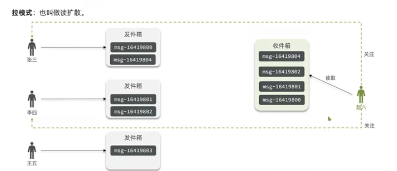

- 推模式：也叫做写扩散。

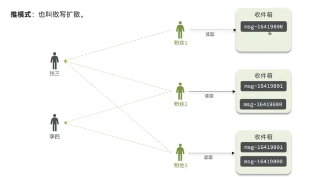

- 推拉结合模式：也叫做读写混合，兼具推拉两种模式的优点。（活跃粉丝推，普通粉丝拉。普通up主默认推，大V默认拉。）

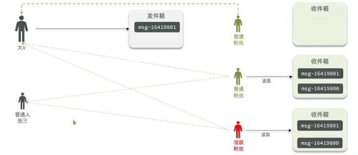

优缺点：

|              | 拉模式   | 推模式            | 推拉结合              |
| ------------ | -------- | ----------------- | --------------------- |
| 写比例       | 低       | 高                | 中                    |
| 读比例       | 高       | 低                | 中                    |
| 用户读取延迟 | 高       | 低                | 低                    |
| 实现难度     | 复杂     | 简单              | 很复杂                |
| 使用场景     | 很少使用 | 用户量少、没有大V | 过千万的用户量，有大V |

案例：基于推模式实现Feed流

需求：

- 修改新增探店笔记的业务，保存blog到数据库的同时，推送到粉丝收件箱
- 收件箱满足可以根据时间戳排序，用Redis的数据结构实现
- 查询收件箱数据时，实现分页查询

难点：

Feed流数据不断更新，数据角标在变化，不能用传统的分页模式。

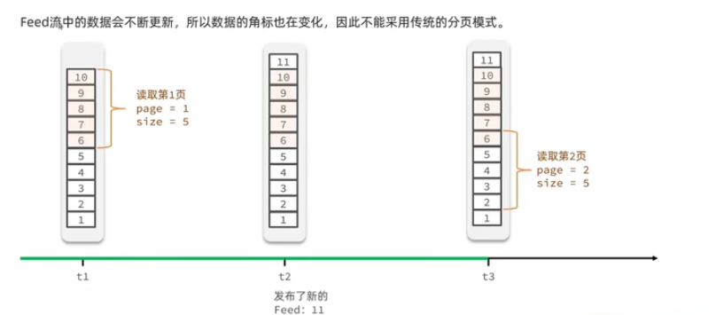

解决方案：

引入lastId，记录当前查到的最后一条记录，从最后一条记录开始查，这样可以避免重复。
在redis中使用zset的**zrevrangeByScore zset maxScore minScore withscores offset count**命令方法，根据时间戳排序，并且记录最后一条记录的分数。

参数设置：

- maxScore：当前时间戳 | 上一次查询的最小时间戳
- minScore：0
- offset：0 | 在上一次的结果中，与最小值一样的元素个数
- count：3（记录个数）

实现代码：

- 推送功能

```java
@Override
public Result saveBlog(Blog blog) {
    // 获取登录用户
    UserDTO user = UserHolder.getUser();
    blog.setUserId(user.getId());
    // 保存探店博文
    boolean isSuccess = save(blog);
    // 查询笔记作者的所有粉丝
    if (isSuccess) {
        return Result.fail("新增笔记失败");
    }
    // 推送笔记id给所有粉丝
    List<Follow> follows = followService.query().eq("follow_user_id", user.getId()).list();
    for (Follow follow : follows) {
        // 获取粉丝id
        Long userId = follow.getUserId();
        // 推送
        String key = "feed:" + userId;
        stringRedisTemplate.opsForZSet().add(key, blog.getId().toString(), System.currentTimeMillis());
    }
    // 返回id
    return Result.ok(blog.getId());
}
```

- 滚动分页查询

```java
 @Override
public Result queryBlogOfFollow(Long max, Integer offset) {
    // 1.获取当前用户
    Long userId = UserHolder.getUser().getId();
    // 2.查询收件箱
    String key = FEED_KEY + userId;
    Set<ZSetOperations.TypedTuple<String>> typedTuples = stringRedisTemplate.opsForZSet()
            .reverseRangeByScoreWithScores(key, 0, max, offset, 2);
    // 非空判断
    if (typedTuples == null || typedTuples.isEmpty()) {
        return Result.ok();
    }
    // 3.解析数据：blogId、minTime、offset
    List<Long> ids = new ArrayList<>(typedTuples.size());
    long minTime = 0;
    int os = 1;
    for (ZSetOperations.TypedTuple<String> tuple : typedTuples) {
        ids.add(Long.valueOf(tuple.getValue()));
        long time = tuple.getScore().longValue();
        if (time == minTime) {
            os ++;
        } else {
            minTime = time;
            os = 1;
        }
    }
    // 4.根据id查询blog
    String idStr = StrUtil.join(",", ids);
    List<Blog> blogs = query().in("id", ids).last("order by field(id," + idStr + ")").list();
    for (Blog blog : blogs) {
        // 查询用户
        queryBlogUser(blog);
        // 查询blog是否被点赞
        isBlogLiked(blog);
    }
    // 5.封装并返回
    ScrollResult scrollResult = new ScrollResult();
    scrollResult.setList(blogs);
    scrollResult.setOffset(os);
    scrollResult.setMinTime(minTime);
    return Result.ok(scrollResult);
}
```

## 24.GEO数据结构

GEO数据结构是Redis的一种数据类型，可以用来存储地理位置信息。

GEO数据结构可以存储地理位置的经纬度坐标，并对坐标进行操作，如计算两坐标之间的距离。

常见命令有：

- GEOADD：添加地理位置坐标，包含经纬度和值(member)
- GEODIST：计算两坐标之间的距离
- GEOHASH：将指定member的坐标转换为字符串表示
- GEOPOS：返回指定member的坐标
- GEORADIUS：根据给定的经纬度坐标和半径，返回指定范围圆内的所有member，并按照与中心坐标的距离进行排序，6.2以后废弃
- GEOSEARCH：在指定范围内搜索member，返回指定范围圆或矩形内的所有member，并按照与中心坐标的距离进行排序，6.2以后新功能
- GEOSEARCHSTORE：与GEOSEARCH功能一致，可以将结果存储到指定key中，6.2以后新功能

示例：

```shell
GEOADD G1 13.361389 38.115556 "Palermo" 15.087269 37.502669 "Catania" 116.323333 40.057500 bjn 116.323456 40.057611 bjx 116.323567 40.057722 bjz
// 计算千米距离
GEODIST G1 Palermo Catania km
// 搜寻指定坐标附近10km范围内的地点
GEOSEARCH G1 FROMLONLAT 116.323333 40.057500 BYRADIUS 10 km WITHDIST
// FROMLONLAT是经纬度的意思

// 返回指定member的坐标
GEOPOS g1 bjz
// 将坐标转为hash
GEOHASH g1 bjz
```

## 25.附近商户搜索

按照商户类型分组，类型相同的商户作为同一组，以typeId为key存入同一个GEO集合中即可。

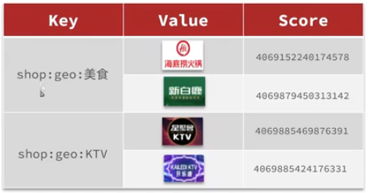

代码实现：

- 添加商铺数据到redis

```java
@Test
void loadShopData() {
    List<Shop> list = shopService.list();
    Map<Long, List<Shop>> map = list.stream().collect(Collectors.groupingBy(Shop::getTypeId));
    for (Map.Entry<Long, List<Shop>> entry : map.entrySet()) {
        Long typeId = entry.getKey();
        List<Shop> shops = entry.getValue();
        String key = "shop:geo:" + typeId;
        List<RedisGeoCommands.GeoLocation<String>> locations = new ArrayList<>(shops.size());
        for (Shop shop : shops) {
            locations.add(new RedisGeoCommands.GeoLocation<>(shop.getId().toString(), new Point(shop.getX(), shop.getY())));
        }
        stringRedisTemplate.opsForGeo().add(key, locations);
    }
}
```

- 搜索附近商铺

```java
@Override
public Result queryShopByType(Integer typeId, Integer current, Double x, Double y) {
    // 1.判断是否根据坐标查询
    if (x == null || y == null) {
        // 根据类型分页查询
        Page<Shop> page = query()
                .eq("type_id", typeId)
                .page(new Page<>(current, SystemConstants.DEFAULT_PAGE_SIZE));
        return Result.ok(page.getRecords());

    }
    // 2.计算分页参数
    int from = (current - 1) * SystemConstants.DEFAULT_PAGE_SIZE;
    int end = current * SystemConstants.DEFAULT_PAGE_SIZE;

    // 3.查询redis，根据距离排序分页，结果：shopId、distance
    String key = SHOP_GEO_KEY + typeId;
    GeoResults<RedisGeoCommands.GeoLocation<String>> results = stringRedisTemplate.opsForGeo()
            .search(key,
                    GeoReference.fromCoordinate(x, y),
                    new Distance(5000),
                    RedisGeoCommands.GeoSearchCommandArgs.newGeoSearchArgs().includeDistance().limit(end)
            );
    // 4.解析出id
    if (results == null) {
        return Result.ok(Collections.emptyList());
    }
    List<GeoResult<RedisGeoCommands.GeoLocation<String>>> list = results.getContent();
    // 4.1.截取from - end的部分
    List<Long> ids = new ArrayList<>(list.size());
    Map<String, Distance> distanceMap = new HashMap<>(list.size());
    list.stream().skip(from).forEach(result -> {
        // 4.2.获取店铺id
        String shopIdStr = result.getContent().getName();
        ids.add(Long.valueOf(shopIdStr));
        // 4.3.获取距离
        Distance distance = result.getDistance();
        distanceMap.put(shopIdStr, distance);
    });
    // 5.根据id查询Shop
    String idStr = StrUtil.join(",", ids);
    List<Shop> shops = query().in("id", ids).last("order by field(id," + idStr + ")").list();
    for (Shop shop: shops) {
        shop.setDistance(distanceMap.get(shop.getId().toString()).getValue());
    }
    // 返回数据
    return Result.ok(shops);
}
```

## 25.用户签到

- 问题

用户签到的数据量极大，如果用普通的sql表进行存储的话，假如有1000万用户，平均每人每年签到10次，则表一年的数据量为1亿条。

- 解决方案

使用**位图（BitMap）**数据结构，将每一个bit位对应当月的每一天，形成映射关系。Redis利用string类型数据结构实现BitMap，因此最大上限是512M，可以存储2^32个bit位。

BitMap常用命令：

- SETBIT：设置指定偏移量的bit位
- GETBIT：获取指定偏移量的bit位
- BITCOUNT：统计指定key中设置了的bit位数量
- BITOP：对多个BitMap进行位运算
- BITFIELD：操作（查询、修改、自增）BitMap中bit数组中的指定位置的值
- BITFIELD_RO：只读模式，用于查询BitMap中bit数组中的指定位置的值，以十进制形式返回
- BITPOS：查找bit数组中指定范围内第一个0或1的位置

- 需求：实现签到接口，将用户签到信息保存到redis的BitMap中。

- 实现代码：

```java
@Override
public Result sign() {
    // 获取用户
    Long userId = UserHolder.getUser().getId();

    // 获取日期
    LocalDateTime now = LocalDateTime.now();
    // 拼接key
    String keySuffix = now.format(DateTimeFormatter.ofPattern("yyyyMM"));
    String key = USER_SIGN_KEY + userId + keySuffix;
    // 获取今天是这个月的第几天
    int dayOfMonth = now.getDayOfMonth();
    // 写入redis
    stringRedisTemplate.opsForValue().setBit(key, dayOfMonth - 1, true);
    return Result.ok();
}
```

- 需求：统计连续签到天数

从最后一次签到向前统计，直到遇到第一个未签到的日期，统计连续签到天数。因此需要从后向前遍历每一位，并与1做与运算，如果遇到0则停止统计。

- 实现代码：

```java
@Override
public Result signCount() {
    // 获取用户
    Long userId = UserHolder.getUser().getId();

    // 获取日期
    LocalDateTime now = LocalDateTime.now();
    // 拼接key
    String keySuffix = now.format(DateTimeFormatter.ofPattern(":yyyyMM"));
    String key = USER_SIGN_KEY + userId + keySuffix;
    // 获取今天是这个月的第几天
    int dayOfMonth = now.getDayOfMonth();
    // 获取本月截至今天为止的所有签到记录，返回的是十进制数字
    List<Long> result = stringRedisTemplate.opsForValue().bitField(
            key, BitFieldSubCommands.create()
                    .get(BitFieldSubCommands.BitFieldType.unsigned(dayOfMonth))
                    .valueAt(0)
    );
    if (result == null || result.isEmpty()) {
        return Result.ok(0);
    }
    Long num = result.get(0);
    if (num == null || num == 0) {
        return Result.ok(0);
    }
    int count = 0;
    // 循环遍历
    while (true) {
        // 与1做与运算，得到数字最后一个bit位  // 判断这个bit位是否为0
        if ((num & 1) == 0) {
            // 为0说明未签到
            break;
        } else {
            // 不为0，说明已签到
            count ++;
            // 把数字右移一位，抛弃最后一个bit位，继续下一个bit位
            num >>>= 1;
        }
    }
    return Result.ok(count);
}
```

## 26.HyperLogLog

首先要明确两个概念：

- UV：全程Unique Visitor，也叫独立访客量，是指通过互联网访问、浏览网页的自然人。一天内同一个用户多次访问，只记录一次。
- PV：全程Page View，也叫页面访问量，用户每访问网站的一个页面，记录1次PV，用户多次打开页面，记录多次PV。衡量网站的流量。

UV统计需要判断用户是否已经统计过了，需要将统计过的用户信息保存。但是如果每个访问过的用户都保存在redis，则数据量太大了。

- 解决方案

HyperLogLog是一种算法，用来确定非常大的集合的基数，不需要存储所有值。
Redis中的HLL基于string结构实现，单个HLL的内存永远小于16kb，但是测量结果是概率性的，有小于0.81%的误差。但这对于UV统计来说，几乎可以忽略。

HLL常用命令：

- PFADD：向HyperLogLog中添加元素
- PFCOUNT：返回HyperLogLog中元素的数量

- 示例代码：

插入1000000条数据进行统计：

```java
@Test
void testHyperLogLog() throws InterruptedException {
    String []values = new String[1000];
    int j = 0;
    for (int i = 0; i < 1000000; i++) {
        j = i % 1000;
        values[j] = "user_" + i;
        if (j == 999) {
            // 发送到Redis
            stringRedisTemplate.opsForHyperLogLog().add("hl2", values);
        }
    }
    // 统计数量
    Long count = stringRedisTemplate.opsForHyperLogLog().size("hl2");
    System.out.println("count = " + count);
}
```

结果如下：

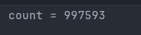

可以看到，误差在0.81%以内，实际数量为1000000，统计得到数量为997593。


