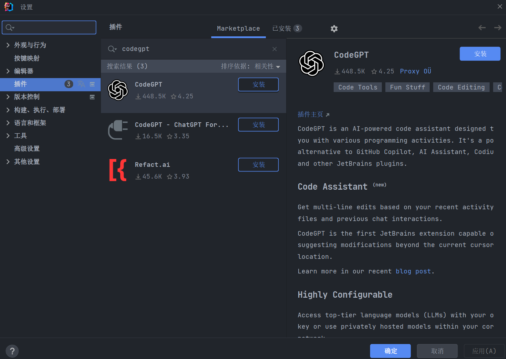
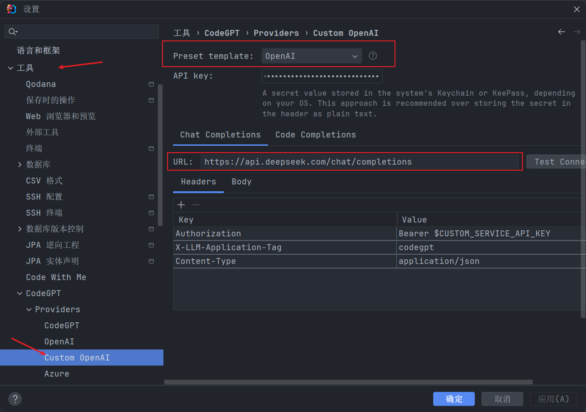
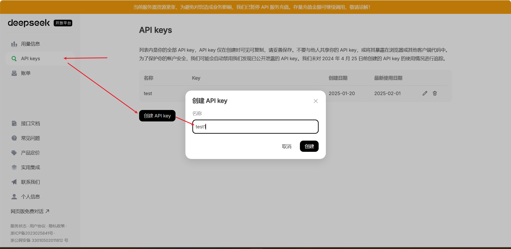
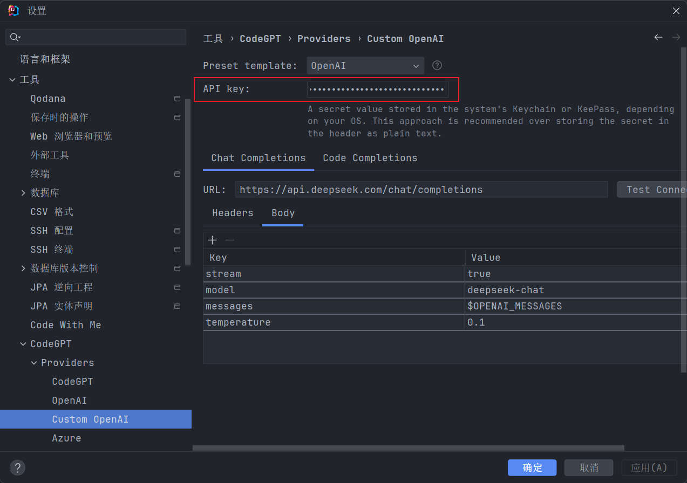
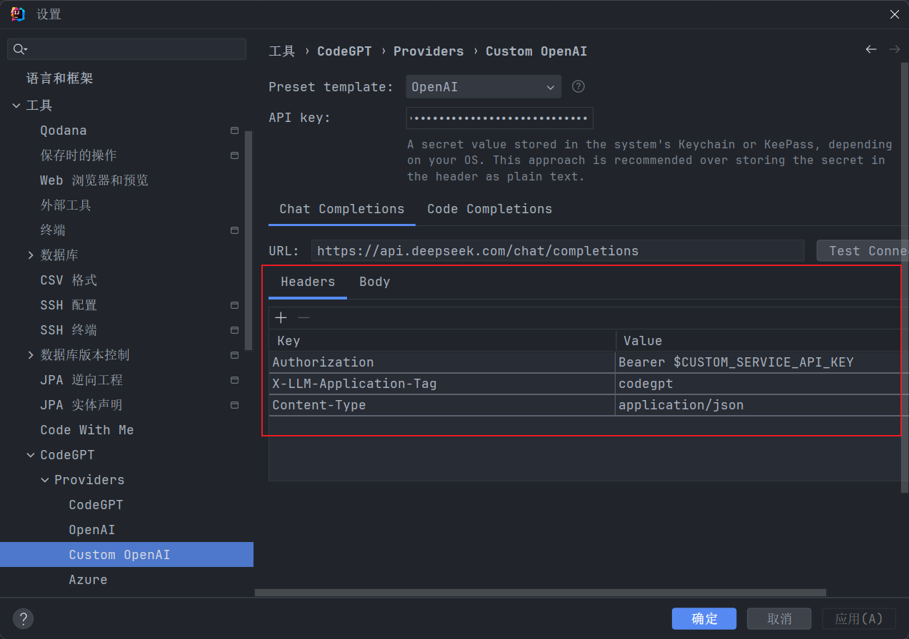
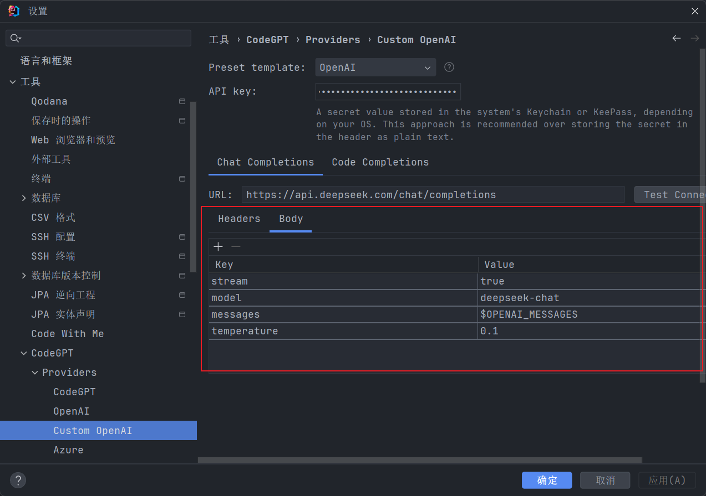
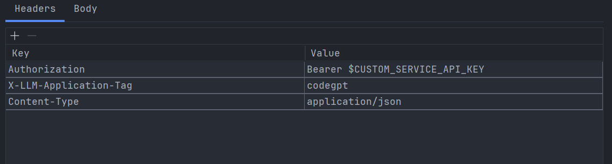
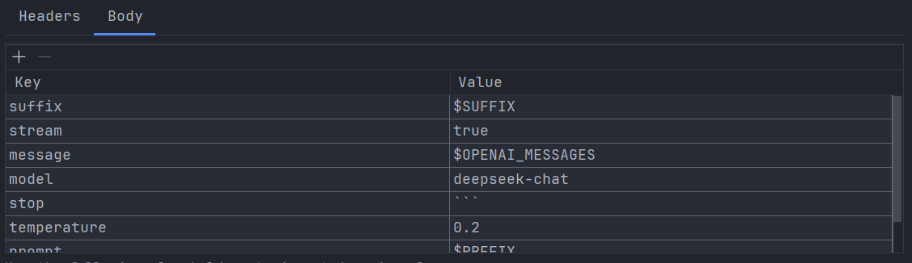
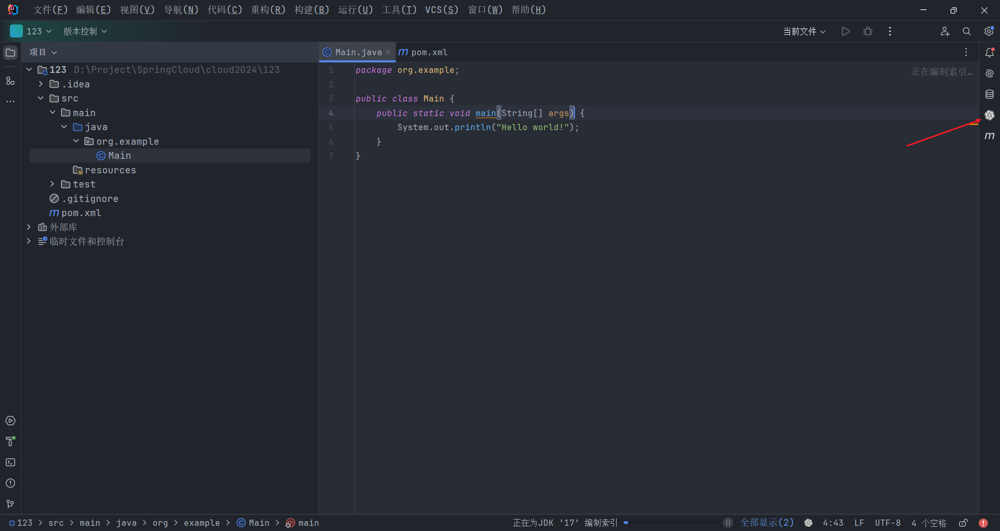
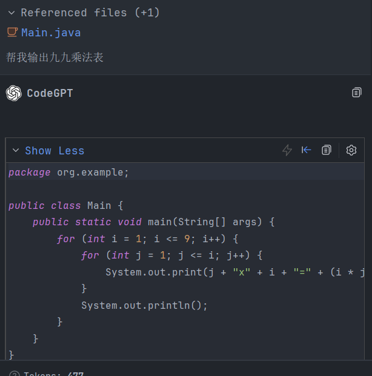

# CodeGPT + IDEA + DeepSeek，在IDEA中引入DeepSeek

## 版本说明

建议和我使用相同版本，实测2022版IDEA无法获取到CodeGPT最新版插件。（在IDEA自带插件市场中搜不到，可以去官网搜索最新版本）

| Tools          | Version      |
|----------------|--------------|
| IntelliJ IDEA  | 2024.1       |
| CodeGPT        | 2.16.2-241.1 |

## 安装步骤

### 1.打开IDEA，点击 File -> Settings -> Plugins

### 2.搜索 CodeGPT，点击 Install

### 3.重启IDEA

### 4.安装完成后，点击 File -> Settings -> Tools -> CodeGPT -> Providers -> Custom OpenAI，修改Preset template，选择OpenAI，修改Chat Completions的URL为：https://api.deepseek.com/chat/completions

### 5.登录DeepSeek官网，前往API开放平台

### 6.在左侧导航栏中选中API keys，点击创建API key，输入名称，点击创建

### 7.复制生成的API key，点击 File -> Settings -> Tools -> CodeGPT -> Custom OpenAI，修改API key，粘贴刚才复制的API key，点击OK

### 8.确保Headers和Body的配置和我相同

### 9.修改Code Completions的配置，将FIM template改为DeepSeek Coder，URL改为https://api.deepseek.com/beta/completions

### 10.修改Code Completions的Header和Body的配置

### 11.点击OK，重启IDEA

### 12.在IDEA中，点击右侧CodeGPT图标，即可开启对话模式

### 参考文档

[DeepSeek API文档](https://api-docs.deepseek.com/zh-cn/)
