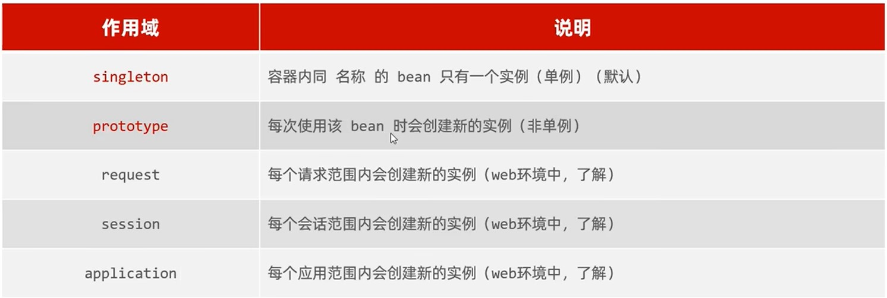

# SpringBoot原理篇

## 一、SpringBoot配置

### 1.配置优先级

命令行参数 > Java系统属性 > properties > yml > yaml

### 2，配置支持

SpringBoot还支持Java系统属性和命令行参数进行属性配置

## 二、Bean管理

### 1.获取Bean

默认情况下，Spring项目启动时会把Bean都创建好放在IOC容器。

```Java
@Autowired
private ApplicationContext applicationContext;
//获取bean对象
@Test
public void testGetBean(){
    //根据bean的名称获取
    DeptController bean1 = (DeptController) applicationContext.getBean("deptController");
    System.out.println(bean1);
    //根据bean的类型获取
    DeptController bean2 = applicationContext.getBean(DeptController.class);
    System.out.println(bean2);
    //根据bean的名称 及 类型获取
    DeptController bean3 = applicationContext.getBean("deptController", DeptController.class);
    System.out.println(bean3);
}
```

### 2.bean作用域



```Java
// 默认容器启动时初始化，并且为单例模式
@Lazy // 仅第一次使用时实例化
//@Scope("prototype") // 每一次访问都创建新的实例
```

### 3.第三方Bean

* 使用@Bean注解注入

```Java
@Bean //将当前方法的返回值对象交给IOC容器管理
// 通过注解的name/value属性指定bean名称，默认是方法名
public SAXReader saxReader() {
    return new SAXReader();
}
```

* 如果要管理第三方bean，使用集中分类配置，通过@Configuration注解声明配置类

* 如果第三方bean需要依赖其他bean对象，直接在bean定义方法中设置形参即可，IOC会自动装配

## 三、SpringBoot原理

### 1.起步依赖

### 2.自动配置

* 当Spring容器启动后，一些配置类，bean对象自动存入IOC容器。
* SpringBoot自动扫描同名子包，如果IOC容器中有其他包的依赖不会被注入

解决方案：

方案一：使用@Component组件扫描

```Java
@ComponentScan({"com.example", "com.itheima"})
@SpringBootApplication
public class SpringbootWebConfig2Application {

    public static void main(String[] args) {
        SpringApplication.run(SpringbootWebConfig2Application.class, args);
    }

//    @Bean //将当前方法的返回值对象交给IOC容器管理
//    public SAXReader saxReader() {
//        return new SAXReader();
//    }
}
```

方案二：使用@Import导入，导入形式有

* 导入普通类
* 导入配置类
* 导入ImportSelector接口实现类
* 使用@EnableXxxx注解，封装@Import注解

```Java
//@ComponentScan(value = {"com.example", "com.itheima"})
//@Import({TokenParser.class, HeaderConfig.class})
//@Import(MyImportSelector.class)
@EnableHeaderConfig
```

### 3.自动配置原理

* @EnableAutoConfiguration：实现自动化配置的核心注解
* @Conditional：按照一定条件进行判断，在满足给定条件后才会注册对应的bean对象到IOC容器
  * @ConditionalOnClass：判断环境中是否有对应字节码文件，才注册bean到IOC容器
  * @ConditionalOnMissingBean：判断环境中是否有对应的bean，才注册bean到IOC（用户没有自定义同类bean才进行注入）
  * @ConditionalOnProperty：判断配置文件中有对应属性和值才注册bean到IOC

### 4.案例

在实际开发经常会定义公共组件，SpringBoot项目中一般会将这些公共组件封装成starter

需要完成依赖管理功能和自动配置功能

#### (1)需求

自定义aliyun-oss-spring-boot-starter，完成OSS操作工具类AliyunOSSUtils的自动配置

#### (2)步骤

* 创建aliyun-oss-spring-boot-starter模块
* 创建aliyun-oss-spring-boot-autoconfigure模块，并在starter中引入模块
* 在autoconfigure模块中的定义自动配置功能，并定义自动配置文件META-INF/spring/xxxx.imports

## 四、maven开发

### 1.分模块开发

* 创建maven项目，命名同名包
* 引入依赖

### 2.继承

* 概念：子工程可以继承父工程中的配置信息，常见于依赖关系的继承
* 作用：简化依赖、统一管理
* 实现：\<parent>...\<parent>

### 3.打包方式

* jar：普通模块打包，springboot项目基本都是jar（内嵌Tomcat运行）
* war：普通web程序打包，需要部署在外部的toncat服务器运行
* pom：父工程，仅进行依赖管理

### 4.版本锁定

\<dependencyManagement>统一管理版本，只管理依赖版本，不提供依赖

### 5.自定义属性/引用属性

```xml
<properties>
    <maven.compiler.source>11</maven.compiler.source>
    <maven.compiler.target>11</maven.compiler.target>
    <lombok.version>1.18.24</lombok.version>
</properties>
```

### 6.聚合

* 聚合

将多个模块组织成一个整体，同时进行项目的构建

* 聚合工程

一个不具有业务功能的空工程（仅有pom）

```xml
<modules>
    <module>../tlias-pojo</module>
    <module>../tlias-utils</module>
    <module>../tlias-web-management</module>
</modules>
```

### 7.私服

是一种特殊的远程仓库，架设在局域网内的仓库服务，用来代理位于外部的中央仓库，用于解决团队内部的资源共享和同步问题


