# SpringCloud

## 1.微服务架构

### 1.1. 客户端与服务端

- 消费者：只负责提交订单，涉及到的数据封装为DTO
- 提供者：只负责处理订单，涉及到的数据封装为DO

整体数据流为：VO -> DTO -> DO -> PO

### 1.2. 工程重构

- 拆分工程，将公共代码抽取出来，形成独立模块(api-commons)
- 将公共模块作为依赖引入到其他模块中

### 1.3. 服务拆分

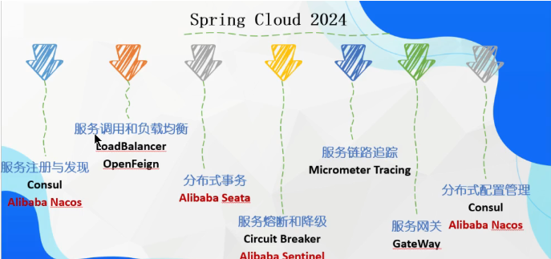

## 2.LoadBalancer

### 2.1. 简介

- 提供客户端的软件负载均衡算法和服务调用，将请求分发到不同的服务实例上，实现系统的HA（高可用）
- SpringCloud中提供了两种负载均衡算法：轮询、随机
- SpringCloud中提供了两种负载均衡组件：Ribbon(替代使用Spring Cloud Loadbalancer、OpenFeign

### 2.2. 客户端负载 VS 服务器端负载均衡

- Nginx是服务器负载均衡，客户端所有请求都移交给nginx，然后由nginx实现转发
- loadbalancer是客户端负载均衡，在调用微服务接口时，会在注册中心获取注册信息服务列表缓存在JVM本地，从而实现在本地实现RPC远程服务调用技术

### 2.3. Spring Cloud Loadbalancer

- 在SpringCloud中，实现负载均衡，只需要在RestTemplate的配置类中添加@LoadBalanced注解即可。用于消费者进行调用服务端方法。

```java
@Configuration
public class ApplicationContextConfig {
    @Bean
    @LoadBalanced
    public RestTemplate getRestTemplate() {
        return new RestTemplate();
    }
}
```

## 3.Nacos

### 3.1. 简介

- Nacos是SpringCloudAlibaba提供的服务注册与发现组件
- Nacos=Na+Config+Service
- Nacos支持AP和CP两种模式
- Nacos支持K8S、Docker、SpringCloud

### 3.2. Nacos安装

- 下载地址：https://github.com/alibaba/nacos/releases
- 启动命令：startup.cmd -m standalone

### 3.3. 服务注册与发现

- 在服务提供者以及消费者中引入依赖

```xml
<dependency>
    <groupId>com.alibaba.cloud</groupId>
    <artifactId>spring-cloud-starter-alibaba-nacos-discovery</artifactId>
</dependency>
```

- 在服务提供者以及消费者中配置Nacos地址

```yaml
spring:
  cloud:
    nacos:
      discovery:
        server-addr: localhost:8848
```

- 在服务提供者以及消费者中添加@EnableDiscoveryClient注解

```java
@SpringBootApplication
@EnableDiscoveryClient
public class PaymentMain9001 {
    public static void main(String[] args) {
        SpringApplication.run(PaymentMain9001.class, args);
    }
}
```

访问：http://localhost:8848/nacos/index.html，可以在服务列表中看到对应的服务

### 3.4. 配置中心

通过Nacos和spring-cloud-starter-alibaba-nacos-config实现中心化全局配置的动态变更,在项目初始化时，要保证先从配置中心进行配置拉取，拉取配置之后，才能保证项目的正常启动。

springboot中配置文件的加载存在优先级顺序，bootstrap优先级高于application。

业务类示例代码：

```java
@RestController
@RefreshScope #实现配置自动更新
public class NacosConfigClientController {
    @Value("${config.info}") #从配置中心获取配置
    private String configInfo;

    @GetMapping("/config/info")
    public String getConfigInfo() {
        return configInfo;
    }
}
```

bootstrap.yml配置文件示例代码：

```yaml
spring:
  application:
    name: nacos-config-client
  cloud:
    nacos:
      discovery:
        server-addr: localhost:8848
      config:
        server-addr: localhost:8848
        file-extension: yaml

# nacos端配置文件DataId的命名规则：
# ${spring.application.name}-${spring.profiles.active}.${spring.cloud.nacos.config.file-extension}
# 本案例的DataID是nacos-config-client-dev.yaml
```

application.yml配置文件示例代码：

```yaml
server:
  port: 3377
spring:
  profiles:
    active: dev
```

### 3.5. Namespace-Group-DataId三元组

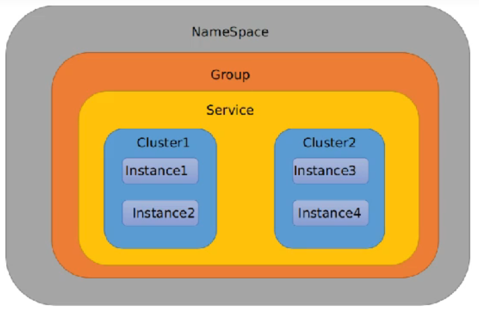

- Namespace：用于区分部署环境，默认为public，可以实现开发、测试、生产环境隔离。
- Group：用于区分服务或应用，默认为DEFAULT_GROUP，可以划分不同的微服务组
- DataId：配置文件名称，默认为\${spring.application.name}-\${spring.profiles.active}.\${spring.cloud.nacos.config.file-extension}
- Service就是微服务，一个Service可以包含多个Cluster（集群），一个Cluster可以包含多个实例（Instance），Cluster是对指定微服务的一个虚拟划分。

bootstrap.yml配置文件示例代码：

```yaml
spring:
  application:
    name: nacos-config-client
  cloud:
    nacos:
      discovery:
        server-addr: localhost:8848
      config:
        server-addr: localhost:8848
        file-extension: yaml
        group: PROD_GROUP
        namespace: Prod_NameSpace #Namespace的ID
```

## 4.Sentinel

### 4.1. 简介

- Sentinel是阿里开源的流量控制组件，以流量为切入点，从流量控制、熔断降级、系统负载保护等多个维度保护服务的稳定性。

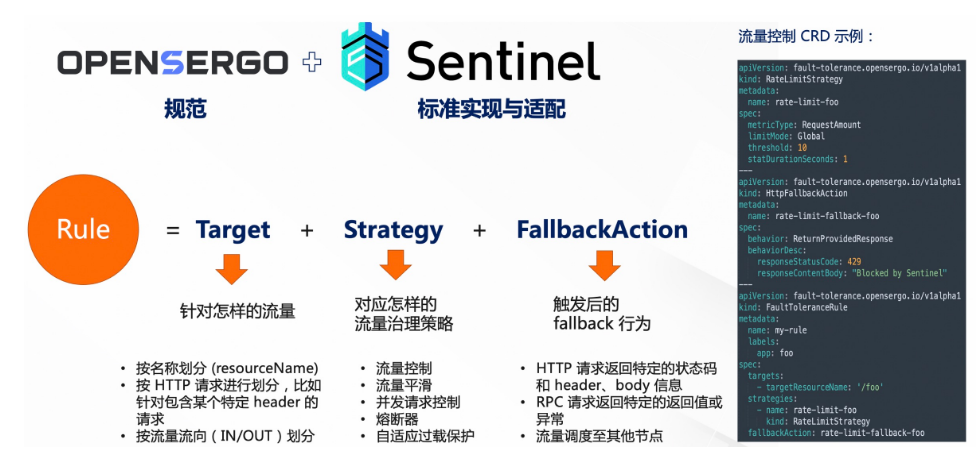

### 4.2. 常见服务故障

- 服务雪崩：由于多个微服务之间存在互相调用的情况，当其中一个微服务出现故障时，这个故障模块还调用其他模块，这样就会发生级联故障，可能会导致整个微服务架构出现故障，这种现象被称为服务雪崩。
- 服务降级： 当服务出现故障时，为了防止故障的继续扩散，需要将故障服务进行降级处理，降级处理的方式就是将故障服务返回一个默认值（托底方案），从而保证其他服务正常运行。
- 服务熔断：如果下游服务因为访问压力过大导致相应很慢或者一直调用失败，上游服务为了防止因为等待下游服务响应而造成线程阻塞，会暂时断开与下游服务的连接，这种方式称为熔断。
  - 闭合状态：熔断器不进行拦截，直接将请求转发到下游服务。
  - 打开状态：熔断器拦截所有请求，上游服务不再钓友下游服务，直接返回预定方法。
  - 半开状态：上游服务会根据规则，尝试恢复对下游服务调用。上游服务会以有限的流量调用下游服务，同时会监控调用的成功率。如果成功率达到阈值，则说明下游服务已经恢复，熔断器会进入闭合状态，否则熔断器会重新进入打开状态。
- 服务限流：当服务访问压力过大时，为了保证服务的稳定运行，需要对访问服务的流量进行限制，这种限制称为限流。
  - 请求总量计数
  - 时间窗口限流：令牌桶算法、漏牌桶算法
- 服务超时：在上游服务调用下游服务时，设置一个最大响应时间，如果超过这个时间，下游服务没有响应，上游服务就会断开与下游服务的连接，这种方式称为服务超时。

### 4.3. 安装Sentinel

- 下载地址：https://github.com/alibaba/Sentinel/releases
- 启动命令：java -jar sentinel-dashboard-1.8.6.jar
- 访问地址：http://localhost:8080

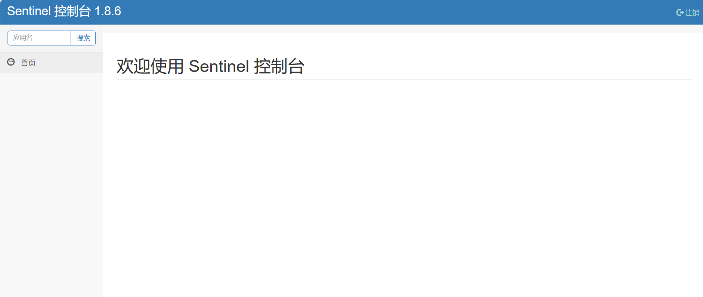

### 4.4. Sentinel组件

- Sentinel的核心库，不依赖JDK和任何框架/库，能够运行于所有Java运行时环境，同时对Dubbo、Spring Cloud等框架也有较好的支持。端口默认为8719。
- Sentinel-Dashboard：Sentinel的可视化控制台，提供机器发现、单机资源实时监控、集群资源汇总、规则管理等功能。端口默认为8080。默认用户名和密码都是sentinel。

### 4.5. Sentinel示例代码

#### 4.5.1. 引入依赖（使用Nacos做服务注册）

```xml
<!--SpringCloud Alibaba Sentinel-->
<dependency>
    <groupId>com.alibaba.csp</groupId>
    <artifactId>sentinel-datasource-nacos</artifactId>
</dependency>
<dependency>
    <groupId>com.alibaba.cloud</groupId>
    <artifactId>spring-cloud-starter-alibaba-sentinel</artifactId>
</dependency>
<dependency>
    <groupId>com.alibaba.cloud</groupId>
    <artifactId>spring-cloud-starter-alibaba-nacos-discovery</artifactId>
</dependency>
```

#### 4.5.2. 配置文件

```yaml
server:
  port: 8401
spring:
  application:
    name: cloudalibaba-sentinel-service
  cloud:
    nacos:
      discovery:
        server-addr: localhost:8848
    sentinel:
      transport:
        dashboard: localhost:8080
        port: 8719
```

#### 4.5.3. 启动类

```java
@SpringBootApplication
@EnableDiscoveryClient
public class SentinelApplication {
    public static void main(String[] args) {
        SpringApplication.run(SentinelApplication.class, args);
    }
}
```

#### 4.5.4. 控制层

```java
@RestController
public class FlowLimitController {
    @GetMapping("/testA")
    public String testA() {
        return "------testA";
    }

    @GetMapping("/testB")
    public String testB() {
        return "------testB";
    }
}
}
```

#### 4.5.5. 测试

- 启动Sentinel-Dashboard
- 启动cloudalibaba-sentinel-service8401
- 访问http://localhost:8401/testA，http://localhost:8401/testB(Sentinel采用懒加载)
- 访问http://localhost:8080

### 4.6. Sentinel流控规则

- 流控模式：直接、关联、链路
- 流控效果：快速失败、Warm Up、排队等待

#### 4.6.1. 直接流控

- 直接流控：当请求的QPS超过设定的阈值时，新的请求就会被限流。

#### 4.6.2. 关联流控

- 关联流控：当关联的资源达到阈值时，就限流自己。(B扛不住压力，A限流)

#### 4.6.3. 链路流控

- 链路流控：只记录指定链路上的流量，指定资源从入口资源进来的流量，如果达到阈值，就进行限流。(例如同一个controller下不同的service可以指定不同的流控规则)

#### 4.6.4. 流控效果

- 快速失败：直接失败，抛出异常。
- Warm Up：预热模式，根据codeFactor（冷加载因子，默认为3）的值，从阈值codeFactor，经过预热时长，才达到设置的QPS阈值。应用场景：商品秒杀阶段，避免冷启动导致系统流量暴增，系统压力过大。
- 排队等待：让请求以均匀的速度通过，对应的是漏桶算法。用于处理间隔性突发的流量，让突发的流量可以放到空闲状态时进行处理，例如消息队列。突然的请求会排队处理，设置排队阈值后会把请求带入空闲时间处理，如果请求超时则抛弃请求。

### 4.7. Sentinel熔断规则

#### 4.7.1. 熔断策略

- 慢调用比例 (SLOW_REQUEST_RATIO)：选择以慢调用比例作为阈值，需要设置允许的慢调用 RT（即最大的响应时间），请求的**响应时间**大于该值则统计为慢调用。当单位统计时长（statIntervalMs）内请求数目大于设置的最小请求数目，并且慢调用的比例大于阈值，则接下来的熔断时长内请求会自动被熔断。经过熔断时长后熔断器会进入探测恢复状态（HALF-OPEN 状态），若接下来的一个请求响应时间小于设置的慢调用 RT 则结束熔断，若大于设置的慢调用 RT 则会再次被熔断。

  - 示例：1秒内，至少收集5个请求，在这些请求中，超过200ms的比例超过0.1，就开启熔断

  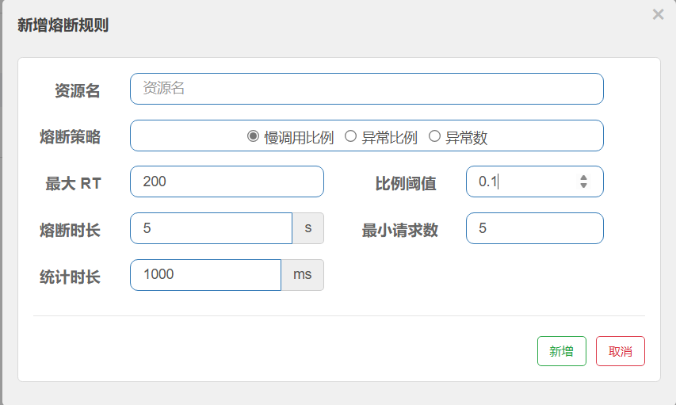
- 异常比例 (ERROR_RATIO)：当单位统计时长（statIntervalMs）内请求数目大于设置的最小请求数目，并且**异常**的比例大于阈值，则接下来的熔断时长内请求会自动被熔断。经过熔断时长后熔断器会进入探测恢复状态（HALF-OPEN 状态），若接下来的一个请求成功完成（没有错误）则结束熔断，否则会再次被熔断。异常比率的阈值范围是 [0.0, 1.0]，代表 0% - 100%。
- 异常数 (ERROR_COUNT)：当单位统计时长内的异常数目超过阈值之后会自动进行熔断。经过熔断时长后熔断器会进入探测恢复状态（HALF-OPEN 状态），若接下来的一个请求成功完成（没有错误）则结束熔断，否则会再次被熔断。

#### 4.7.2. 熔断恢复

1.熔断状态：在熔断时长内，请求都会被拒绝，
2.熔断时长结束后，熔断器会进入探测恢复状态（HALF-OPEN 状态）
3.若接下来的一个请求成功完成（没有错误）则结束熔断，否则会再次被熔断。

### 4.8. @SentinelResource注解

- @SentinelResource用于标识资源，其value属性用于指定资源名称，blockHandler属性用于指定sentinel配置后出现违规情况时的处理方法，fallback属性用于指定程序异常了JVM抛出的异常时的服务降级方法，且Sentinel的fallback处理方法优先级高于配置的全局异常处理，资源内抛出的异常不会被全局异常处理。
- 按SentinelResource资源名称限流+自定义限流返回，示例代码：

```java
@GetMapping("/rateLimit/byResource")
@SentinelResource(value = "byResourceSentinelResource",blockHandler = "handlerBlockHandler")
public String byResource() {
    return "按照资源名称SentinelResource限流测试";
}


public String handlerBlockHandler(BlockException exception) {
    return "服务不可用，触发了@SentinelResource，blockHandler";
}
```

- 按SentinelResource资源名称限流+自定义限流返回+程序异常返回fallback服务降级，示例代码：

```java
@GetMapping("/rateLimit/doAction/{p1}")
@SentinelResource(value = "doActionSentinelResource",blockHandler = "doActionBlockHandler", fallback = "doActionFallback")
public String doAction(@PathVariable("p1") Integer p1) {
    if (p1 == 0) {
        throw new RuntimeException("p1不能为0");
    }
    return "doAction";
}

public String doActionBlockHandler(@PathVariable("p1") Integer p1, BlockException exception) {
    log.error("sentinel配置自定义限流：{}", exception);
    return "sentinel配置自定义限流";
}

public String doActionFallback(@PathVariable("p1") Integer p1, Throwable e) {
    log.error("程序逻辑异常了:{}", e);
    return "程序逻辑异常了" + "\t" + e.getMessage();
}
```

### 4.9. Sentinel热点规则

- 热点规则：热点即经常访问的数据。很多时候我们希望统计某个热点数据中访问频次最高的 Top K 数据，并对其访问进行限制。比如下面的例子，对某个参数进行限制。
- 参数例外项：可以配置例外项，例外项表示参数值等于例外项时，**即使热点参数的限流阈值被打满，也不会触发限流。**
- 热点规则配置示例：

```java
@GetMapping("/testHotKey")
@SentinelResource(value = "testHotKey",blockHandler = "testHotKeyBlockHandler")
public String testHotKey(@RequestParam(value = "p1", required = false) String p1,
                          @RequestParam(value = "p2", required = false) String p2) {
    return "testHotKey";
}

public String testHotKeyBlockHandler(String p1, String p2, BlockException exception) {
    return "testHotKeyBlockHandler";
}
```

### 4.10. Sentinel授权规则

- 根据请求的来源判断是否允许本次请求通过
- 配置示例代码：

```java
@Component
public class MyRequestOriginParser implements RequestOriginParser {

    @Override
    public String parseOrigin(HttpServletRequest httpServletRequest) {
        return httpServletRequest.getParameter("serverName");
    }
}
```

- 授权规则对serverName进行判断，在流控应用中加入对应的serverName，然后在请求时即可在路径中加入参数实现黑白名单。

### 4.11. Sentinel持久化

- Sentinel的规则默认是内存态的，重启后就会消失，所以需要持久化规则。
- 持久化需要将限流配置规则写入到Nacos中，只要刷新某个rest地址，sentinel控制台的流控规则就能看到，Nacos中规则一旦发生变化，sentinel控制台就会更新显示。
- 持久化配置示例代码：

#### 4.11.1. 引入依赖

```xml
<dependency>
    <groupId>com.alibaba.csp</groupId>
    <artifactId>sentinel-datasource-nacos</artifactId>
</dependency>
```

#### 4.11.2. 配置文件

```yaml
sentinel:
  transport:
    dashboard: localhost:8080
    port: 8719
  web-context-unify: false #controller层的方法对service层调用不认为是同一个根链路
  datasource:
    ds1:
      nacos:
        server-addr: localhost:8848
        dataId: ${spring.application.name}
        groupId: DEFAULT_GROUP
        data-type: json
        rule-type: flow #具体类型见com.alibaba.cloud.sentinel.datasource.RuleType

```

#### 4.11.2. Nacos配置文件

```json
[
    {
        "resource": "/rateLimit/byUrl",
        "limitApp": "default",
        "grade": 1,
        "count": 1,
        "strategy": 0,
        "controlBehavior": 0,
        "clusterMode": false
    }
]
```

### 4.12. Sentinel + OpenFeign统一Fallback

Sentinel负责流控、Openfeign负责fallback

- 服务端

```java
// openfeign+sentinel
@GetMapping("/pay/nacos/get/{orderNo}")
@SentinelResource(value = "getPayByOrderNo", blockHandler = "handlerBlockHandler")
public ResultData<PayDTO> getPayByOrderNo(@PathVariable("orderNo") String orderNo) {
    // 模拟查询
    PayDTO payDTO = new PayDTO(1024, orderNo, "pay" + IdUtil.simpleUUID(), 1, BigDecimal.valueOf(9.9));
    return ResultData.success(payDTO);
}

public ResultData<PayDTO> handlerBlockHandler(String orderNo, BlockException e) {
    return ResultData.fail(ReturnCodeEnum.RC500.getCode(), "getPayByOrder服务不可用，" +
            "触发sentinel流控配置规则");
}
```

- feignApi

```java
## Interface
@FeignClient(value = "nacos-pay-provider", fallback = PayFeignSentinelApiFallback.class)
public interface PayFeignSentinelApi {
    @RequestLine("GET /{orderNo}") # 契约规则
    public ResultData<PayDTO> getPayByOrderNo(@PathVariable("orderNo") String orderNo);
}

##FallbackClass
@Component
public class PayFeignSentinelApiFallback implements PayFeignSentinelApi{
    @Override
    public ResultData<PayDTO> getPayByOrderNo(String orderNo) {
        return ResultData.fail(ReturnCodeEnum.RC500.getCode(), "Fallback服务降级");
    }
}
```

### 4.13. Sentinel + Gateway限流处理

GatewayConfiguration

```java
@Configuration
public class GatewayConfiguration {
    private final List<ViewResolver> viewResolvers;
    private final ServerCodecConfigurer serverCodecConfigurer;

    public GatewayConfiguration(List<ViewResolver> viewResolvers, ServerCodecConfigurer serverCodecConfigurer) {
        this.viewResolvers = viewResolvers;
        this.serverCodecConfigurer = serverCodecConfigurer;
    }

    @Bean
    @Order(Ordered.HIGHEST_PRECEDENCE)
    public SentinelGatewayBlockExceptionHandler sentinelGatewayBlockExceptionHandler() {
        return new SentinelGatewayBlockExceptionHandler(viewResolvers, serverCodecConfigurer);
    }

    @Bean
    @Order(-1) // 将Sentinel优先级设置为最高，将他作为GatewayFilter
    public GlobalFilter sentinelGatewayFilter() {
        return new SentinelGatewayFilter();
    }

    @PostConstruct
    public void doInit() {
        initBlockHandler();
    }

    private void initBlockHandler() {
        Set<GatewayFlowRule> rules = new HashSet<>();
        // 定义限流规则
        rules.add(new GatewayFlowRule("pay_route1")
                .setCount(2)
                .setIntervalSec(1)
        );
        GatewayRuleManager.loadRules(rules);
        // 定义限流处理
        BlockRequestHandler handler = (serverWebExchange, throwable) -> {
            HashMap<String, String> map = new HashMap<>();
            map.put("ErrorCode", HttpStatus.TOO_MANY_REQUESTS.getReasonPhrase());
            map.put("ErrorMessage", "请求过于频繁, 触发了sentinel限流 ... ");
            return ServerResponse.status(HttpStatus.TOO_MANY_REQUESTS)
                    .contentType(MediaType.APPLICATION_JSON)
                    .body(BodyInserters.fromValue(map));
        };

        GatewayCallbackManager.setBlockHandler(handler);
    }
}
```

## 5.openFeign

### 5.1. 简介

- Feign是一个声明式的Web Service客户端，使用Feign能让编写Web Service客户端更加简单。它的使用方法是定义一个接口，然后在上面添加注解.
- 可插拔的注解支持，包括Feign注解和JAX-RS注解.
- 支持可插拔的编码器和解码器.
- 支持Sentinel和Fallback
- 支持SpringCloudLoadBalancer的负载均衡
- 支持HTTP请求和响应的压缩

### 5.2. 服务架构

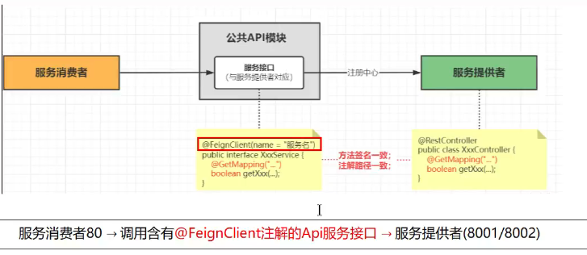

服务消费者 -》 OpenFeign -》 服务提供者

### 5.3.快速上手

服务提供者：nacos-pay-provider

```java
@RestController
public class PayAlibabaController {

    @Value("${server.port}")
    private String serverPort;

    @GetMapping("/pay/nacos/{id}")
    public ResultData<String> getPayInfo(@PathVariable("id") Integer id) {
        return ResultData.success("nacos registry serverPost: " + serverPort + ", id: " + id) ;
    }

}
```

feign api：nacos-feign-api

```java
@FeignClient(value = "nacos-pay-provider") //微服务对应application.name
public interface PayFeignApi {

    @GetMapping("/pay/nacos/{id}")
    public ResultData<String> getPayInfo(@PathVariable("id") Integer id);

}
```

服务消费者：cloud-consumer-openfeign-order

```java
@RestController
public class OrderController {
    @Resource
    private PayFeignApi payFeignApi;

    @GetMapping(value = "/feign/pay/nacos/{id}")
    public ResultData<String> getOrder(@PathVariable("id") Integer id){
        System.out.println("feign add order");
        return payFeignApi.getPayInfo(id);
    }
}

@SpringBootApplication
@EnableDiscoveryClient
@EnableFeignClients //开启feign客户端
public class MainOpenFeign80 {
    public static void main(String[] args) {
        SpringApplication.run(MainOpenFeign80.class,args);
    }
}
```

### 5.4. OpenFeign超时控制

- OpenFeign默认等待60s，超过60s就会报错，可以通过配置文件修改超时时间。

```yaml
openfeign:
  client:
    config:
      default: # 设置feign客户端超时时间
        connectTimeout: 5000
        readTimeout: 5000
      nacos-pay-provider: # 为nacos-pay-provider服务单独设置超时时间
        connectTimeout: 5000
        readTimeout: 5000
```

### 5.5. OpenFeign重试机制

- OpenFeign默认是没有重试机制的，需要手动配置。
- 默认不开启OpenFeign重试机制

```java

import feign.Retryer;
import org.springframework.context.annotation.Bean;
import org.springframework.context.annotation.Configuration;

@Configuration
public class FeignConfig {
    @Bean
    public Retryer myRetryer(){
        return Retryer.NEVER_RETRY;
    }
}
```

- 开启OpenFeign重试机制

```java
import feign.Retryer;
import org.springframework.context.annotation.Bean;
import org.springframework.context.annotation.Configuration;

@Configuration
public class FeignConfig {
    @Bean
    public Retryer myRetryer(){
        return new Retryer.Default(100, 1000, 3);
    }
}
```

### 5.6. OpenFeign httpclient配置

- OpenFeign默认使用的是HttpURLConnection，没有连接池，性能较差，可以切换为Apache HttpClient5

#### 5.6.1. 引入依赖

```xml
<dependency>
    <groupId>io.github.openfeign</groupId>
    <artifactId>feign-hc5</artifactId>
    <version>13.1</version>
</dependency>
<dependency>
    <groupId>org.apache.httpcomponents.client5</groupId>
    <artifactId>httpclient5</artifactId>
    <version>5.3.1</version>
</dependency>
```

#### 5.6.2. 配置文件

```yaml
server:
  port: 80

spring:
  application:
    name: cloud-consumer-openfeign-order
  cloud:
    nacos:
      discovery:
        server-addr: localhost:8848
    openfeign:
      client:
        config:
          default: # 设置feign客户端超时时间
            connectTimeout: 5000
            readTimeout: 5000
          nacos-pay-provider: # 为nacos-pay-provider服务单独设置超时时间
            connectTimeout: 5000
            readTimeout: 5000
  httpclient:
    hc5:
      enabled: true
```

### 5.7. OpenFeign请求响应压缩

- OpenFeign支持对请求和响应进行GZIP压缩，减少通信过程的性能损耗。
- 细粒度设置：指定压缩的请求数据类型并设置请求压缩的大小下限，超过大小才进行压缩。
- 配置文件

```yaml
server:
  port: 80

spring:
  application:
    name: cloud-consumer-openfeign-order
  cloud:
    nacos:
      discovery:
        server-addr: localhost:8848
    openfeign:
      compression:
        request:
          enabled: true
          min-request-size: 2048 # 请求压缩的最小值
          mime-types: text/xml,application/xml,application/json # 请求压缩的MIME类型
        response:
          enabled: true
```

### 5.8. OpenFeign日志

- OpenFeign提供了日志打印功能，方便开发人员排查问题。

#### 5.8.1. 日志级别

| 级别    | 说明                                        |
| ------- | ------------------------------------------- |
| NONE    | 不记录任何日志                              |
| BASIC   | 只记录请求方法、URL、响应状态码及执行时间   |
| HEADERS | 在BASIC的基础上，记录请求和响应的头信息     |
| FULL    | 在HEADERS的基础上，记录请求和响应的正文信息 |

#### 5.8.2. 配置日志

- 配置类

```java
import feign.Logger;
import org.springframework.context.annotation.Bean;
import org.springframework.context.annotation.Configuration;

@Configuration
public class FeignConfig {
    @Bean
    public Logger.Level feignLoggerLevel(){
        return Logger.Level.FULL;
    }
}
```

- 配置文件

```yaml
logging:
  level:
    org:
      example:
        cloud:
          apis:
            org.example.cloud.apis.PayFeignApi: debug
```

## 6.Micrometer

### 6.1. 简介

- 在微服务框架中，一个由客户端发起的请求，可能会经过多个微服务，每个微服务又可能调用多个其他微服务，形成了一个复杂的调用链路，任何一环出现高延时或错误都会引起整个请求最后的失败。
- Micrometer分布式链路追踪，就是将一次分布式请求还原成一个调用链路，对每个环节进行日志记录和性能监控，并将一次分布式请求的调用情况集中web展示从而让我们可以直观地发现错误发生在哪个环节，以及耗时主要耗费在哪个环节，便于我们快速定位问题。

### 6.2.分布式链路原理

- 基于Spring Cloud Sleuth实现分布式链路追踪，Sleuth可以记录一次分布式请求的调用链路，并生成一个全局唯一的TraceID，用于标识一次分布式请求（链路），同时还会生成多个SpanID，用于标识一次分布式请求的多个阶段（请求信息）。

### 6.3.Zipkin

- Zipkin是一个分布式链路追踪系统，可以收集分布式系统的服务调用数据，并生成可视化的调用链路图，方便开发人员排查问题。
- Zipkin由两部分组成：Collector和Storage，Collector负责接收服务调用数据，Storage负责存储服务调用数据，并提供查询接口。
- Zipkin还提供了Web UI，用于展示服务调用链路图。

#### 6.3.1. 安装

- 下载Zipkin

登录官网下载jar包

- 运行Zipkin

```shell
java -jar zipkin-server-3.4.4-exec.jar
```

访问http://localhost:9411/zipkin/

#### 6.3.2. 集成

- 引入依赖

```xml
<!--micrometer-tracing一系列包  -->
<dependency>
    <groupId>io.micrometer</groupId>
    <artifactId>micrometer-tracing-bom</artifactId>
    <version>${micrometer-tracing.version}</version>
    <type>pom</type>
    <scope>import</scope>
</dependency>
<dependency>
    <groupId>io.micrometer</groupId>
    <artifactId>micrometer-tracing</artifactId>
    <version>${micrometer-tracing.version}</version>
</dependency>
<dependency>
    <groupId>io.micrometer</groupId>
    <artifactId>micrometer-tracing-bridge-brave</artifactId>
    <version>${micrometer-tracing.version}</version>
</dependency>
<dependency>
    <groupId>io.micrometer</groupId>
    <artifactId>micrometer-observation</artifactId>
    <version>${micrometer-observation.version}</version>
</dependency>
<dependency>
    <groupId>io.github.openfeign</groupId>
    <artifactId>feign-micrometer</artifactId>
    <version>${feign-micrometer.version}</version>
</dependency>
<dependency>
    <groupId>io.zipkin.reporter2</groupId>
    <artifactId>zipkin-reporter-brave</artifactId>
    <version>${zipkin-reporter-brave.version}</version>
</dependency>
```

- 服务配置文件

```yaml
management:
  zipkin:
    tracing:
      endpoint: http://localhost:9411/api/v2/spans
  tracing:
    sampling:
      probability: 1.0 # 采样率默认为0.1（十次记录一次），值越大收集越及时
```

## 7.GateWay网关

### 7.1. 简介

- Spring Cloud Gateway是Spring Cloud生态系统中的网关组件，用于提供路由、过滤、限流等功能。Spring Cloud Gateway基于Spring6、Spring Boot3和Project Reactor等技术。它旨在为微服务架构提供简单有效的统一API路由管理。
- 核心是一系列的过滤器，通过这些过滤器可以将客户端的请求转发到对应的微服务。是加在整个微服务最前沿的防火墙和代理期，**隐藏微服务节点IP端口**信息，加强安全保护。
- Spring Cloud Gateway本身也是微服务，需要注册进服务注册中心。

### 7.2.网关定位

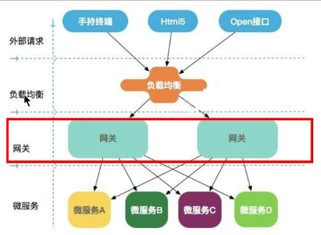

- GateWay VS Nginx：Nginx位于客户端和服务器之间，用于反向代理和负载均衡，而Spring Cloud Gateway位于微服务和Nginx之间，用于路由、过滤和限流。

### 7.3. GateWay三大核心

- 路由：路由是GateWay中最基础的功能，它将客户端的请求转发到对应的微服务。由ID、URI、断言、过滤器组成，如果断言为true则匹配该路由。
- 断言：断言是GateWay中用于判断请求是否满足特定条件的机制，开发人员可以匹配HTTP请求中的所有内容（例如请求头或请求参数），只有满足条件的请求才会被转发到对应的微服务。
- 过滤：过滤是GateWay中用于处理请求和响应的机制，它可以在请求被路由前或者之后对请求进行处理。

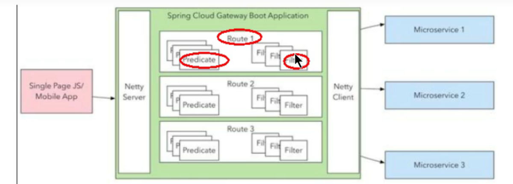

### 7.4. GateWay工作流程

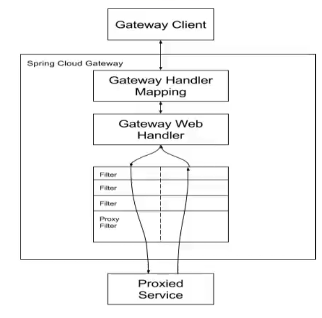

- 客户端向GateWay发送请求，GateWay根据请求的路径和路由规则，将请求发送到WebHandler。Handler通过指定的过滤器链来将请求发送给对应的微服务。
- 过滤器可能会在发送代理之前或之后执行业务逻辑。
- "pre"类型的过滤可以做参数校验、权限校验、流量监控、日志输出、协议转换等，
- "post"类型的过滤器可以做响应内容、响应头的修改，日志的输出，流量监控等有着非常重要的作用。

### 7.5. GateWay路由配置

- 配置文件

```yaml
server:
  port: 9527

spring:
  application:
    name: cloud-gateway
  cloud:
    nacos:
      discovery:
        server-addr: localhost:8848
  gateway:
    routes:
      - id: payment_route1
#          uri: http://localhost:9001
        uri: lb://nacos-pay-provider #动态路由，直接寻找微服务，支持负载均衡
        predicates:
          - Path=/pay/gateway/get/**
      - id: payment_route2
#          uri: http://localhost:9001
        uri: lb://nacos-pay-provider
        predicates:
          - Path=/pay/gateway/info/**
```

- openfeign配置

```java
@FeignClient(value = "cloud-gateway") //微服务对应网关
public interface PayFeignApi {

    @GetMapping("/pay/nacos/{id}")
    public ResultData<String> getPayInfo(@PathVariable("id") Integer id);

    @GetMapping(value="/pay/micrometer/{id}")
    public String myMicrometer(@PathVariable("id") Integer id);

    @GetMapping("/pay/gateway/get/{id}")
    public ResultData<PayDTO> getById(@PathVariable("id") Integer id);

    @GetMapping("/pay/gateway/info")
    public ResultData<String> getInfo();
}
```

客户端发送请求后，openfeign会寻找对应网关，成功访问9527端口下的 **/pay/gateway/get/\*\*** 和 **/pay/gateway/info/\*\***，请求会被转发到9001端口。

### 7.6. GateWay断言

- Path：路径断言，用于匹配请求路径。例如，`Path=/pay/gateway/get/**`表示匹配所有以 `/pay/gateway/get/`开头的请求路径。
- After：时间断言，用于匹配请求时间。例如，`After=2022-01-01T00:00:00.000+0000`表示匹配在2022年1月1日00:00:00之后发出的请求。
- Before：时间断言，用于匹配请求时间。例如，`Before=2022-01-01T00:00:00.000+0000`表示匹配在2022年1月1日00:00:00之前发出的请求。
- Cookie：Cookie断言，用于匹配请求中的Cookie。例如，`Cookie=username,zzyy`表示匹配Cookie中包含 `username=zzyy`的请求。
- Header: Header断言，用于匹配请求头。例如，`Header=X-Request-Id, \d+`表示匹配请求头中包含 `X-Request-Id`且其值为数字的请求。
- Host: 匹配请求的主机名。例如，`Host=**.zzyy.com`表示匹配所有以 `.zzyy.com`结尾的主机名。
- Query: 匹配请求的查询参数。例如，`Query=username, \d+`表示匹配查询参数中包含 `username=整数`的请求。例如请求为 `/pay/gateway/get/1?username=1`，则匹配成功。
- RemoteAddr: 匹配请求的远程地址。例如，`RemoteAddr=192.168.1.1/24`表示匹配来自 `192.168.1.0/24`网段的请求。
- Metthod: 匹配请求的方法。例如，`Method=GET`表示匹配GET请求。

示例代码：

```yaml
server:
  port: 9527

spring:
  application:
    name: cloud-gateway
  cloud:
    nacos:
      discovery:
        server-addr: localhost:8848
  gateway:
    routes:
      - id: payment_route1
#          uri: http://localhost:9001
        uri: lb://nacos-pay-provider #动态路由，直接寻找微服务，支持负载均衡
        predicates:
          - Path=/pay/gateway/get/**
          - After=2025-02-05T15:08:30.031606300+08:00[Asia/Shanghai]
          - Cookie=username,zzyy
          - Header=X-Request-Id, \d+
          - Host=**.zzyy.com
          - Query=username, \d+
          - RemoteAddr=192.168.83.1/24
          - Method=GET, POST
      - id: payment_route2
#          uri: http://localhost:9001
        uri: lb://nacos-pay-provider
        predicates:
          - Path=/pay/gateway/info/**

```

### 7.7. GateWay自定义断言

#### 7.7.1. 自定义步骤

1. 新建类名以RoutePredicateFactory结尾，继承AbstractRoutePredicateFactory
2. 重写apply方法
3. 新建apply方法所需要的静态内部类MyRoutePredicateConfig，这个是路由断言规则
4. 空参构造方法，内部调用super
5. 重写apply方法第二版

#### 7.7.2. 代码实现

1. 编写自定义断言类

```java
@Component
public class MyRoutePredicateFactory extends AbstractRoutePredicateFactory<MyRoutePredicateFactory.Config> {


    public MyRoutePredicateFactory() {
        super(MyRoutePredicateFactory.Config.class);
    }

    @Override
    public Predicate<ServerWebExchange> apply(Config config) {
        return new Predicate<ServerWebExchange>() {
            @Override
            public boolean test(ServerWebExchange serverWebExchange) {
                String userType = serverWebExchange.getRequest().getQueryParams().getFirst("userType");
                if (userType == null) {
                    return false;
                }
                if (userType.equalsIgnoreCase(config.getUserType())) {
                    return true;
                }
                return false;
            }
        };
    }

    public static class Config {
        @Setter@Getter@NotEmpty
        private String userType; //用户等级
    }
    # 支持短格式书写配置
    @Override
    public List<String> shortcutFieldOrder() {
        return Collections.singletonList("userType");
    }
}
```

2. 编写配置文件

```yaml
server:
  port: 9527

spring:
  application:
    name: cloud-gateway
  cloud:
    nacos:
      discovery:
        server-addr: localhost:8848
  gateway:
    routes:
      - id: payment_route1
#          uri: http://localhost:9001
        uri: lb://nacos-pay-provider #动态路由，直接寻找微服务，支持负载均衡
        predicates:
          - Path=/pay/gateway/get/**
#            - name: My
#              args:
#                userType: diamond
          - My=diamond
```

### 7.8. GateWay过滤器

#### 7.8.1. 过滤器的作用

- 过滤器可以在请求被路由之前或之后对请求进行修改，或者对路由的请求响应进行修改。

#### 7.8.2. GateWay内置过滤器

- 过滤器类型
  - GatewayFilter
  - GlobalFilter
  - 自定义Filter
- 过滤器作用范围
  - 单个路由
  - 全局

#### 7.8.3. GateWay常用内置过滤器

1.RequestHeader:

- AddRequestHeader：添加请求头
- RemoveRequestHeader：移除请求头
- SetRequestHeader：设置请求头

2.RequestParameter:

- AddRequestParameter：添加请求参数
- RemoveRequestParameter：移除请求参数
- SetRequestParameter：设置请求参数

3.ResponseHeader:

- AddResponseHeader：添加响应头
- RemoveResponseHeader：移除响应头
- SetResponseHeader：设置响应头

4.Path:

- PrefixPath：路径前缀
- SetPath：设置替换路径
- RedirectTo：重定向

配置文件：

```yaml
spring:
  application:
    name: cloud-gateway
  cloud:
    nacos:
      discovery:
        server-addr: localhost:8848
    gateway:
      routes:
        - id: payment_route1
#          uri: http://localhost:9001
          uri: lb://nacos-pay-provider #动态路由，直接寻找微服务，支持负载均衡
          predicates:
            - Path=/pay/gateway/get/**
            - After=2025-02-05T15:08:30.031606300+08:00[Asia/Shanghai]
            - Cookie=username,zzyy
            - Header=X-Request-Id, \d+
            - Host=**.zzyy.com
            - Query=username, \d+
#            - RemoteAddr=192.168.83.1/24
            - Method=GET, POST
#            - name: My
#              args:
#                userType: diamond
            - My=diamond
        - id: payment_route2
#          uri: http://localhost:9001
          uri: lb://nacos-pay-provider
          predicates:
            - Path=/pay/gateway/info/**
        - id: payment_route3
            #          uri: http://localhost:9001
          uri: lb://nacos-pay-provider
          predicates:
            - Path=/pay/gateway/filter/**
#            - Path=/gateway/filter/**
#            - Path=/XYZ/abc/{segment}
          filters:
            - RedirectTo=302,http://www.baidu.com #302错误进行跳转
#            - SetPATH=/pay/gateway/{segment} # 上面配置的/XYZ/abc会被替换为当前路径
#            - PrefixPath= /pay # 前缀由配置统一管理
#            - AddRequestHeader=X-Request-yeffky,yeffky
#            - RemoveRequestHeader=cookie
#            - SetRequestHeader=X-Request-Id,123456
#            - AddRequestParameter=customerId,9527001
#            - RemoveRequestParameter=customerName
#            - AddResponseHeader=X-Response-Id,BlueResponse
#            - RemoveResponseHeader=Content-Type
#            - SetResponseHeader=Date,2099-11-11
```

#### 7.8.4.自定义过滤器

- 自定义全局Filter：统计接口调用耗时

```java
@Component
@Slf4j
public class MyGlobalFilter implements GlobalFilter, Ordered {

    public static final String BEGIN_VISIT_TIME = "begin_visit_time";
    @Override
    public Mono<Void> filter(ServerWebExchange exchange, GatewayFilterChain chain) {
        exchange.getAttributes().put(BEGIN_VISIT_TIME, System.currentTimeMillis());
        return chain.filter(exchange).then(Mono.fromRunnable(()->{
            Long beginVisitTime = exchange.getAttribute(BEGIN_VISIT_TIME);
            if (beginVisitTime != null) {
                log.info("访问接口主机：" + exchange.getRequest().getURI().getHost());
                log.info("访问接口端口：" + exchange.getRequest().getURI().getPort());
                log.info("访问接口URL：" + exchange.getRequest().getURI().getPath());
                log.info("访问接口参数：" + exchange.getRequest().getURI().getRawQuery());
                log.info("访问接口时长：" + (System.currentTimeMillis() - beginVisitTime) + "ms");
                log.info("=================");
                System.out.println();
            }
        }));
    }

//    数字越小，优先级越高
    @Override
    public int getOrder() {
        return 0;
    }
}
```

- 自定义条件Filter

  -配置类

```java
@Component
public class MyGatewayFilterFactory extends AbstractGatewayFilterFactory<MyGatewayFilterFactory.Config> {

    public MyGatewayFilterFactory() {
        super(MyGatewayFilterFactory.Config.class);
    }


    @Override
    public GatewayFilter apply(Config config) {
        return new GatewayFilter() {
            @Override
            public Mono<Void> filter(ServerWebExchange exchange, GatewayFilterChain chain) {
                ServerHttpRequest request = exchange.getRequest();
                System.out.println("进入了自定义网关过滤器：" + config.getStatus());
                if (request.getQueryParams().containsKey(config.getStatus())) {
                    return chain.filter(exchange);
                } else {
                    exchange.getResponse().setStatusCode(HttpStatus.BAD_GATEWAY);
                    return exchange.getResponse().setComplete();
                }

            }
        };
    }

    public static class Config {
        @Getter @Setter
        private String status;
    }

    @Override
    public List<String> shortcutFieldOrder() {
        return Arrays.asList("status");
    }
}
```

  -yml配置

```yaml
spring:
  cloud:
    gateway:
      routes:
        - id: payment_route3
            #          uri: http://localhost:9001
          uri: lb://nacos-pay-provider
          predicates:
            - Path=/pay/gateway/filter/**
          filters:
            - My=yeffky #需要有yeffky这个键，而非键值对为"status: yeffky"
```

## 8.Seata分布式事务

### 8.1. Seata简介

- Seata是一款开源的分布式事务解决方案，致力于提供高性能和简单易用的分布式事务服务。

### 8.2. Seata工作组件

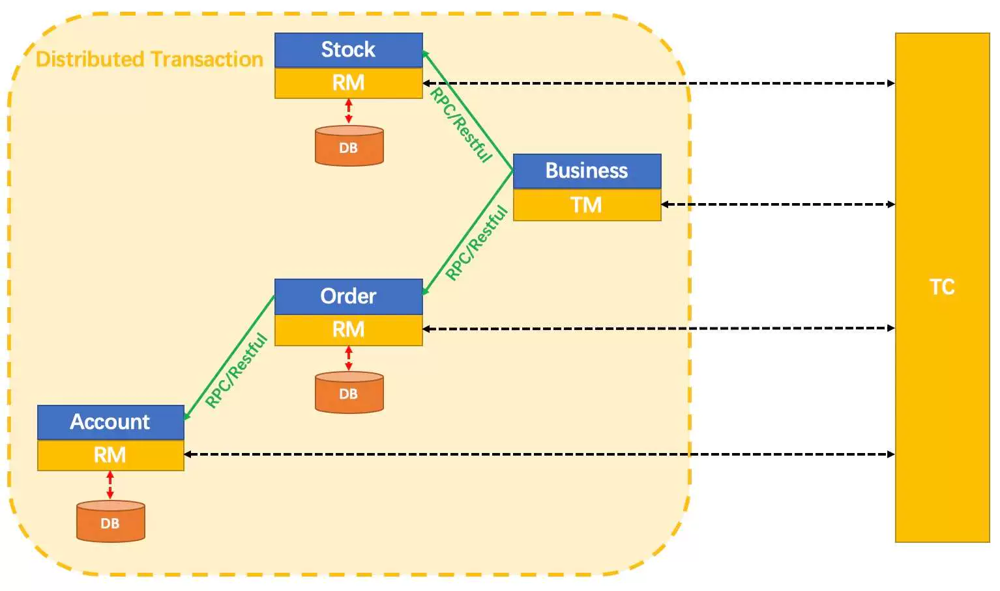

- XID：全局事务的唯一标识，在微服务调用链中传递，绑定到服务的事务的上下文。
- TC：事务协调者，就是Seata，维护全局和分支事务的状态，驱动全局事务提交或回滚。（以Seata Server的形式独立部署）
- TM：事务管理器，标注全局@GlobalTransactional启动入口动作的微服务模块，是事务的发起者。定义全局事务的范围：开始全局事务、提交或回滚全局事务。
- RM：资源管理器，是MySQL数据库本身，管理分支事务处理的资源，与TC交谈以注册分支事务和报告分支事务的状态，并驱动分支事务提交或回滚。

### 8.3. Seata工作流程

1.TM向TC申请开启全局事务，创建成功生成全局唯一的XID。

2.XID在微服务调用链中传播。

3.RM向TC注册分支事务，将其纳入XID对应的全局事务的管辖。

4.TM向TC发起针对XID的全局提交或回滚决议。

5.TC调度XID下管辖的全部分支事务完成提交或回滚请求。

### 8.4. Seata安装

#### 8.4.1.安装流程

- 下载解压

  - https://github.com/seata/seata/releases

- 创建数据库
  - seata的server端需要创建一个数据库，用于存储事务信息

```sql
CREATE DATABASE seata;
USE seata;
```

- 导入表

  - https://github.com/apache/incubator-seata/blob/2.x/script/server/db/mysql.sql

  - 执行sql脚本

- 修改配置文件

  - 修改application.yml

```yaml
#  Copyright 1999-2019 Seata.io Group.
#
#  Licensed under the Apache License, Version 2.0 (the "License");
#  you may not use this file except in compliance with the License.
#  You may obtain a copy of the License at
#
#  http://www.apache.org/licenses/LICENSE-2.0
#
#  Unless required by applicable law or agreed to in writing, software
#  distributed under the License is distributed on an "AS IS" BASIS,
#  WITHOUT WARRANTIES OR CONDITIONS OF ANY KIND, either express or implied.
#  See the License for the specific language governing permissions and
#  limitations under the License.

server:
  port: 7091

spring:
  application:
    name: seata-server

logging:
  config: classpath:logback-spring.xml
  file:
    path: ${log.home:${user.home}/logs/seata}
  extend:
    logstash-appender:
      destination: 127.0.0.1:4560
    kafka-appender:
      bootstrap-servers: 127.0.0.1:9092
      topic: logback_to_logstash

console:
  user:
    username: seata
    password: seata
seata:
  config:
    # support: nacos, consul, apollo, zk, etcd3
    type: nacos
    nacos:
      server-addr: 127.0.0.1:8848
      namespace: ""
      group: SEATA_GROUP
      username: nacos
      password: nacos
  registry:
    # support: nacos, eureka, redis, zk, consul, etcd3, sofa
    type: nacos
    nacos:
      application: seata-server
      server-addr: 127.0.0.1:8848
      group: SEATA_GROUP
      namespace: ""
      cluster: default
      username: nacos
      password: nacos
  store:
    # support: file 、 db 、 redis 、 raft
    mode: db
    db:
      datasource: druid
      db-type: mysql 
      driver-class-name: com.mysql.dj.jdbc.Driver
      url: jdbc:mysql://localhost:3307/seata?characterEncoding=utf8&useUnicode=true&useSSL=false&serverTimezone=GMT%2B8&rewriteBatchedStatements=true
      user: root
      password: 123456
      minConn: 10
      maxConn: 100
      global-table: global_table
      branch-table: branch_table
      lock-table: lock_table
      distributed-lock-table: distributed_lock
      query-limit: 1000
      maxWait: 5000
  #  server:
  #    service-port: 8091 #If not configured, the default is '${server.port} + 1000'
  security:
    secretKey: SeataSecretKey0c382ef121d778043159209298fd40bf3850a017
    tokenValidityInMilliseconds: 1800000
    ignore:
      urls: /,/**/*.css,/**/*.js,/**/*.html,/**/*.map,/**/*.svg,/**/*.png,/**/*.jpeg,/**/*.ico,/api/v1/auth/login,/metadata/v1/**
```

- 启动nacos

- 启动seata

  - bin目录下执行seata-server.sh

#### 8.4.2.验证

- 访问nacos，服务注册成功

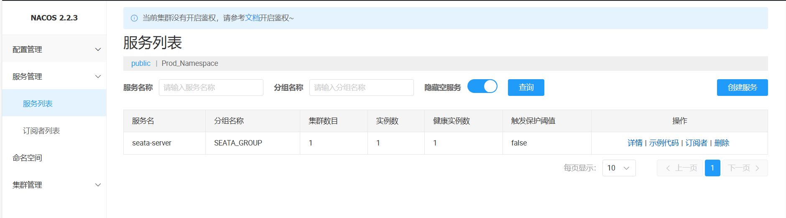

- 访问seata，账号密码初始化均为seata，登录成功

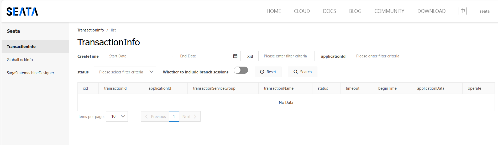

### 8.5. Seata使用（订单下单案例）

1.创建三个数据库

CREATE DATABASE seata_order;
CREATE DATABASE seata_storage;
CREATE DATABASE seata_account;

2.创建表

3.mybatis一键生成实体和标准mapper

4.创建三个微服务

- 订单服务
- 库存服务
- 账户服务

5.新增库存和账户两个Feign接口

- 库存接口

```java
@FeignClient(name = "seata-storage-service")
public interface StorageFeignApi {

    /**
     * 扣减库存
     */
    @PostMapping("/storage/decrease")
    ResultData decrease(@RequestParam("productId") Long productId, @RequestParam("count") Integer count);
}
```

- 账户接口

```java
@FeignClient(name = "seata-account-service")
public interface AccountFeignApi {

    /**
     * 扣减账户余额
     */
    @PostMapping("/account/decrease")
    ResultData decrease(@RequestParam("userId") Long userId, @RequestParam("money") Long money);
}
```

6.订单微服务

- 配置文件

```yaml
server:
  port: 2001

spring:
  application:
    name: seata-order-service
  cloud:
    nacos:
      server-addr: localhost:8848
  datasource:
    type: com.alibaba.druid.pool.DruidDataSource
    driver-class-name: com.mysql.cj.jdbc.Driver
    url: jdbc:mysql://localhost:3307/seata_order?characterEncoding=utf-8&useSSL=false&serverTimezone=GMT%2B8&rewriteBatchedStatements=true&allowPublicKeyRetrieval=true
    username: root
    password: 123456

mybatis:
  mapper-locations: classpath:mapper/*.xml
  type-aliases-package: org.example.cloud.entities
  configuration:
    map-underscore-to-camel-case: true

seata:
  registry:
    type: nacos
    nacos:
      server-addr: localhost:8848
      namespace: ""
      group: SEATA_GROUP
      application: seata-server
  tx-service-group: default_tx_group # 事务组名称，由他获得TC服务的集群名称
  service:
    vgroup-mapping:
      # 事务组名称与集群名称的映射关系，例如当前事务组为ProjectA，这个ProjectA的集群名称为default，如果当前集群down了，只需要修改集群名称即可启动备用集群进行事务管理
      default_tx_group: default 
  data-source-proxy-mode: AT

logging:
  level:
    io:
      seata: info
```

- 业务代码

```java
@Service
@Slf4j
public class OrderServiceImpl implements OrderService {

    @Resource
    private OrderMapper orderMapper;

    @Resource// 订单微服务调用库存微服务
    private StorageFeignApi storageFeignApi;

    @Resource// 订单微服务调用账户微服务
    private AccountFeignApi accountFeignApi;


    @Override
    public void create(Order order) {
        //xid全局事务id检查
        String xid = RootContext.getXID();
        //1. 新建订单
        log.info("----->开始新建订单: " + "\t" + "xid: " + xid);
        // 订单新建初始状态为0
        order.setStatus(0);
        int result = orderMapper.insertSelective(order);

        Order orderFromDB = null;

        if(result > 0) {
            // 从mysql查出记录
            orderFromDB = orderMapper.selectOne(order);
            log.info("----->新建订单成功: " + "\t" + "orderFromDB info: " + orderFromDB);
            System.out.println();
            log.info("----->调用storage: " + "\t");
            storageFeignApi.decrease(orderFromDB.getProductId(), orderFromDB.getCount());
            log.info("----->调用storage完成: " + "\t");
            log.info("----->调用account: " + "\t");
            accountFeignApi.decrease(orderFromDB.getUserId(), order.getMoney());
            log.info("----->调用account完成: " + "\t");
            System.out.println();
            // 修改订单状态，从0改为1
            log.info("----->修改订单状态: " + "\t");
            orderFromDB.setStatus(1);
            Example whereCondition = new Example(Order.class);
            Example.Criteria criteria = whereCondition.createCriteria();
            criteria.andEqualTo("userId", order.getId());
            criteria.andEqualTo("status", 0);
            int updateResult = orderMapper.updateByExampleSelective(orderFromDB, whereCondition);
            log.info("----->修改订单状态完成: " + "\t" + "updateResult: " + updateResult);
            log.info("----->orderFromDB info: " + orderFromDB);
        }
        System.out.println();
        System.out.println("----->结束新建订单: " + "\t" + "xid: " + xid);

    }
}
```

7.库存微服务

- mapper

```java
public interface StorageMapper extends Mapper<Storage> {
    void decrease(@Param("productId") Long productId, @Param("count") Integer count);
}
```

```xml
<update id="decrease">
    update t_storage
    set used = used + #{count},
    residue = residue - #{count}
    where product_id = #{productId}
</update>
```

8.账户微服务

- mapper

```java
public interface AccountMapper extends Mapper<Account> {
    void decrease(@Param("userId") Long userId, @Param("money") Long money);
}
```

```xml
<update id="decrease">
    update t_account
    set used = used + #{money},
    residue = residue - #{money}
    where user_id = #{userId}
</update>
```

### 8.6. Seata测试（订单下单案例）

- 未添加@GlobalTransactional注解

  - 账户微服务超时异常
    - 账户微服务和库存微服务均未回滚
    - 订单状态为0，未进行更新
  - 账户微服务业务代码异常
    - 账户微服务和库存微服务均未回滚
    - 订单状态为0，未进行更新


```java
// OrderServiceImpl.java
@GlobalTransactional(name = "zzyy-create-order", rollbackFor = Exception.class)
public void create(Order order) {
    //xid全局事务id检查
    String xid = RootContext.getXID();
    //1. 新建订单
    log.info("----->开始新建订单: " + "\t" + "xid: " + xid);
    // 订单新建初始状态为0
    order.setStatus(0);
    int result = orderMapper.insertSelective(order);

    Order orderFromDB = null;

    if(result > 0) {
        // 从mysql查出记录
        orderFromDB = orderMapper.selectOne(order);
        log.info("----->新建订单成功: " + "\t" + "orderFromDB info: " + orderFromDB);
        System.out.println();
        log.info("----->调用storage: " + "\t");
        storageFeignApi.decrease(orderFromDB.getProductId(), orderFromDB.getCount());
        log.info("----->调用storage完成: " + "\t");
        log.info("----->调用account: " + "\t");
        accountFeignApi.decrease(orderFromDB.getUserId(), orderFromDB.getMoney());
        log.info("----->调用account完成: " + "\t");
        System.out.println();
        // 修改订单状态，从0改为1
        log.info("----->修改订单状态: " + "\t");
        orderFromDB.setStatus(1);
        Example whereCondition = new Example(Order.class);
        Example.Criteria criteria = whereCondition.createCriteria();
        criteria.andEqualTo("id", orderFromDB.getId());
        criteria.andEqualTo("status", 0);
        int updateResult = orderMapper.updateByExampleSelective(orderFromDB, whereCondition);
        log.info("----->修改订单状态完成: " + "\t" + "updateResult: " + updateResult);
        log.info("----->orderFromDB info: " + orderFromDB);
    }
    System.out.println();
    System.out.println("----->结束新建订单: " + "\t" + "xid: " + xid);
}
```

- 添加@GlobalTransactional注解
  - 账户微服务超时异常
    - 超时前，账户微服务和库存微服务均未回滚，逻辑正常更新，但订单状态为0，未进行更新，且undolog记录存在
    - seata后台
    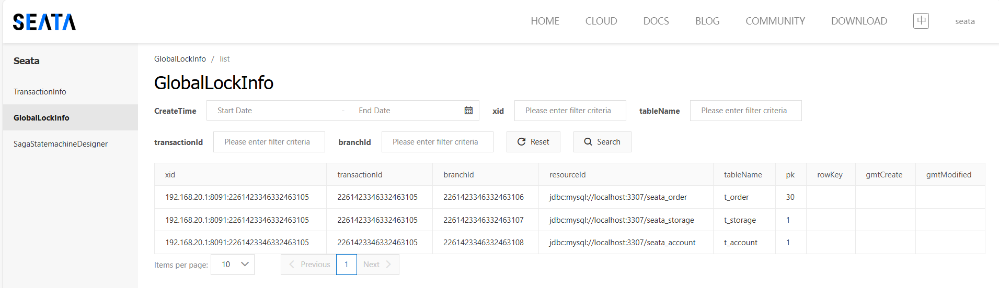
    - 超时后，账户微服务和库存微服务均回滚，订单记录消失，undolog记录被删除
    - seata后台
    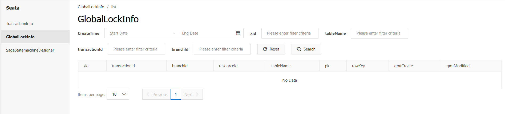

### 8.7.原理总结与面试题

#### 8.7.1 AT模式如何做到对业务无侵入

1.两阶段提交协议的演变

- 一阶段：业务数据和回滚日志记录在同一个事务中提交，释放数据库锁资源。

- 二阶段：
  - 提交异步化，非常快速地完成。
  - 基于undo_log回滚日志，反向补偿。

2.一阶段加载

在一阶段，Seata会拦截业务SQL，
（1）解析SQL语义，找到业务SQL要更新的业务数据，在业务数据被更新前，将其保存成“before image”，
（2）执行业务SQL更新业务数据，在业务数据更新之后，
（3）将其保存成“after image”，最后生成行锁。
上述操作在一个数据库事务完成，保证原子性。

3.二阶段提交

- 二阶段如果是顺利提交，因为业务SQL在一阶段已经提交，所以Seata只需将一阶段保存的快照数据和行锁删掉，完成数据清理即可。
- 二阶段如果是回滚的话，Seata需要回滚一阶段已经执行的业务SQL，回滚的方式就是用“before image”还原业务数据，还原之前要首先校验脏写，对比“数据库当前业务数据”和“after image”，如果数据不一致，说明有脏写，需要转人工处理，如果数据一致，则用“before image”去覆盖“当前业务数据”，完成数据回滚。最后清理掉一阶段保存的快照数据和行锁。
