<!--
 * @Author: yeffky
 * @Date: 2025-04-05 17:47:27
 * @LastEditTime: 2025-04-12 09:56:08
-->

# 海外版Trae软件安装文档

## 前言

海外版Trae软件是一款基于AI的编程IDE，可以帮助开发者提升编程能力、提高工作效率。本文档将介绍如何安装和使用海外版Trae软件。

## 0. 前置条件

使用国际版需要使用魔法。国际版可以使用Claude模型。

## 1. 下载安装包

- 下载地址：[https://www.trae.com/downloads/](https://www.trae.ai/download)
- 选择合适的版本下载安装包，如：Windows、Mac、Linux

## 2. 安装

- 双击下载好的安装包。
- 这里选择**我同意此协议**，然后点击下一步。
  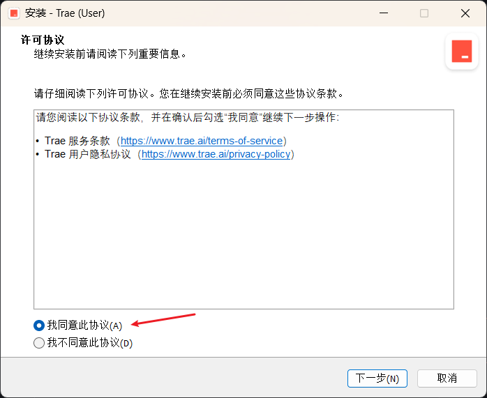
- 修改安装路径，这里可以选择其他盘符，如：D盘。
  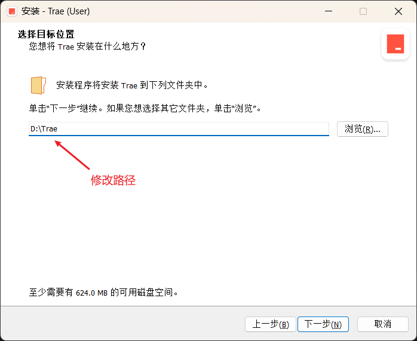
  完成之后点击**下一步**。
- 之后无特殊情况直接无脑点击**下一步**即可。
  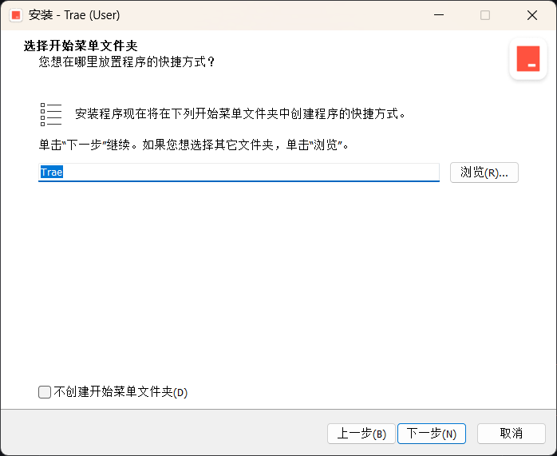
  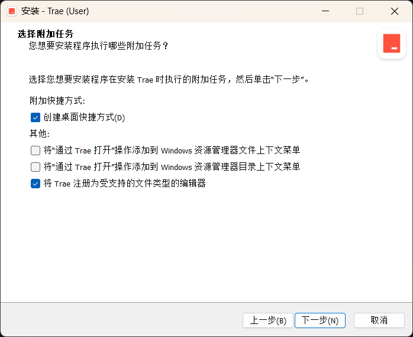
  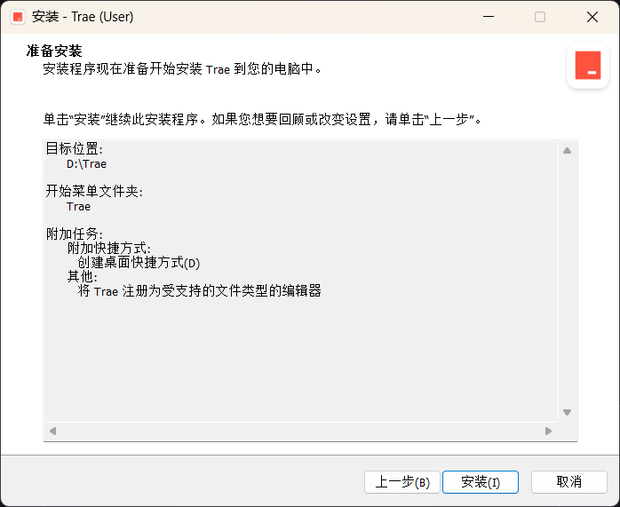

## 3. 启动

- 启动之后，会出现如下界面：
  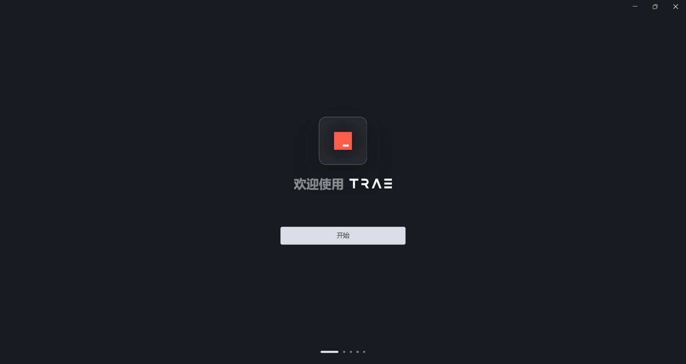
  点击**开始**即可
- 接下来根据自己的喜好选择主题，trae提供了三个基础主题：
  
- 如果之前使用过vscode，可以选择导入vscode的配置：
  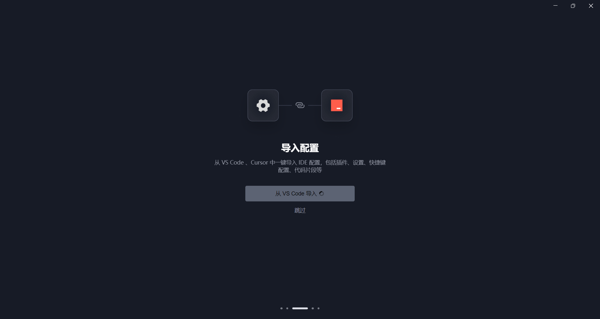
- 选择是否添加命令行：
  
  这里默认选择**安装trae命令**即可
- 接下来进行登录，这里选择**登录**，将跳转到登录界面：
  
- 这里可以使用google账号或者github账号登录，登录成功后，即可开始使用trae软件了。
  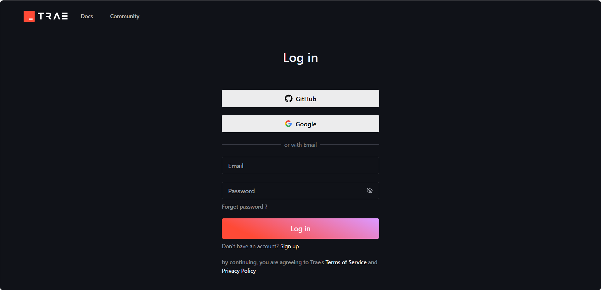

## 4. 测试

- 打开trae软件，打开**AI侧栏**：
 
- 选择**builder模式**，输入以下指令，将会自动构建项目：
 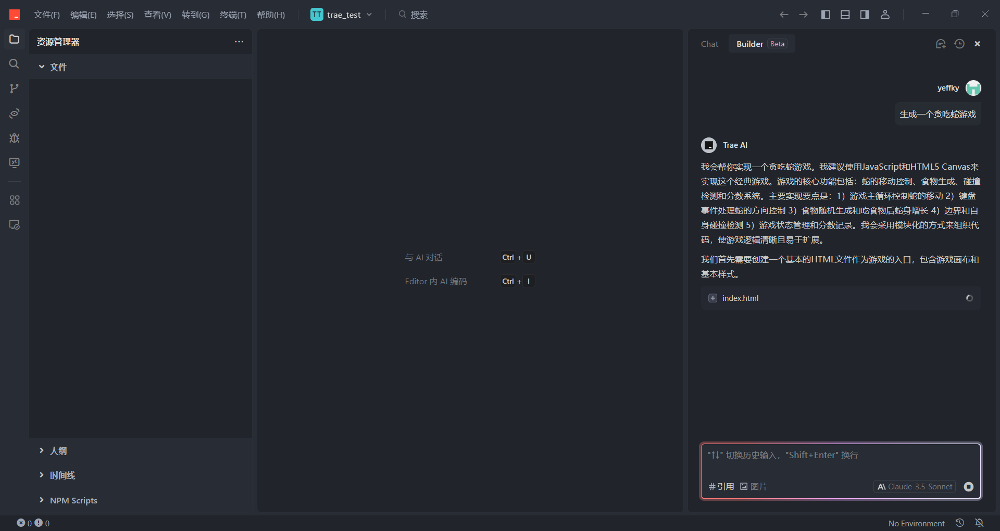
- builder模式下，trae会自动构建项目，构建完成后，会指引用户运行项目：
  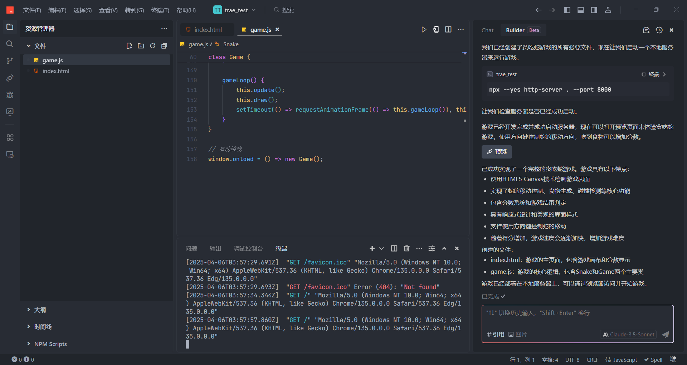
- 最终生成游戏效果如下：
  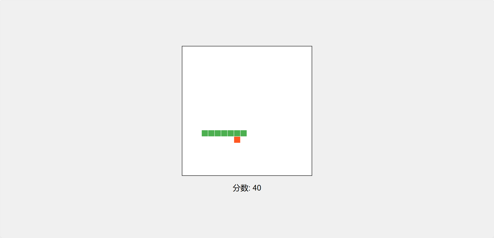

  
