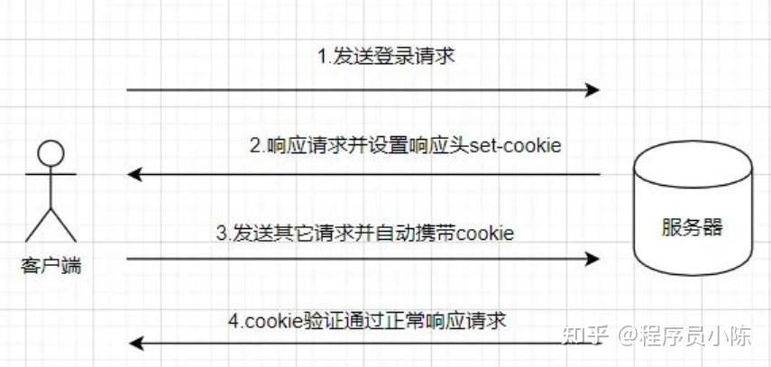
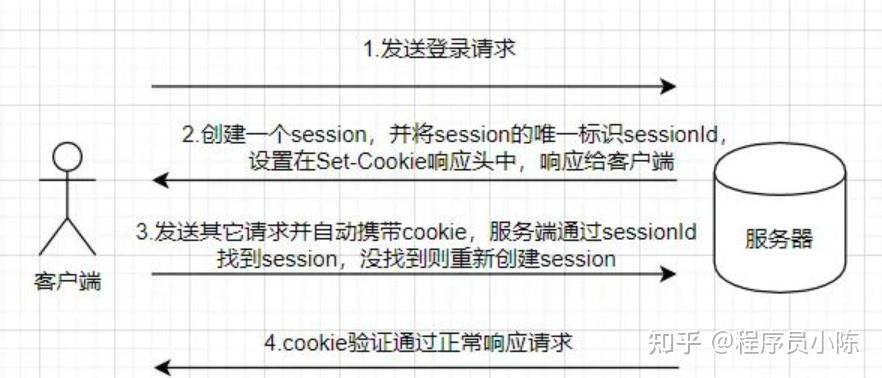
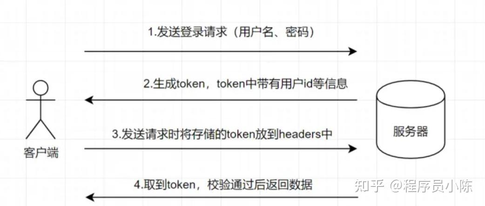

<!--
 * @Author: yeffky
 * @Date: 2026-02-12 16:13:12
 * @LastEditTime: 2026-02-12 16:51:16
-->
# 面试题

记录找实习路上遇见的一些常见面试题。

## 一、计算机网络

### 1.session、cookie、token的区别

HTTP协议是无状态的，也就是说，对于同一个客户端的请求，服务器无法从会话中获取之前的状态信息。因此，我们如果需要判断多次会话请求的用户身份，就需要用到session、token或者cookie。

#### cookie

cookie是**客户端存储数据**的技术。它是服务器发送到用户浏览器并保存在本地的小文件，它会在同一个会话（session）中被发送到同一个服务器。服务器通过读取 Cookie 信息，就可以判断该请求来自哪个客户端。cookie是一种轻量级的存储机制，用于存储少量的信息，如用户的身份信息、语言偏好、登录状态等。

但是，cookie存在一些问题：

- cookie 有存储大小限制，4KB 左右。
- cookie 数据容易被查看。
- cookie **无法跨域**。

cookie使用流程：

- 客户端发送请求到服务端（比如登录请求）。
- 服务器收到请求生成session会话。
- 服务器在响应头中设置Set-Cookie，包含sessionId。其中sessionId用于标识客户端。
- 客户端收到响应，并保存cookie。
- 客户端下次请求时，会在请求头中带上cookie。
- 服务端收到请求，通过sessionId判断客户端身份。

#### session

session是**服务器存储数据**的技术。它是基于cookie的一种实现。服务器会在内存中创建一块数据，用来存储用户的会话信息。当用户请求服务器时，服务器会根据用户的请求信息，在session中查找用户的会话信息，即检索请求中是否包含sessionId。如果包含，则服务器会去查找对应sessionId的会话信息；如果没有，则会创建一个新的会话，并生成新的sessionId，并把它返回给客户端，通常存储在cookie中。

每一个客户端与服务端连接，服务端都会为该客户端创建一个 session，并将 session 的唯一标识 sessionId 通过设置 Set-Cookie 头的方式响应给客户端，客户端将 sessionId 存到 cookie 中。

session 使用流程：

cookie和session的区别：

cookie和session通过sessionId进行关联，通常结合使用。

- cookie数据存放在客户的浏览器上，session数据放在服务器上。
- cookie保存在客户端上，session保存在服务器上。
- cookie只支持存储字符串，session可以存储对象。
- cookie的有效期可以设置较长时间，session 有效期都比较短。
- cookie存储空间小，session存储空间大。

#### token

token是一种**无状态**的授权机制。它是一种令牌，包含了用户身份信息，一般由服务器生成，并通过加密算法进行签名。生成后，将其发送给客户端，客户端收到token后，需要将Token携带在请求头中，服务器通过验证token的有效性，来判断用户的身份。Token 可以有效地避免了 Cookie 的一些安全问题，比如 CSRF 攻击。

token组成：

- header：包含了token的算法和类型，比如HMAC,RSA,SHA256等。
- payload：包含了用户身份信息，比如用户ID、用户名、过期时间等。
- signature：签名，用于验证token的有效性。使用私钥签名，公钥验证。

token使用流程：

- 客户端向服务器发出登录请求，携带用户名和密码。
- 服务器验证用户名和密码，生成token。
- 服务器返回token给客户端。
- 客户端收到token，并将其存储在本地。
- 客户端向服务器发送请求，在请求头或者其他地方携带token。
- 服务器验证token的有效性，如果有效，则允许访问资源。